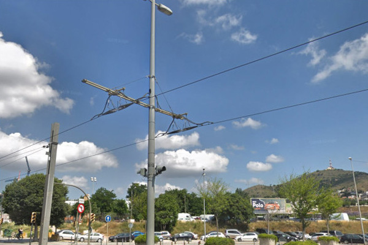
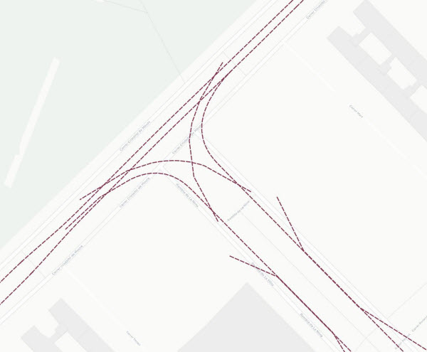
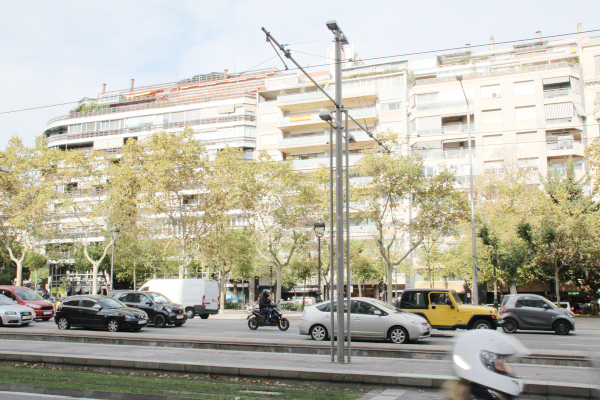
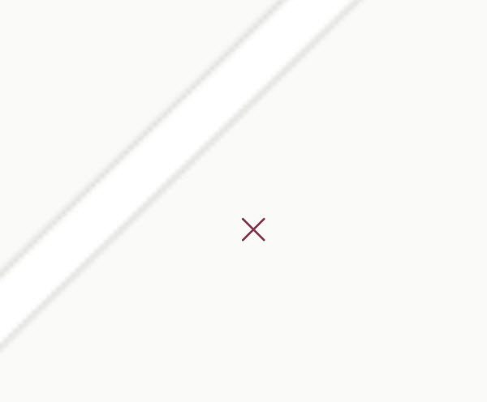
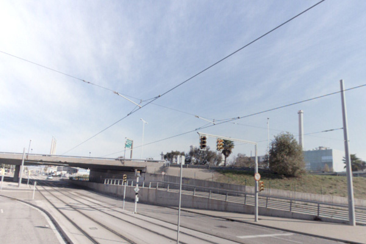

## 08 Catenària

 

>  Grup: Sistemes Tramviaris · Número elements: 6

 

Sistema de suspensió dels cables que constitueixen la línia aèria d'alimentació del tramvia, disposada de manera que el fil de contacte resti en tots els seus punts a una determinada altura sobre la via.

 

### 001 Seccionadors

> `Identificador: 08001 | Codi: SEC | Geometria: PUNT`

 

Element que permet l'aïllar una o vàries seccions elèctriques. Els seccionadors són utilitzats per seccionar diferents trams de catenària, ja sigui en cas d'incidència o per necessitats de manteniment.

 

 

**Atributs**

| Atribut       | Tipus    | Descripció  |
| ------------- |:-------------| :-----|
| XARXA         | Indica a la xarxa a la qual pertany la infraestructura tramviària. Actualment Trambaix (TBX) o bé Trambesòs (TBS). En un futur es podran incloure altres xarxes encara no definides. | [String (20)] |
| CODI_ACTIU    | Codi que identifica un element en el GIS de forma unívoca. Està format per 4 parts separades per un guió. Comença amb el prefix TRM, després el codi de l'element segons el model de dades, un numero de dos dígits que indica l'operador o creador i un número de 5 dígits que identifica l'element al GIS de forma única.      |   [String (20)] |
| SUBSECCIO_1 | Indica el nom de la secció elèctrica inicial separada pel seccionador. | [String (200)] |
| SUBSECCIO_2 | Indica el nom de la secció elèctrica final separada pel seccionador.| [String (20)] |
| TIPUS | Fa referència als diferents tipus d'aïlladors de secció. L'atribut ha de tenir un dels següents valors:<ul><li>**IAT**: Interruptor d'Aïllament Telecomandat. </li><li>**DAT**: Disjuntor d'Aïllament Telecomandat. </li><li>**SAT**: Seccionador d'Aïllament Telecomandat. </li>| [String (20)]|

 

**Representació GIS:**

 

 

    Nom capa element: Catenaria-seccionadors
    Nom taula DB: atmgis_08_seccionadors
    Nom camp geometria DB: geom
    Representació gràfica:

        [symbol: 'seccionador.svg', size: '2', weight: '0.4', color: '#813753', fillcolor: '#c1766f']

  

### 002 LAC

> `Identificador: 08002 | Codi: FDC | Geometria: LÍNIA`

 

Línia aèria de contacte (LAC). Són els fils conductors des dels quals els tramvies capten l'energia elèctrica necessària, per mitjà del pantògraf embarcat. La seva tensió nominal és 750Vcc.

 

**Atributs**

| Atribut       | Tipus    | Descripció  |
| ------------- |:-------------| :-----|
| XARXA         | Indica a la xarxa a la qual pertany la infraestructura tramviària. Actualment Trambaix (TBX) o bé Trambesòs (TBS). En un futur es podran incloure altres xarxes encara no definides. | [String (20)] |
| CODI_ACTIU    | Codi que identifica un element en el GIS de forma unívoca. Està format per 4 parts separades per un guió. Comença amb el prefix TRM, després el codi de l'element segons el model de dades, un numero de dos dígits que indica l'operador o creador i un número de 5 dígits que identifica l'element al GIS de forma única.      |   [String (20)] |
| SECCIO | Conté la codificació de la secció elèctrica en la que es troba el fil de contacte. | [String (20)] |
| SUBSECCIO | Conté la codificació de la subsecció elèctrica en la que es troba el fil de contacte. | [String (20)] |

 

**Representació GIS:**

 

 

    Nom capa element: Catenaria-fil de contacte
    Nom taula DB: atmgis_08_lac
    Nom camp geometria DB: geom
    Representació gràfica:

        [weight: '0.5', dasharray: '3 1', color: '#813753']

  

### 003 Pals

> `Identificador: 08003 | Codi: PCT | Geometria: PUNT`

 

Pals de catenària. Els pals, de diferent secció i alçada segons les necessitats, van fixats al sòl mitjançant massissos de formigó i acullen els elements de sustentació de la línia d'aèria de contacte. Ocasionalment i amb l'objectiu de minimitzar el nombre d'elements verticals de la via pública, també poden portar enllumenat.

 

 

**Atributs**

| Atribut       | Tipus    | Descripció  |
| ------------- |:-------------| :-----|
| XARXA         | Indica a la xarxa a la qual pertany la infraestructura tramviària. Actualment Trambaix (TBX) o bé Trambesòs (TBS). En un futur es podran incloure altres xarxes encara no definides. | [String (20)] |
| CODI_ACTIU    | Codi que identifica un element en el GIS de forma unívoca. Està format per 4 parts separades per un guió. Comença amb el prefix TRM, després el codi de l'element segons el model de dades, un numero de dos dígits que indica l'operador o creador i un número de 5 dígits que identifica l'element al GIS de forma única.      |   [String (20)] |
| TIPUS_PAL | Indica el model de pal de catenària. L'atribut ha de tenir un dels següents valors:<ul><li>**1**: Tipus de pal. [**Veure**](img/0800311.pdf) </li><li>**10**: Tipus de pal. [**Veure**](img/0800312.pdf) </li><li>**1R**: Tipus de pal. [**Veure**](img/0800313.pdf) </li><li>**2**: Tipus de pal. [**Veure**](img/0800314.pdf) </li><li>**2E**: Tipus de pal. [**Veure**](img/0800315.jpg) </li><li>**2E DIAM 260**: Tipus de pal. [**Veure**](img/0800316.pdf) </li><li>**3**: Tipus de pal. [**Veure**](img/0800317.pdf) </li><li>**3b**: Tipus de pal. [**Veure**](img/0800318.pdf) </li><li>**4**: Tipus de pal. [**Veure**](img/0800319.pdf) </li><li>**4-10**: Tipus de pal. [**Veure**](img/08003110.pdf) </li><li>**4-9**: Tipus de pal. [**Veure**](img/08003111.pdf) </li><li>**4A**: Tipus de pal. [**Veure**](img/08003112.pdf) </li><li>**4A10**: Tipus de pal. [**Veure**](img/08003113.pdf) </li><li>**4Abis**: Tipus de pal. [**Veure**](img/08003114.pdf) </li><li>**4AE**: Tipus de pal. [**Veure**](img/08003115.pdf) </li><li>**4bis**: Tipus de pal. [**Veure**](img/08003116.pdf) </li><li>**4E**: Tipus de pal. [**Veure**](img/08003117.pdf) </li><li>**4E'**: Tipus de pal. [**Veure**](img/08003118.pdf) </li><li>**4R**: Tipus de pal. [**Veure**](img/08003119.pdf) </li><li>**5.1**: Tipus de pal. [**Veure**](img/08003120.pdf) </li><li>**5.2**: Tipus de pal. [**Veure**](img/08003121.pdf) </li><li>**6**: Tipus de pal. [**Veure**](img/08003122.pdf) </li><li>**6E**: Tipus de pal. [**Veure**](img/08003123.pdf) </li><li>**6R**: Tipus de pal. [**Veure**](img/08003124.pdf) </li><li>**7**: Tipus de pal. [**Veure**](img/08003125.pdf) </li><li>**8**: Tipus de pal. [**Veure**](img/08003126.pdf) </li><li>**8bis**: Tipus de pal. [**Veure**](img/08003127.pdf) </li><li>**9**: Tipus de pal. [**Veure**](img/08003128.pdf) </li><li>**HEB 200 ANCORATGE 1**: Tipus de pal. [**Veure**](img/08003129.pdf) </li><li>**HEB 200 S-55**: Tipus de pal. [**Veure**](img/08003130.pdf) </li><li>**HEB 200 S-57**: Tipus de pal. [**Veure**](img/08003131.pdf) </li><li>**HEB 320**: Tipus de pal. [**Veure**](img/08003132.pdf) </li><li>**IMPU**: Tipus de pal. [**Veure**](img/08003133.pdf) </li><li>**PRIM**: Tipus de pal. [**Veure**](img/08003134.pdf) </li><li>**HEB 200**: Tipus de pal. [**Veure**](img/08003135.pdf) </li><li>**HEB 220**: Tipus de pal. </li><li>**HEB 280**: Tipus de pal. </li><li>**HEB 300**: Tipus de pal. [**Veure**](img/08003136.pdf) </li><li>**A4/4R**: Tipus de pal. [**Veure**](img/08003137.pdf) </li><li>**HEB 300 TIPUS 5**: Tipus de pal. [**Veure**](img/08003138.pdf) </li><li>**HEB 300 TIPUS 5A**: Tipus de pal. [**Veure**](img/08003139.pdf) </li>| [String (25)] |
| NUMERO | Fa referència a la numeració interna del pal. | [String (10)] |
| TIPUS_SUSTENTACIO | Conté el tipus de sustentació del pal. La sustentació pot ser de tipus mènsula, pòrtic o tensors. L'atribut ha de tenir un dels següents valors:<ul><li>**Mensula**: Indica que la sustentació de la que disposa el pal és de tipus mènsula. [**Veure**](img/08003140.jpg) </li><li>**Portic**: Indica que la sustentació de la que disposa el pal és de tipus pòrtic. [**Veure**](img/08003141.jpg) </li><li>**Tibant**: Indica que la sustentació de la que disposa el pal és de tipus tibant. [**Veure**](img/08003142.jpg) </li><li>**Mensula-Portic**: </li><li>**Mensula-Portic-Tibant**: </li><li>**Mensula-Tibant**: </li><li>**Portic-Tibant**: </li>| [String (30)]|
| ALCADA_LAC_V1 | Es refereix a l'alçada que pren el fil de contacte a la Via 1. | [Real (3)] |
| ALCADA_LAC_V2 | Es refereix a l'alçada que pren el fil de contacte a la Via 2. | [Real (3)] |
| TIPUS_FONAMENT | Indica el tipus de fonamentació del pal. | [String (20)]|
| DOCUMENT_ FONAMENT | Document PDF amb la informació del massis o fonament. | [String (100)]|

 

**Representació GIS:**

 

 

    Nom capa element: Catenaria-pals
    Nom taula DB: atmgis_08_pals
    Nom camp geometria DB: geom
    Representació gràfica:

        [symbol: 'pal.svg', size: '3', weight: '0.3', color: '#813753', fillcolor: '#c1766f']

  

### 004 Subjeccions

> `Identificador: 08004 | Codi: SBJ | Geometria: PUNT`

 

Elements de subjecció de la LAC en casos singulars. Elements que permeten la subjecció de la línia aèria de contacte en casos d'alçada lliure insuficient, com passos inferiors.

 

 

**Atributs**

| Atribut       | Tipus    | Descripció  |
| ------------- |:-------------| :-----|
| XARXA         | Indica a la xarxa a la qual pertany la infraestructura tramviària. Actualment Trambaix (TBX) o bé Trambesòs (TBS). En un futur es podran incloure altres xarxes encara no definides. | [String (20)] |
| CODI_ACTIU    | Codi que identifica un element en el GIS de forma unívoca. Està format per 4 parts separades per un guió. Comença amb el prefix TRM, després el codi de l'element segons el model de dades, un numero de dos dígits que indica l'operador o creador i un número de 5 dígits que identifica l'element al GIS de forma única.      |   [String (20)] |
| NUMERO | Fa referència a la numeració interna de la subjecció. | [Integer (3)] |
| TIPUS_SUBJECCIONS | Indica amb quin tipus de subjecció compta la catenària. | [String (50)] |
| ALCADA_LAC_V1 | Es refereix a l'alçada que pren el fil de contacte a la Via 1. | [Real (3)] |
| ALCADA_LAC_V2 | Es refereix a l'alçada que pren el fil de contacte a la Via 2.| [Real (3)] |

 

**Representació GIS:**

 

 

    Nom capa element: Catenaria-subjeccions
    Nom taula DB: atmgis_08_subjeccions
    Nom camp geometria DB: geom
    Representació gràfica:

        [symbol: 'subjeccions.svg', size: '1', weight: '1', color: '#813753']

  

### 005 Pòrtics

> `Identificador: 08005 | Codi: POR | Geometria: LÍNIA`

 

Element de sustentació de la LAC que permet cobrir grans llums. Els pòrtics són elements que, mitjançant l'estesa de cable no electrificat entre pals, sustenten la línia aèria de contacte deixant un àmbit diàfan i lliure d'obstacles.

 

 

**Atributs**

| Atribut       | Tipus    | Descripció  |
| ------------- |:-------------| :-----|
| XARXA         | Indica a la xarxa a la qual pertany la infraestructura tramviària. Actualment Trambaix (TBX) o bé Trambesòs (TBS). En un futur es podran incloure altres xarxes encara no definides. | [String (20)] |
| CODI_ACTIU    | Codi que identifica un element en el GIS de forma unívoca. Està format per 4 parts separades per un guió. Comença amb el prefix TRM, després el codi de l'element segons el model de dades, un numero de dos dígits que indica l'operador o creador i un número de 5 dígits que identifica l'element al GIS de forma única.      |   [String (20)] |

 

**Representació GIS:**

 

 

    Nom capa element: Catenaria-pòrtics
    Nom taula DB: atmgis_08_portics
    Nom camp geometria DB: geom
    Representació gràfica:

        [weight: '0.45', dasharray: '3 1', color: '#c1766f']

  

### 006 Tensors

> `Identificador: 08006 | Codi: TIV | Geometria: LÍNIA`

 

Cablejat no electrificat que tensa el fil de contacte. Cablejat no electrificat que tensa la catenària per tal que aquesta segueixi el traçat correcte.

 

 
Foto de detall:
 

 

**Atributs**

| Atribut       | Tipus    | Descripció  |
| ------------- |:-------------| :-----|
| XARXA         | Indica a la xarxa a la qual pertany la infraestructura tramviària. Actualment Trambaix (TBX) o bé Trambesòs (TBS). En un futur es podran incloure altres xarxes encara no definides. | [String (20)] |
| CODI_ACTIU    | Codi que identifica un element en el GIS de forma unívoca. Està format per 4 parts separades per un guió. Comença amb el prefix TRM, després el codi de l'element segons el model de dades, un numero de dos dígits que indica l'operador o creador i un número de 5 dígits que identifica l'element al GIS de forma única.      |   [String (20)] |

 

**Representació GIS:**

 

 

    Nom capa element: Catenaria-tensors
    Nom taula DB: atmgis_08_tensors
    Nom camp geometria DB: geom
    Representació gràfica:

        [weight: '0.3', dasharray: '2 1', color: '#c1766f']
