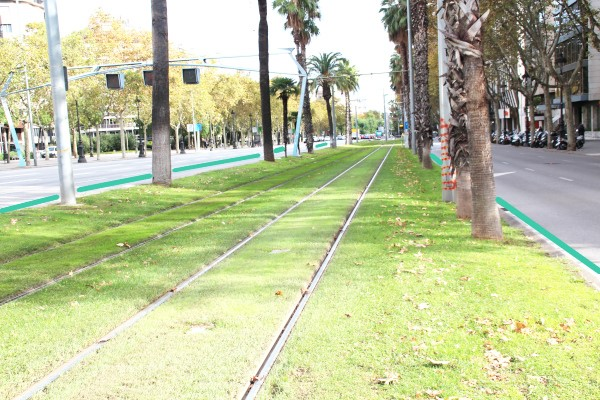
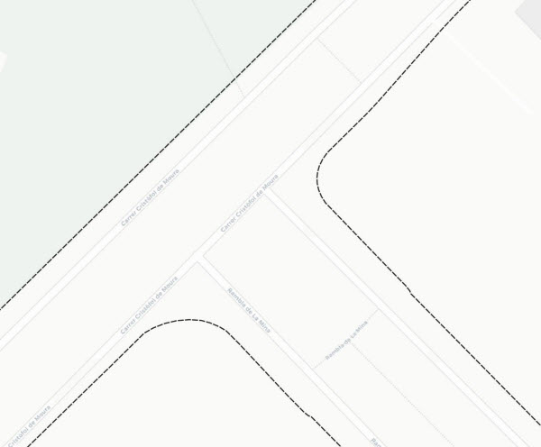

## 01 Domini públic

 

>  Grup: Obra Civil · Número elements: 2

 

Categoria on es defineixen els límits del domini públic tramviari i la seva zona de protecció segons la Llei 4/2006, ferroviària, de Catalunya.

 

### 001 Infraestructura tramviària

> `Identificador: 01001 | Codi: PLA | Geometria: POLÍGON`

 

Límit del domini públic tramviari. Són de domini públic els terrenys ocupats per la infraestructura tramviària, incloent-hi, en tots els casos, els ocupats per la plataforma de via i aquells on hi ha els elements funcionals o les instal·lacions afectes a l'ús i l'explotació del tramvia. També formen part del domini públic afecte al servei tramviari el subsòl i la projecció vertical dels terrenys ocupats per la infraestructura tramviària, de la manera que es determini per reglament (art. 40.1 Llei 4/2006, ferroviària, de Catalunya).

 

 

**Atributs**

| Atribut       | Tipus    | Descripció  |
| ------------- |:-------------| :-----|
| XARXA         | Indica a la xarxa a la qual pertany la infraestructura tramviària. Actualment Trambaix (TBX) o bé Trambesòs (TBS). En un futur es podran incloure altres xarxes encara no definides. | [String (20)] |
| CODI_ACTIU    | Codi que identifica un element en el GIS de forma unívoca. Està format per 4 parts separades per un guió. Comença amb el prefix TRM, després el codi de l'element segons el model de dades, un numero de dos dígits que indica l'operador o creador i un número de 5 dígits que identifica l'element al GIS de forma única.      |   [String (20)] |

 

**Representació GIS:**

 

 

    Nom capa element: Infra-tram
    Nom taula DB: atmgis_01_infraestructura_tramviaria
    Nom camp geometria DB: geom
    Representació gràfica:

    [weight: '0.35', dasharray: '3 1', color: '#707070', fillcolor: '#fcf9ea', fillopacity: '56', fillstyle: 'solid']

  

### 002 Franja protecció

> `Identificador: 01002 | Codi: FRP | Geometria: POLÍGON`

 

Zona de protecció contigua al domini públic. La zona de protecció és contigua al domini públic i consisteix en una franja de terreny de vuit metres comptats des de les arestes exteriors de la plataforma de via. Aquesta franja s'ha de reduir en zones de sòl urbà consolidat, a proposta de l'ajuntament afectat i amb l'informe previ favorable de l'administració titular de la infraestructura tramviària. En la zona de protecció, no s'hi poden executar obres i solament s'hi permeten els usos que són compatibles amb la seguretat del trànsit tramviari (art 40.3 Llei 4/2006, ferroviària, de Catalunya).

 

 

**Atributs**

| Atribut       | Tipus    | Descripció  |
| ------------- |:-------------| :-----|
| XARXA         | Indica a la xarxa a la qual pertany la infraestructura tramviària. Actualment Trambaix (TBX) o bé Trambesòs (TBS). En un futur es podran incloure altres xarxes encara no definides. | [String (20)] |
| CODI_ACTIU    | Codi que identifica un element en el GIS de forma unívoca. Està format per 4 parts separades per un guió. Comença amb el prefix TRM, després el codi de l'element segons el model de dades, un numero de dos dígits que indica l'operador o creador i un número de 5 dígits que identifica l'element al GIS de forma única.      |   [String (20)] |

 

**Representació GIS:**

 

 

    Nom capa element: franja-protecció
    Nom taula DB: atmgis_01_franja_proteccio
    Nom camp geometria DB: geom
    Representació gràfica:

        [weight: '0.26', dasharray: '3 1', color: '#282828']
