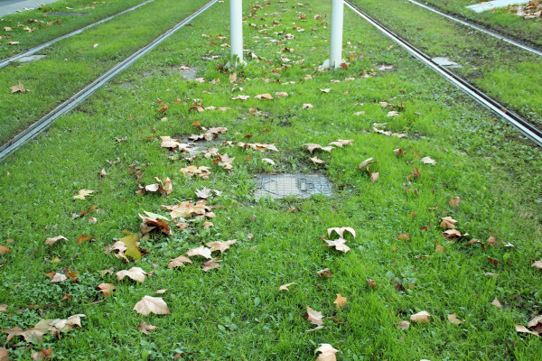
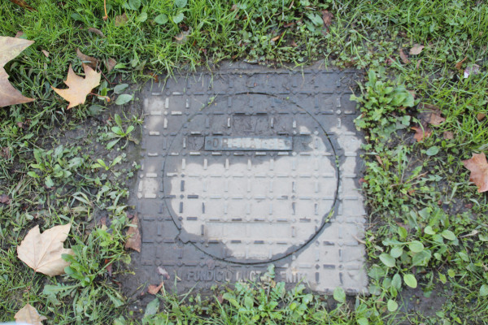
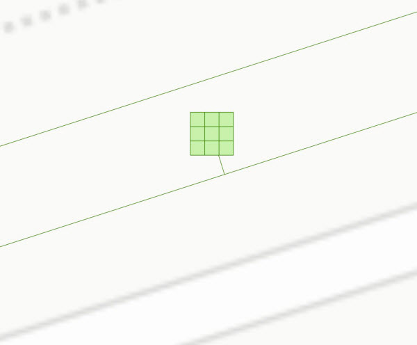
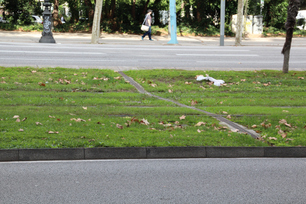
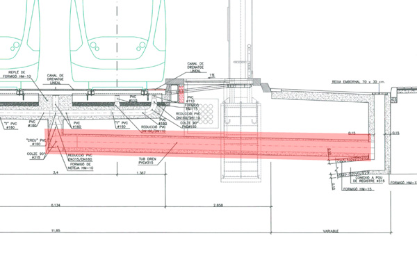
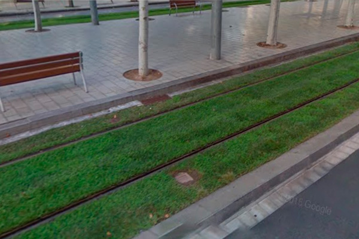
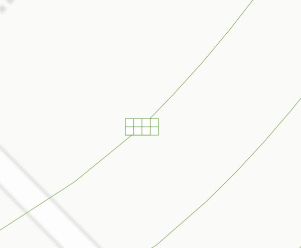
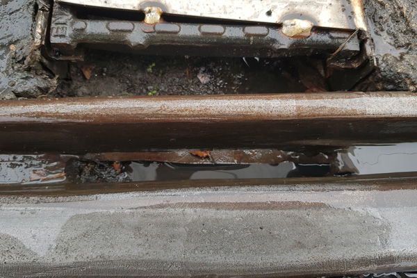
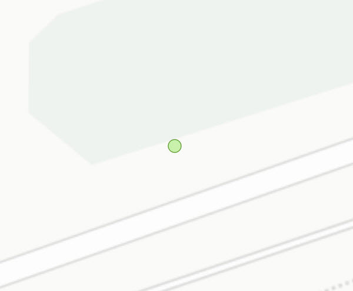

## 06 Drenatge

 

>  Grup: Obra Civil · Número elements: 7

 

El drenatge és el sistema que elimina l'aigua excedent del reg o la pluja, desviant-la cap a la xarxa de col·lectors.

 

### 001 Pericons

> `Identificador: 06001 | Codi: ARD | Geometria: PUNT`

 

Pericó del sistema de drenatge. Un pericó és una caixa d'obra o prefabricada utilitzada per rebre, enllaçar i distribuir canalitzacions o conductes subterranis. Solen estar enterrats i tenen una tapa a la part superior per a poder accedir-hi i procedir al seu registre o netejar el seu interior.

 

 
Foto de detall:
 

 

**Atributs**

| Atribut       | Tipus    | Descripció  |
| ------------- |:-------------| :-----|
| XARXA         | Indica a la xarxa a la qual pertany la infraestructura tramviària. Actualment Trambaix (TBX) o bé Trambesòs (TBS). En un futur es podran incloure altres xarxes encara no definides. | [String (20)] |
| CODI_ACTIU    | Codi que identifica un element en el GIS de forma unívoca. Està format per 4 parts separades per un guió. Comença amb el prefix TRM, després el codi de l'element segons el model de dades, un numero de dos dígits que indica l'operador o creador i un número de 5 dígits que identifica l'element al GIS de forma única.      |   [String (20)] |
| TIPUS | Indica el tipus i les dimensions del pericó de drenatge . L'atribut ha de tenir un dels següents valors:<ul><li>**20x20**: Indica que es tracta d'un pericó de drenatge de tipus 20x20. </li><li>**60x60**: Indica que es tracta d'un pericó de drenatge de tipus 60x60. </li><li>**D160**: Indica que es tracta d'un pericó de drenatge de tipus D160. </li><li>**Desguas 400**: Indica que es tracta d'un pericó de drenatge de tipus desguàs 400. </li>| [String (20)] |

 

**Representació GIS:**

 

 

    Nom capa element: Drenatge_pericons
    Nom taula DB: atmgis_06_pericons
    Nom camp geometria DB: geom
    Representació gràfica:

        [symbol: 'perico.svg', size: '2.5', weight: '0.3', color: '#398404', fillcolor: '#c8f2ab']

  

### 002 Drenatges centrals i laterals

> `Identificador: 06002 | Codi: DRE | Geometria: LÍNIA`

 

Drenatges centrals i laterals. Els drenatges centrals i laterals de la plataforma són un tubs de PVC enterrats que recullen l'aigua excedent acumulada a la plataforma del tramvia.

 

 

**Atributs**

| Atribut       | Tipus    | Descripció  |
| ------------- |:-------------| :-----|
| XARXA         | Indica a la xarxa a la qual pertany la infraestructura tramviària. Actualment Trambaix (TBX) o bé Trambesòs (TBS). En un futur es podran incloure altres xarxes encara no definides. | [String (20)] |
| CODI_ACTIU    | Codi que identifica un element en el GIS de forma unívoca. Està format per 4 parts separades per un guió. Comença amb el prefix TRM, després el codi de l'element segons el model de dades, un numero de dos dígits que indica l'operador o creador i un número de 5 dígits que identifica l'element al GIS de forma única.      |   [String (20)] |
| TIPUS | Indica la tipologia del drenatge. Pot ser central o lateral. L'atribut ha de tenir un dels següents valors:<ul><li>**Central**: Defineix que es tracta d'un drenatge central. </li><li>**Lateral**: Defineix que es tracta d'un drenatge lateral. </li><li>**Col·lector**: Defineix que es tracta d'un drenatge de col·lector. </li>| [String (20)] |
| DIAMETRE | Indica el diàmetre del tub en mm. L'atribut ha de tenir un dels següents valors:<ul><li>**DN 90**: Defineix que el diàmetre del tub de drenatge és de 90 mm. </li><li>**DN 110**: Defineix que el diàmetre del tub de drenatge és de 110 mm. </li><li>**DN 160**: Defineix que el diàmetre del tub de drenatge és de 160 mm. </li><li>**DN 200**: Defineix que el diàmetre del tub de drenatge és de 200 mm. </li> | [String (10)] |

 

**Representació GIS:**

 

 

    Nom capa element: Drenatge_lat_cen
    Nom taula DB: atmgis_06_drenatges_centrals_i_laterals
    Nom camp geometria DB: geom
    Representació gràfica:

        [weight: '0.26', dasharray: 'continua', color: '#398404']

  

### 003 Reixa

> `Identificador: 06003 | Codi: REI | Geometria: POLÍGON`

 

Reixa de drenatge. Reixa, generalment metàl·lica, que recull l'excés d'aigua de la superfície de la plataforma per portar-la als tubs de drenatge enterrats.

 

 
Foto de detall:
 

 

**Atributs**

| Atribut       | Tipus    | Descripció  |
| ------------- |:-------------| :-----|
| XARXA         | Indica a la xarxa a la qual pertany la infraestructura tramviària. Actualment Trambaix (TBX) o bé Trambesòs (TBS). En un futur es podran incloure altres xarxes encara no definides. | [String (20)] |
| CODI_ACTIU    | Codi que identifica un element en el GIS de forma unívoca. Està format per 4 parts separades per un guió. Comença amb el prefix TRM, després el codi de l'element segons el model de dades, un numero de dos dígits que indica l'operador o creador i un número de 5 dígits que identifica l'element al GIS de forma única.      |   [String (20)] |
| MIDES | Indica les mides de les reixes de drenatge. Unitats en metres. | [String (15)] |
| TIPUS | Fa referència a la tipologia de la reixa de drenatge. Aquesta pot ser transversal o longitudinal. L'atribut ha de tenir un dels següents valors:<ul><li>**Transversal**: Defineix que la reixa de drenatge és de tipus transversal. [**Veure**](img/0600311.jpg) </li><li>**Longitudinal**: Defineix que la reixa de drenatge és de tipus longitudinal. </li>| [String (20)] |

 

**Representació GIS:**

 

 

    Nom capa element: Drenatge_reixa
    Nom taula DB: atmgis_06_reixa
    Nom camp geometria DB: geom
    Representació gràfica:

        [weight: '0.3', dasharray: 'continua', color: '#398404', fillcolor: '#c8f2ab', fillstyle: 'solid']

  

### 004 Tubs de desguàs

> `Identificador: 06004 | Codi: TUD | Geometria: LÍNIA`

 

Tubs de PVC per a la sortida del drenatge. Tubs de PVC que connecten els drenatges de la plataforma amb la xarxa de col·lectors municipal/metropolitana.

 

 

**Atributs**

| Atribut       | Tipus    | Descripció  |
| ------------- |:-------------| :-----|
| XARXA         | Indica a la xarxa a la qual pertany la infraestructura tramviària. Actualment Trambaix (TBX) o bé Trambesòs (TBS). En un futur es podran incloure altres xarxes encara no definides. | [String (20)] |
| CODI_ACTIU    | Codi que identifica un element en el GIS de forma unívoca. Està format per 4 parts separades per un guió. Comença amb el prefix TRM, després el codi de l'element segons el model de dades, un numero de dos dígits que indica l'operador o creador i un número de 5 dígits que identifica l'element al GIS de forma única.      |   [String (20)] |
| TIPUS | Indica la tipologia de tub que forma el tub de sortida de drenatge. Per exemple: D200, PVC135, … | [String (20)] |

 

**Representació GIS:**

 

 

    Nom capa element: Drenatge_sortida
    Nom taula DB: atmgis_06_tubs_de_desguas
    Nom camp geometria DB: geom
    Representació gràfica:

        [symbol: 'fletxa.svg', size: '1.5', weight: '0.4', dasharray: '4 4', color: '#398404']

  

### 005 Embornals de plataforma

> `Identificador: 06005 | Codi: EMB | Geometria: PUNT`

 

Embornals situats a la plataforma del tramvia. Els embornals són forats de desguàs practicat a un costat de la plataforma, generalment vora les vorades que la delimiten.

 

 

**Atributs**

| Atribut       | Tipus    | Descripció  |
| ------------- |:-------------| :-----|
| XARXA         | Indica a la xarxa a la qual pertany la infraestructura tramviària. Actualment Trambaix (TBX) o bé Trambesòs (TBS). En un futur es podran incloure altres xarxes encara no definides. | [String (20)] |
| CODI_ACTIU    | Codi que identifica un element en el GIS de forma unívoca. Està format per 4 parts separades per un guió. Comença amb el prefix TRM, després el codi de l'element segons el model de dades, un numero de dos dígits que indica l'operador o creador i un número de 5 dígits que identifica l'element al GIS de forma única.      |   [String (20)] |

 

**Representació GIS:**

 

 

    Nom capa element: Drenatge_embornals
    Nom taula DB: atmgis_06_embornals_de_plataforma
    Nom camp geometria DB: geom
    Representació gràfica:

        [symbol: 'embornal.svg', size: '3', weight: '0.3', color: '#398404']

  

### 006 Drenatge vertical

> `Identificador: 06006 | Codi: CAD | Geometria: PUNT`

 

Sistemes drenants del propi del carril, aparells de via i altres. El drenatge de carril s'encarrega de drenar l'aigua circulant per la gorja del carril o bé del fons de les caixes d'aparells de via.

 

 
Foto de detall:
 

 

**Atributs**

| Atribut       | Tipus    | Descripció  |
| ------------- |:-------------| :-----|
| XARXA         | Indica a la xarxa a la qual pertany la infraestructura tramviària. Actualment Trambaix (TBX) o bé Trambesòs (TBS). En un futur es podran incloure altres xarxes encara no definides. | [String (20)] |
| CODI_ACTIU    | Codi que identifica un element en el GIS de forma unívoca. Està format per 4 parts separades per un guió. Comença amb el prefix TRM, després el codi de l'element segons el model de dades, un numero de dos dígits que indica l'operador o creador i un número de 5 dígits que identifica l'element al GIS de forma única.      |   [String (20)] |
| TIPUS | Indica el tipus de drenatge vertical. L'atribut ha de tenir un dels següents valors:<ul><li>**Carril**: Drenatge de carril. </li><li>**Aparell de via**: Drenatge d'aparells de via. </li><li>**Altres**: Altres drenatges verticals. </li><li>**Col·lector**: Drenatges verticals de col·lector. </li>| [String (20)] |

 

**Representació GIS:**

 

 

    Nom capa element: Drenatge_dren_vertical
    Nom taula DB: atmgis_06_drenatge_vertical
    Nom camp geometria DB: geom
    Representació gràfica:

        [symbol: 'punt_drenatge_vertical.svg', size: '1.2', weight: 'sin borde', color: '#398404', fillcolor: '#398404']

  

### 007 Punt de connexió

> `Identificador: 06007 | Codi: PCO | Geometria: PUNT`

 

Punt de connexió amb el desguàs general. S'utilitza per indicar el destí final dels tubs de desguàs.

 

 

**Atributs**

| Atribut       | Tipus    | Descripció  |
| ------------- |:-------------| :-----|
| XARXA         | Indica a la xarxa a la qual pertany la infraestructura tramviària. Actualment Trambaix (TBX) o bé Trambesòs (TBS). En un futur es podran incloure altres xarxes encara no definides. | [String (20)] |
| CODI_ACTIU    | Codi que identifica un element en el GIS de forma unívoca. Està format per 4 parts separades per un guió. Comença amb el prefix TRM, després el codi de l'element segons el model de dades, un numero de dos dígits que indica l'operador o creador i un número de 5 dígits que identifica l'element al GIS de forma única.      |   [String (20)] |
| TIPUS | Indica el tipus de punt de connexió. L'atribut ha de tenir un dels següents valors:<ul><li>**Embornal**: El punt de connexió és un embornal fora de la plataforma. </li><li>**Col·lector**: El punt de connexió és un col·lector. </li><li>**Emboreixa**: El punt de connexió és de tipus Emboreixa. </li> | [String (20)] |

 

**Representació GIS:**

 

 

    Nom capa element: Drenatge_punt_connexio
    Nom taula DB: atmgis_06_punt_de_connexio
    Nom camp geometria DB: geom
    Representació gràfica:

        [symbol: 'punt_drenatge_vertical.svg', size: '2', weight: '0.4', color: '#398404', fillcolor: '#c8f2ab']
