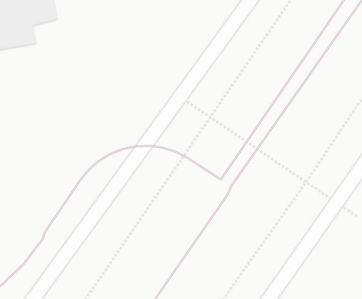
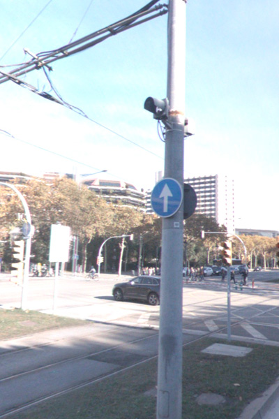
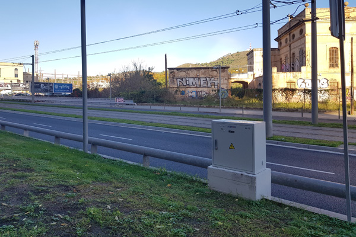
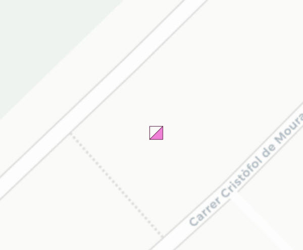
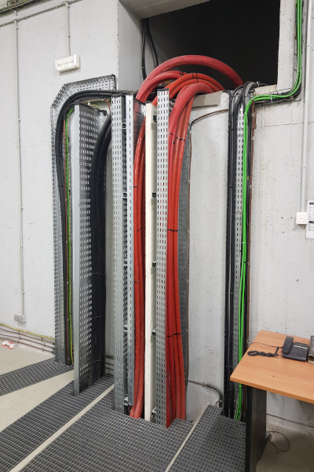
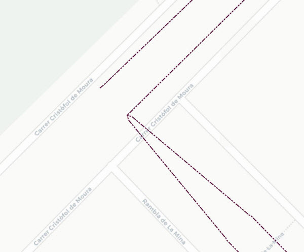

## 10 Energia

 

>  Grup: Sistemes Tramviaris · Número elements: 4

 

Són el conjunt d'elements que fan arribar l'energia elèctrica des de la companyia subministradora fins als centres de transformació i rectificació (subestacions) i d'aquí fins als diferents consums, com la línia aèria de contacte (LAC).

 

### 001 Feeder

> `Identificador: 10001 | Codi: FED | Geometria: LÍNIA`

 

Feeder o cable d'acompanyament de la LAC. El feeder (positiu) és un cable d'alimentació elèctrica de 750Vcc, normalment d'alumini i 1000 mm² de secció, que acompanya la LAC per la multitubular i que es connecta als dos fils de contacte en intervals regulars per suplir la caiguda de potencial. Les connexions als fils de contacte es duen a terme per mitjà uns armaris dels qual surten dos cables, de Cu i 240 mm², un per a cada via.

 

 

**Atributs**

| Atribut       | Tipus    | Descripció  |
| ------------- |:-------------| :-----|
| XARXA         | Indica a la xarxa a la qual pertany la infraestructura tramviària. Actualment Trambaix (TBX) o bé Trambesòs (TBS). En un futur es podran incloure altres xarxes encara no definides. | [String (20)] |
| CODI_ACTIU    | Codi que identifica un element en el GIS de forma unívoca. Està format per 4 parts separades per un guió. Comença amb el prefix TRM, després el codi de l'element segons el model de dades, un numero de dos dígits que indica l'operador o creador i un número de 5 dígits que identifica l'element al GIS de forma única.      |   [String (20)] |
| VIA | Determina sobre quin número de via es troba l'element. Els números de via són 1, 2, 3 i 4. | [String (20)] |
| TIPUS | Indica el tipus de feeder existent. L'atribut ha de tenir un dels següents valors:<ul><li>**1x1000 AL-XLPE/PVC**: Defineix el tipus de Feeder com a 1x1000 AL-XLPE/PVC </li> | [String (20)]|

 

**Representació GIS:**

 

 

    Nom capa element: Energia-feeder
    Nom taula DB: atmgis_10_feeder
    Nom camp geometria DB: geom
    Representació gràfica:

        part 1 [weight: '0.6', dasharray: 'continua', color: '#ffffff']
        part 2 [weight: '1', dasharray: 'continua', color: '#af6a95']

  

### 002 Indicadors de tensió

> `Identificador: 10002 | Codi: IND | Geometria: PUNT`

 

Senyal lluminós que indica la presència de tensió en una secció elèctrica. Dispositius verificadors de tensió elèctrica destinats a la detecció i indicació, mitjançant un senyal, de l'absència o la presència de tensió en una secció elèctrica de la línia aèria de contacte (catenària).

 

 
Foto de detall:
 

 

**Atributs**

| Atribut       | Tipus    | Descripció  |
| ------------- |:-------------| :-----|
| XARXA         | Indica a la xarxa a la qual pertany la infraestructura tramviària. Actualment Trambaix (TBX) o bé Trambesòs (TBS). En un futur es podran incloure altres xarxes encara no definides. | [String (20)] |
| CODI_ACTIU    | Codi que identifica un element en el GIS de forma unívoca. Està format per 4 parts separades per un guió. Comença amb el prefix TRM, després el codi de l'element segons el model de dades, un numero de dos dígits que indica l'operador o creador i un número de 5 dígits que identifica l'element al GIS de forma única.      |   [String (20)] |

 

**Representació GIS:**

 

 

    Nom capa element: Energia-indicadors de tensió
    Nom taula DB: atmgis_10_indicadors_de_tensio
    Nom camp geometria DB: geom
    Representació gràfica:

        [symbol: 'indicador_tensio.svg', angle: '180', size: '3', weight: '0.3', color: '#550a38', fillcolor: '#ef81d8']

  

### 003 Armaris

> `Identificador: 10003 | Codi: ARM | Geometria: PUNT`

 

Armaris de gestió d'energia. Armaris vora el traçat de la via que contenen els diferents elements electromecànics per al seccionament i alimentació de la catenària.

 

 
Foto de detall:
 

 

**Atributs**

| Atribut       | Tipus    | Descripció  |
| ------------- |:-------------| :-----|
| XARXA         | Indica a la xarxa a la qual pertany la infraestructura tramviària. Actualment Trambaix (TBX) o bé Trambesòs (TBS). En un futur es podran incloure altres xarxes encara no definides. | [String (20)] |
| CODI_ACTIU    | Codi que identifica un element en el GIS de forma unívoca. Està format per 4 parts separades per un guió. Comença amb el prefix TRM, després el codi de l'element segons el model de dades, un numero de dos dígits que indica l'operador o creador i un número de 5 dígits que identifica l'element al GIS de forma única.      |   [String (20)] |
| NOM | Indica la nomenclatura interna de l’armari . | [String (30)] |
| TIPUS | Determina els diferents tipus d'armaris: IAT, SAT, DAT o Feeder. L'atribut ha de tenir un dels següents valors:<ul><li>**Feeder**: Defineix que l'armari és de tipus Feeder. </li><li>**SAT**:  Defineix que l'armari és de tipus SAT. </li><li>**IAT**: Defineix que l'armari és de tipus IAT. </li><li>**DAT**:Defineix que l'armari és de tipus DAT. </li> | [String (20)]|

 

**Representació GIS:**

 

 

    Nom capa element: Energia-armaris
    Nom taula DB: atmgis_10_armaris
    Nom camp geometria DB: geom
    Representació gràfica:

        [symbol: 'armari.svg', angle: '90', size: '3', weight: '0.3', color: '#550a38', fillcolor: '#ef81d8']

  

### 004 Cablejat de distribució

> `Identificador: 10004 | Codi: CMT | Geometria: LÍNIA`

 

Cable d'alimentació de mitja tensió (25 kVca). Cable d'energia de 25 kVca que alimenta les diferents subestacions des de l'escomesa de companyia.

 

 

**Atributs**

| Atribut       | Tipus    | Descripció  |
| ------------- |:-------------| :-----|
| XARXA         | Indica a la xarxa a la qual pertany la infraestructura tramviària. Actualment Trambaix (TBX) o bé Trambesòs (TBS). En un futur es podran incloure altres xarxes encara no definides. | [String (20)] |
| CODI_ACTIU    | Codi que identifica un element en el GIS de forma unívoca. Està format per 4 parts separades per un guió. Comença amb el prefix TRM, després el codi de l'element segons el model de dades, un numero de dos dígits que indica l'operador o creador i un número de 5 dígits que identifica l'element al GIS de forma única.      |   [String (20)] |
| TIPUS | Tipus de cable del cablejat de distribució. Pot ser unipolar o multipolar. L'atribut ha de tenir un dels següents valors:<ul><li>**Multipolar**: Defineix que el cablejat de distribució és de tipus multipolar.[**Veure**](img/1000411.jpg) </li><li>**Unipolar**:  Defineix que el cablejat de distribució és de tipus unipolar. [**Veure**](img/1000412.jpg) </li><li>**Tripolar 3 x 35**: Defineix que el cablejat de distribució és de tipus Tripolar 3 x 35. </li><li>**Tripolar 3 x 70**: Defineix que el cablejat de distribució és de tipus Tripolar 3 x 70. </li><li>**Unipolar 1 x 120**: Defineix que el cablejat de distribució és de tipus Unipolar 1 x 120. </li> | [String (20)] |

 

**Representació GIS:**

 

 

    Nom capa element: Energia-cablejat distribució
    Nom taula DB: atmgis_10_cablejat_de_distribucio
    Nom camp geometria DB: geom
    Representació gràfica:

        [weight: '0.3', dasharray: '3 1 2 1 2', color: '#550a38']
