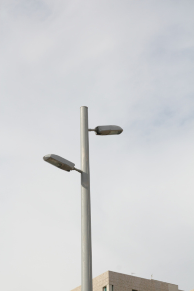
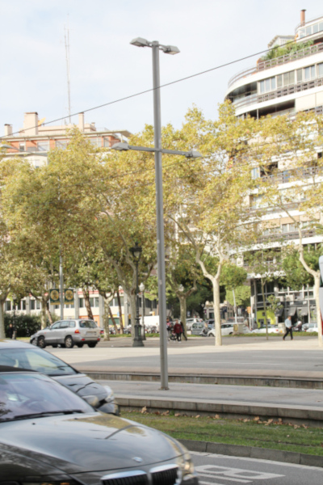
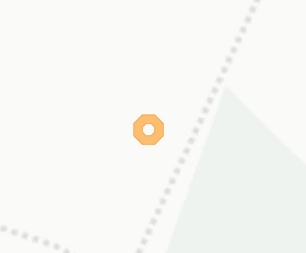
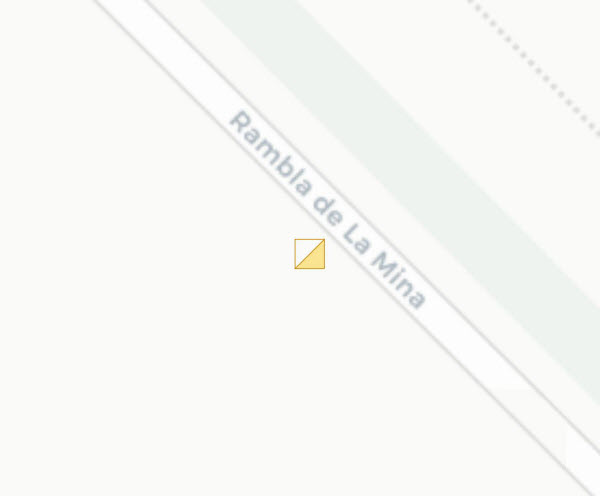

## 07 Enllumenat

 

>  Grup: Obra Civil · Número elements: 5

 

Es tracta del conjunt d'elements (punts de llum, suports, línies, etc.) presents a la plataforma del tramvia que il·luminen tant l'àmbit de la parada, la plataforma del tramvia i, en ocasions, la resta de la via pública.

 

### 001 Línies

> `Identificador: 07001 | Codi: LIN | Geometria: LÍNIA`

 

Estesa de cable elèctric que porta electricitat als punts de llum. Es tracta del cablejat que forma part del sistema d'enllumenat juntament amb els punts de llum i els alimenta.

 

 

**Atributs**

| Atribut       | Tipus    | Descripció  |
| ------------- |:-------------| :-----|
| XARXA         | Indica a la xarxa a la qual pertany la infraestructura tramviària. Actualment Trambaix (TBX) o bé Trambesòs (TBS). En un futur es podran incloure altres xarxes encara no definides. | [String (20)] |
| CODI_ACTIU    | Codi que identifica un element en el GIS de forma unívoca. Està format per 4 parts separades per un guió. Comença amb el prefix TRM, després el codi de l'element segons el model de dades, un numero de dos dígits que indica l'operador o creador i un número de 5 dígits que identifica l'element al GIS de forma única.      |   [String (20)] |
| QUADRE | Indica el quadre de comandament al qual està connectada la línia. | [String (200)] |

 

**Representació GIS:**

 

 

    Nom capa element: Enllumenat-linies
    Nom taula DB: atmgis_07_linies
    Nom camp geometria DB: geom
    Representació gràfica:

        [weight: '0.3', dasharray: '3 1', color: '#f8d01a']

  

### 002 Punts de llum

> `Identificador: 07002 | Codi: LUM | Geometria: PUNT`

 

Punts de llum dins de la plataforma del tramvia. Es tracta de les lluminàries, ja siguin de parada o d'enllumenat de via pública, ubicades dins de la plataforma tramviària.

 

 

**Atributs**

| Atribut       | Tipus    | Descripció  |
| ------------- |:-------------| :-----|
| XARXA         | Indica a la xarxa a la qual pertany la infraestructura tramviària. Actualment Trambaix (TBX) o bé Trambesòs (TBS). En un futur es podran incloure altres xarxes encara no definides. | [String (20)] |
| CODI_ACTIU    | Codi que identifica un element en el GIS de forma unívoca. Està format per 4 parts separades per un guió. Comença amb el prefix TRM, després el codi de l'element segons el model de dades, un numero de dos dígits que indica l'operador o creador i un número de 5 dígits que identifica l'element al GIS de forma única.      |   [String (20)] |
| TIPUS | Indica el model de lluminària emprat per al punt de llum. | [String (20)] |
| POTENCIA | Fa referència a la potència de la lluminària en watts. | [String (20)] |

 

**Representació GIS:**

 

 

    Nom capa element: Enllumenat-Punts de llum
    Nom taula DB: atmgis_07_punts_de_llum
    Nom camp geometria DB: geom
    Representació gràfica:

        [symbol: 'punt_llum.svg', size: '5', weight: '0.4', color: '#fab92c', fillcolor: '#f8d01a']

  

### 003 Columnes

> `Identificador: 07003 | Codi: COL | Geometria: PUNT`

 

Pals amb dedicació exclusiva a l'enllumenat. Columnes que sustenten els diferents punts de llum al llarg de la plataforma del tramvia.

 

 

**Atributs**

| Atribut       | Tipus    | Descripció  |
| ------------- |:-------------| :-----|
| XARXA         | Indica a la xarxa a la qual pertany la infraestructura tramviària. Actualment Trambaix (TBX) o bé Trambesòs (TBS). En un futur es podran incloure altres xarxes encara no definides. | [String (20)] |
| CODI_ACTIU    | Codi que identifica un element en el GIS de forma unívoca. Està format per 4 parts separades per un guió. Comença amb el prefix TRM, després el codi de l'element segons el model de dades, un numero de dos dígits que indica l'operador o creador i un número de 5 dígits que identifica l'element al GIS de forma única.      |   [String (20)] |
| TIPUS | Indica el tipus de columna sobre la que se sustenta el punt de llum. L'atribut ha de tenir un dels següents valors:<ul><li>**Prim**: Indica que el tipus de columna de l'enllumenat és de tipus Prim. [**Veure**](img/0700311.pdf) </li><li>**Acer galvanizat**: Indica que el tipus de columna de l'enllumenat és de tipus Acer galvanitzat. </li><li>**Troncoconica**: Indica que el tipus de columna de l'enllumenat és de tipus Troncocònica. </li><li>**Catenaria**: Indica que el tipus de columna de l'enllumenat és de tipus Catenaria. </li><li>**Plus con soporte para catenaria**: Indica que el tipus de columna de l'enllumenat és de tipus Plus con soporte para catenaria. </li>| [String (40)] |
| ALCADA | Indica l'alçada de la columna sobre la que se sustenta el punt de llum. Unitats en metres. | [Real (3)] |

 

**Representació GIS:**

 

 

    Nom capa element: Enllumenat-columnes
    Nom taula DB: atmgis_07_columnes
    Nom camp geometria DB: geom
    Representació gràfica:

        [symbol: 'pal.svg', size: '3', weight: '0.3', color: '#ff7f00', fillcolor: '#fdbf6f']

  

### 004 Elements LED de parada

> `Identificador: 07004 | Codi: LED | Geometria: PUNT`

 

Il·luminació LED de les parades. Es tracta de la il·luminació de tecnologia LED situada a les parades.

 

 
Foto de detall:
 

 

**Atributs**

| Atribut       | Tipus    | Descripció  |
| ------------- |:-------------| :-----|
| XARXA         | Indica a la xarxa a la qual pertany la infraestructura tramviària. Actualment Trambaix (TBX) o bé Trambesòs (TBS). En un futur es podran incloure altres xarxes encara no definides. | [String (20)] |
| CODI_ACTIU    | Codi que identifica un element en el GIS de forma unívoca. Està format per 4 parts separades per un guió. Comença amb el prefix TRM, després el codi de l'element segons el model de dades, un numero de dos dígits que indica l'operador o creador i un número de 5 dígits que identifica l'element al GIS de forma única.      |   [String (20)] |

 

**Representació GIS:**

 

 

    Nom capa element: Enllumenat-leds parada
    Nom taula DB: atmgis_07_elements_led_de_parada
    Nom camp geometria DB: geom
    Representació gràfica:

        [symbol: 'punt_reg.svg', size: '1.2', weight: 'sin borde', color: '#fab92c', fillcolor: '#f3bf4f']

  

### 005 Quadres Municipals

> `Identificador: 07005 | Codi: QMU | Geometria: PUNT`

 

Quadres d'enllumenat municipals. Són els quadres municipals que donen energia a l'enllumenat de via pública.

 

 

**Atributs**

| Atribut       | Tipus    | Descripció  |
| ------------- |:-------------| :-----|
| XARXA         | Indica a la xarxa a la qual pertany la infraestructura tramviària. Actualment Trambaix (TBX) o bé Trambesòs (TBS). En un futur es podran incloure altres xarxes encara no definides. | [String (20)] |
| CODI_ACTIU    | Codi que identifica un element en el GIS de forma unívoca. Està format per 4 parts separades per un guió. Comença amb el prefix TRM, després el codi de l'element segons el model de dades, un numero de dos dígits que indica l'operador o creador i un número de 5 dígits que identifica l'element al GIS de forma única.      |   [String (20)] |
| QUADRE | Indica el quadre de comandament al qual està connectada la línia. | [String (200)] |

 

**Representació GIS:**

 

 

    Nom capa element: Enllumenat- quadres municipals
    Nom taula DB: atmgis_07_quadres_municipals
    Nom camp geometria DB: geom
    Representació gràfica:

        [symbol: 'armari.svg', angle: '90', size: '3', weight: '0.3', color: '#cb8906', fillcolor: '#fae491']
