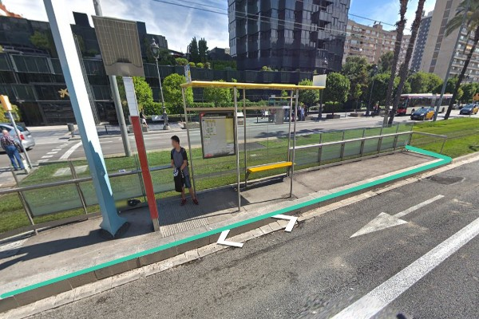
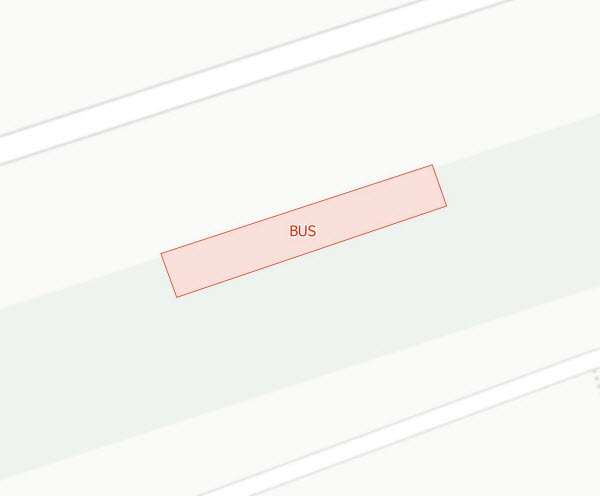
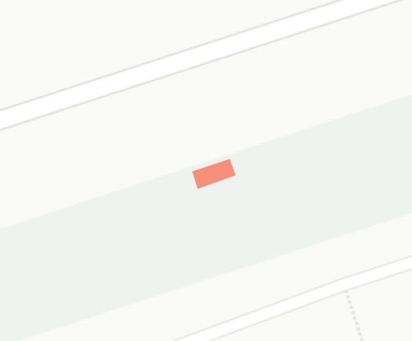

## 18 Mobiliari urbà

 

>  Grup: Sistemes Auxiliars · Número elements: 3

 

És el conjunt d'elements de l'espai urbà que tenen o poden tenir una relació amb el domini públic tramviari. És el cas dels arbres presents dins o a prop de la plataforma i de les parades d'autobús a continuació d'algunes parades de tramvia de la Diagonal - TBX.

 

### 001 Arbre

> `Identificador: 18001 | Codi: ARB | Geometria: PUNT`

 

Arbres plantats a la via pública. Es tracta d'arbres que han estat plantats en l'espai públic principalment sota criteris de qualitat paisatgística i ambiental.

 

 

**Atributs**

| Atribut       | Tipus    | Descripció  |
| ------------- |:-------------| :-----|
| XARXA         | Indica a la xarxa a la qual pertany la infraestructura tramviària. Actualment Trambaix (TBX) o bé Trambesòs (TBS). En un futur es podran incloure altres xarxes encara no definides. | [String (20)] |
| CODI_ACTIU    | Codi que identifica un element en el GIS de forma unívoca. Està format per 4 parts separades per un guió. Comença amb el prefix TRM, després el codi de l'element segons el model de dades, un numero de dos dígits que indica l'operador o creador i un número de 5 dígits que identifica l'element al GIS de forma única.      |   [String (20)] |
| COPA | Perímetre de la copa de l'arbre plantat en metres. | [String (20)] |
| EDAT | Edat de l'arbre plantat. | [String (20)] |
| ALCADA | Indica l'alçada total de l'arbre plantat. | [String (20)] |
| ESPECIE | Indica l'espècie de l'arbre plantat. | [String (20)] |
| ESCOCELL | Indica si l'arbre plantat disposa d'escocell o no. | [Boolean] |

 

**Representació GIS:**

 

 

    Nom capa element: Mobiliari urbà-arbre
    Nom taula DB: atmgis_18_arbre
    Nom camp geometria DB: geom
    Representació gràfica:

        [symbol: 'arbre.svg', size: '7', weight: '0.4', color: '#568436', fillcolor: '#eef69d']

  

### 002 Andanes de parada de bus

> `Identificador: 18002 | Codi: PBA | Geometria: POLÍGON`

 

Andanes de les parades de bus. Es tracta de les andanes d'aquelles parades d'autobús que es troben dins de la plataforma del tramvia.

 

 

**Atributs**

| Atribut       | Tipus    | Descripció  |
| ------------- |:-------------| :-----|
| XARXA         | Indica a la xarxa a la qual pertany la infraestructura tramviària. Actualment Trambaix (TBX) o bé Trambesòs (TBS). En un futur es podran incloure altres xarxes encara no definides. | [String (20)] |
| CODI_ACTIU    | Codi que identifica un element en el GIS de forma unívoca. Està format per 4 parts separades per un guió. Comença amb el prefix TRM, després el codi de l'element segons el model de dades, un numero de dos dígits que indica l'operador o creador i un número de 5 dígits que identifica l'element al GIS de forma única.      |   [String (20)] |

 

**Representació GIS:**

 

 

    Nom capa element: Mobiliari urbà-andana bus
    Nom taula DB: atmgis_18_andanes_de_parada_de_bus
    Nom camp geometria DB: geom
    Representació gràfica:

        [weight: '0.26', dasharray: 'continua', color: '#e02c07', fillcolor: '#fae0db', fillstyle: 'solid', labelby: 'bus']

  

### 003 Marquesines de parada de bus

> `Identificador: 18003 | Codi: PBM | Geometria: POLÍGON`

 

Marquesines de les parades de bus. Es tracta de les marquesines d'aquelles parades d'autobús que es troben ubicades dins de la plataforma del tramvia.

 

 

**Atributs**

| Atribut       | Tipus    | Descripció  |
| ------------- |:-------------| :-----|
| XARXA         | Indica a la xarxa a la qual pertany la infraestructura tramviària. Actualment Trambaix (TBX) o bé Trambesòs (TBS). En un futur es podran incloure altres xarxes encara no definides. | [String (20)] |
| CODI_ACTIU    | Codi que identifica un element en el GIS de forma unívoca. Està format per 4 parts separades per un guió. Comença amb el prefix TRM, després el codi de l'element segons el model de dades, un numero de dos dígits que indica l'operador o creador i un número de 5 dígits que identifica l'element al GIS de forma única.      |   [String (20)] |

 

**Representació GIS:**

 

 

    Nom capa element: Mobiliari urbà-marquesina bus
    Nom taula DB: atmgis_18_marquesines_de_parada_de_bus
    Nom camp geometria DB: geom
    Representació gràfica:

        [weight: '0.35', dasharray: 'null', color: '#f78f7a', fillcolor: '#f78f7a', fillstyle: 'solid']
