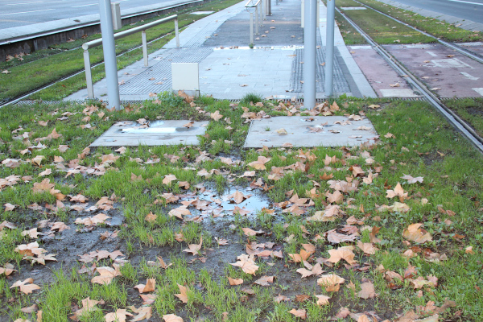
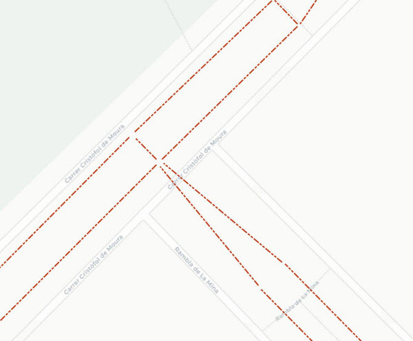

## 09 Multitubular

 

>  Grup: Sistemes Tramviaris · Número elements: 2

 

Conjunt de tubulars, continguts en un prisma de formigó enterrat o bé disposats en safates, que transcorre al llarg de la traça del tramvia i que contenen cablejat corresponent a diferents subsistemes tramviaris, tals com energia, enllumenat, telecomunicacions, semaforització i d'altres.

 

### 001 Pericons

> `Identificador: 09001 | Codi: ARQ | Geometria: POLÍGON`

 

Pericó de registre del prisma multitubular tramviari. Un pericó és una caixa d'obra o prefabricada utilitzada per rebre, enllaçar i distribuir canalitzacions o conductes subterranis. Solen estar enterrats i tenen una tapa a la part superior per a poder accedir-hi i procedir al seu registre o netejar el seu interior.

 

 
Foto de detall:
 

 

**Atributs**

| Atribut       | Tipus    | Descripció  |
| ------------- |:-------------| :-----|
| XARXA         | Indica a la xarxa a la qual pertany la infraestructura tramviària. Actualment Trambaix (TBX) o bé Trambesòs (TBS). En un futur es podran incloure altres xarxes encara no definides. | [String (20)] |
| CODI_ACTIU    | Codi que identifica un element en el GIS de forma unívoca. Està format per 4 parts separades per un guió. Comença amb el prefix TRM, després el codi de l'element segons el model de dades, un numero de dos dígits que indica l'operador o creador i un número de 5 dígits que identifica l'element al GIS de forma única.      |   [String (20)] |
| DIMENSIONS | Indica l'amplada i la longitud dels Pericons del multitubular en mm. | [String (15)] |
| CODI_ASBUILT | Codi provinent dels Asbuilts per identificar els elements. | [String (20)] |
| PROF_COTA_SUPERIOR | Indica la profunditat en la cota superior del pericó. | [Real (3)] |
| TIPUS | Indica el tipus de pericó de multitubular. Aquesta pot ser de tipus metàl·lica, formigó, o tapa. L'atribut ha de tenir un dels següents valors:<ul><li>**Formigo**: Defineixen el tipus d'arqueta de Formigó. </li><li>**Metalica**: Defineixen el tipus d'arqueta Metàl·lica. </li><li>**Tapa**: Defineixen l'arqueta de tipus Tapa. </li>| [String (20)] |
| MT | Indica si el pericó de multitubular allotja cablejat de MT (25 kV). | [Boolean] |
| FEEDER | Indica si el pericó de multitubular allotja cablejat d’alimentació de catenària (750 V).| [Boolean] |
| PROF_SOLERA | Indica la profunditat a la base on s'assenta el prisma multitubular. | [Real (3)] |

 

**Representació GIS:**

 

 

    Nom capa element: Multitubular-Pericons
    Nom taula DB: atmgis_09_pericons
    Nom camp geometria DB: geom
    Representació gràfica:

        [weight: '0.35', dasharray: 'continua', color: '#c53814', fillcolor: '#f39a84', fillstyle: 'solid']

  

### 002 Prisma

> `Identificador: 09002 | Codi: MUL | Geometria: LÍNIA`

 

Multitubular que allotja el cablejat de diferents subsistemes tramviaris. Canalitzacions o safates per on transcorren un conjunt de tubs corrugats plàstics que contenen cables associats als diferents subsistemes tramviaris (energia, comunicacions, enllumenat, ...) i, en ocasions, altres serveis (semaforització, ...).

 

 

**Atributs**

| Atribut       | Tipus    | Descripció  |
| ------------- |:-------------| :-----|
| XARXA         | Indica a la xarxa a la qual pertany la infraestructura tramviària. Actualment Trambaix (TBX) o bé Trambesòs (TBS). En un futur es podran incloure altres xarxes encara no definides. | [String (20)] |
| CODI_ACTIU    | Codi que identifica un element en el GIS de forma unívoca. Està format per 4 parts separades per un guió. Comença amb el prefix TRM, després el codi de l'element segons el model de dades, un numero de dos dígits que indica l'operador o creador i un número de 5 dígits que identifica l'element al GIS de forma única.      |   [String (20)] |
| LONGITUD | Indica la longitud del prisma multitubular en metres. | [Real (3)] |
| MATRIU | Indica les dimensions de la matriu que defineix les posicions dels tubs en la multitubular. Indicar amb format files x columnes, p.ex: 2x3 | [String (15)] |
| OCUPACIO | Indica quines posicions de la matriu estan ocupades indicant la mida (P-Petita o G-Gran), posició i tipus d'ocupació separats per espai. Cada nova ocupació es separa amb una coma. Els tubs no ocupats es consideraran buits (N). Per exemple: P 1 1 F, G 1 2 T, G 2 1 L | [String (3000)] |
| MT | Indica si hi ha allotjament de cablejat de MT (25 kV). | [boolean] |
| FEEDER | Indica si hi ha allotjament de cablejat d’alimentació de catenària (750 V). | [boolean] |
| TIPUS | Defineix la distribució interna dels prismes. L'atribut ha de tenir un dels següents valors:<ul><li>**Formigó soterrada**: Tipus de distribució </li><li>**Canaleta**: Tipus de distribució </li><li>**Safata galeria**: Tipus de distribució </li><li>**Safata vista**: Tipus de distribució </li><li>**Tub corrugat soterrat**: Tipus de distribució </li>| [String (80)] |

 

**Representació GIS:**

 

 

    Nom capa element: Multitubular-prisma
    Nom taula DB: atmgis_09_prisma
    Nom camp geometria DB: geom
    Representació gràfica:

        [weight: '0.4', dasharray: '3 1 2 1 2', color: '#c53814']
