## 03 Parades

 

> Grup: Obra Civil · Número elements: 16

 

Lloc en què para el tramvia perquè puguin pujar-hi els passatgers o baixar-ne. Les parades del tramvia estan equipades amb la infraestructura i sistemes necessaris per al resguard, informació i comunicació a disposició dels viatgers.

 

### 001 Andanes

> `Identificador: 03001 | Codi: AND | Geometria: POLÍGON`

 

Zona de trànsit d’usuaris a la parada. Plataforma elevada que permet el fàcil accés dels viatgers al tramvia. S'hi inclouen les rampes d'accés.

 

 

**Atributs**

| Atribut       | Tipus    | Descripció  |
| ------------- |:-------------| :-----|
| XARXA         | Indica a la xarxa a la qual pertany la infraestructura tramviària. Actualment Trambaix (TBX) o bé Trambesòs (TBS). En un futur es podran incloure altres xarxes encara no definides. | [String (20)] |
| CODI_ACTIU    | Codi que identifica un element en el GIS de forma unívoca. Està format per 4 parts separades per un guió. Comença amb el prefix TRM, després el codi de l'element segons el model de dades, un numero de dos dígits que indica l'operador o creador i un número de 5 dígits que identifica l'element al GIS de forma única.      |   [String (20)] |
| AMPLADA | Determina en metres l'amplada de l'andana. | [Real (3)] |
| LONGITUD | Determina en metres la longitud de l'andana. | [Real (3)] |
| VIA | Determina sobre quin número de via es troba l'element. Els números de via són 1, 2, 3 i 4. Si l'element està en més d'una via s'indicarà les vies separades per un guionet, per exemple: 1-2 | [String (20)] |
| CODI_PARADA | Fa referència al número de la parada. Nomenclatura P-XX on XX és el número de parada. | [String (20)] |
| PENDENT | Indica en % el pendent que té l'andana. | [Real (3)] |
| TIPUS | Fa referència a la tipologia d'andana. Aquesta pot ser central, lateral o en túnel. L'atribut ha de tenir un dels següents valors:<ul><li>**Central**: Defineix la posició de l'Andana com a Central. [**Veure**](img/0300111.jpg)</li><li>**Lateral**: Defineix la posició de l'Andana com a Lateral. [**Veure**](img/0300112.jpg)</li><li>**Coberta**: Indica que l'andana està coberta (túnel, …) [**Veure**](img/0300113.jpg)</li></ul> | [String (20)] |

 

**Representació GIS:**

 

 

    Nom capa element: Parades-andanes
    Nom taula DB: atmgis_03_andanes
    Nom camp geometria DB: geom
    Representació gràfica:

        [weight: '0.26', dasharray: 'continua', color: '#e02c07', fillcolor: '#fae0db', fillstyle: 'solid']

  

### 002 Marquesines

> `Identificador: 03002 | Codi: MAR | Geometria: POLÍGON`

 

Estructura metàl·lica per aixoplugar els usuaris. Coberta situada damunt l'andana per a oferir refugi als usuaris del sol, el vent o la pluja.

 

 

**Atributs**

| Atribut       | Tipus    | Descripció  |
| ------------- |:-------------| :-----|
| XARXA         | Indica a la xarxa a la qual pertany la infraestructura tramviària. Actualment Trambaix (TBX) o bé Trambesòs (TBS). En un futur es podran incloure altres xarxes encara no definides. | [String (20)] |
| CODI_ACTIU    | Codi que identifica un element en el GIS de forma unívoca. Està format per 4 parts separades per un guió. Comença amb el prefix TRM, després el codi de l'element segons el model de dades, un numero de dos dígits que indica l'operador o creador i un número de 5 dígits que identifica l'element al GIS de forma única.      |   [String (20)] |
| CODI_PARADA | Fa referència al número de la parada. Nomenclatura P-XX on XX és el número de parada. | [String (20)] |
| VIA | Determina sobre quin número de via es troba l'element. Els números de via són 1, 2, 3 i 4. Si l'element està en més d'una via s'indicarà les vies separades per un guionet, per exemple: 1-2 | [String (20)] |
| DOCUMENT_ASSOCIAT | Nom d'un o més documents associats amb plànols de diversos detalls de l'element en qüestió. | [String (20)] |

 

**Representació GIS:**

 

 

    Nom capa element: Parades-marquesines
    Nom taula DB: atmgis_03_marquesines
    Nom camp geometria DB: geom
    Representació gràfica:

        [weight: '0.35', dasharray: 'null', color: '#f78f7a', fillcolor: '#f78f7a', fillstyle: 'solid']

  

### 003 Moble tècnic

> `Identificador: 03003 | Codi: MOB | Geometria: POLÍGON`

 

Element principal del cos de la parada. Es tracta de l'estructura que acull tots els sistemes de la parada (armari de telecomunicacions, aparadors, SIV, DAB, megafonia, interfonia i quadre elèctric).

 

 

**Atributs**

| Atribut       | Tipus    | Descripció  |
| ------------- |:-------------| :-----|
| XARXA         | Indica a la xarxa a la qual pertany la infraestructura tramviària. Actualment Trambaix (TBX) o bé Trambesòs (TBS). En un futur es podran incloure altres xarxes encara no definides. | [String (20)] |
| CODI_ACTIU    | Codi que identifica un element en el GIS de forma unívoca. Està format per 4 parts separades per un guió. Comença amb el prefix TRM, després el codi de l'element segons el model de dades, un numero de dos dígits que indica l'operador o creador i un número de 5 dígits que identifica l'element al GIS de forma única.      |   [String (20)] |
| CODI_PARADA | Fa referència al número de la parada. Nomenclatura P-XX on XX és el número de parada. | [String (20)] |

 

**Representació GIS:**

 

 

    Nom capa element: Parades-moble tècnic
    Nom taula DB: atmgis_03_moble_tecnic
    Nom camp geometria DB: geom
    Representació gràfica:

        [weight: '0.4', dasharray: 'continua', color: '#e02c07', fillcolor: '#e7a493', fillstyle: 'solid']

  

### 004 Quadre elèctric

> `Identificador: 03004 | Codi: QBT | Geometria: PUNT`

 

Quadre general de baixa tensió de la parada. Quadre elèctric de baixa tensió per a la gestió energètica del conjunt d'elements de la parada.

 

 

**Atributs**

| Atribut       | Tipus    | Descripció  |
| ------------- |:-------------| :-----|
| XARXA         | Indica a la xarxa a la qual pertany la infraestructura tramviària. Actualment Trambaix (TBX) o bé Trambesòs (TBS). En un futur es podran incloure altres xarxes encara no definides. | [String (20)] |
| CODI_ACTIU    | Codi que identifica un element en el GIS de forma unívoca. Està format per 4 parts separades per un guió. Comença amb el prefix TRM, després el codi de l'element segons el model de dades, un numero de dos dígits que indica l'operador o creador i un número de 5 dígits que identifica l'element al GIS de forma única.      |   [String (20)] |
| VIA | Determina sobre quin número de via es troba l'element. Els números de via són 1, 2, 3 i 4. Si l'element està en més d'una via s'indicarà les vies separades per un guionet, per exemple: 1-2 | [String (20)] |
| CUP | Fa referència al número de contracte d’escomesa. | [String (20)] |
| POTENCIA | Indica la potència contractada del quadre elèctric. | [String (20)] |
| CODI_ENCLAVAMENT | Indica el codi d’enclavament del quadre elèctric. | [String (20)] |
| CODI_SUBESTACIO | Indica el codi de subestació amb que és alimentat el quadre elèctric. | [String (20)] |
| ESQUEMA_UNIFILAR | Conté un esquema de l'unifilar de l'armari. | [String (20)] |
| CODI_PARADA | Fa referència al número de la parada. Nomenclatura P-XX on XX és el número de parada. | [String (20)] |

 

**Representació GIS:**

 

 

    Nom capa element: Parades-qgtb
    Nom taula DB: atmgis_03_quadre_electric
    Nom camp geometria DB: geom
    Representació gràfica:

        [symbol: 'electric.svg', size: '1.3', weight: '0.5', color: '#e02c07']

  

### 005 Armari de telecomunicacions

> `Identificador: 03005 | Codi: TEL | Geometria: POLÍGON`

 

Armari que allotja equips de comunicacions. Armari situat al cos de la parada que allotja els equips de comunicacions del sistema tramviari.

 

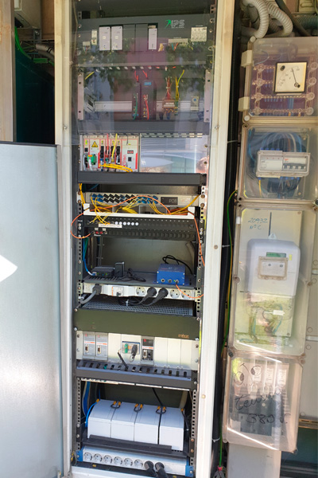

 

**Atributs**

| Atribut       | Tipus    | Descripció  |
| ------------- |:-------------| :-----|
| XARXA         | Indica a la xarxa a la qual pertany la infraestructura tramviària. Actualment Trambaix (TBX) o bé Trambesòs (TBS). En un futur es podran incloure altres xarxes encara no definides. | [String (20)] |
| CODI_ACTIU    | Codi que identifica un element en el GIS de forma unívoca. Està format per 4 parts separades per un guió. Comença amb el prefix TRM, després el codi de l'element segons el model de dades, un numero de dos dígits que indica l'operador o creador i un número de 5 dígits que identifica l'element al GIS de forma única.      |   [String (20)] |
| VIA | Determina sobre quin número de via es troba l'element. Els números de via són 1, 2, 3 i 4. Si l'element està en més d'una via s'indicarà les vies separades per un guionet, per exemple: 1-2 | [String (20)] |
| XOC | Indica la disponibilitat de fibra de Xarxa Oberta de Catalunya. | [boolean] |
| CODI_PARADA | Fa referència al número de la parada. Nomenclatura P-XX on XX és el número de parada. | [String (20)] |
| DOCUMENT_ASSOCIAT | Camp amb un document informatiu de l'armari de telecomunicacions. | [String (20)] |

 

**Representació GIS:**

 

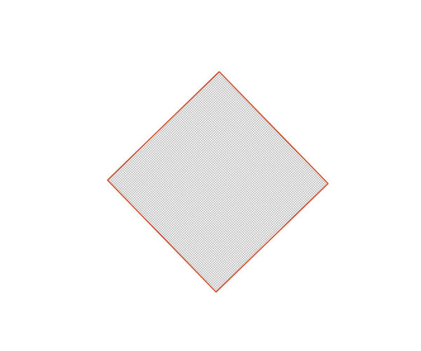

 

    Nom capa element: Parades-telecom
    Nom taula DB: atmgis_03_armari_de_telecomunicacions
    Nom camp geometria DB: geom
    Representació gràfica:

        [weight: '0.5', dasharray: 'continua', color: '#e02c07', fillcolor: '#7a7a7a', fillstyle: 'trama en x']

  

### 006 Distribuïdor automàtic de bitllets

> `Identificador: 03006 | Codi: DAB | Geometria: PUNT`

 

Distribuïdora automàtica de bitllets. Màquina per a la consulta, venda i/o càrrega de títols de transport.

 

 
Foto de detall:
 

 

**Atributs**

| Atribut       | Tipus    | Descripció  |
| ------------- |:-------------| :-----|
| XARXA         | Indica a la xarxa a la qual pertany la infraestructura tramviària. Actualment Trambaix (TBX) o bé Trambesòs (TBS). En un futur es podran incloure altres xarxes encara no definides. | [String (20)] |
| CODI_ACTIU    | Codi que identifica un element en el GIS de forma unívoca. Està format per 4 parts separades per un guió. Comença amb el prefix TRM, després el codi de l'element segons el model de dades, un numero de dos dígits que indica l'operador o creador i un número de 5 dígits que identifica l'element al GIS de forma única.      |   [String (20)] |
| VIA | Determina sobre quin número de via es troba l'element. Els números de via són 1, 2, 3 i 4. Si l'element està en més d'una via s'indicarà les vies separades per un guionet, per exemple: 1-2 | [String (20)] |
| CODI_INTERN | Codi intern de l'aparell de distribució automàtica de bitllets. | [Integer (20)] |
| CODI_PARADA | Fa referència al número de la parada. Nomenclatura P-XX on XX és el número de parada. | [String (20)] |

 

**Representació GIS:**

 

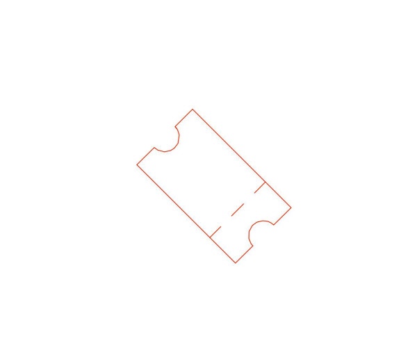

 

    Nom capa element: Parades-dab
    Nom taula DB: atmgis_03_distribuidor_automatic_de_bitllets
    Nom camp geometria DB: geom
    Representació gràfica:

        [symbol: 'ticket.svg', size: '1', weight: '0.4', color: '#e02c07']

  

### 007 SIV

> `Identificador: 03007 | Codi: SIV | Geometria: PUNT`

 

Sistema d’informació als viatgers. Pantalla per a la informació dels usuaris (temps properes sortides, incidències, etc.).

 

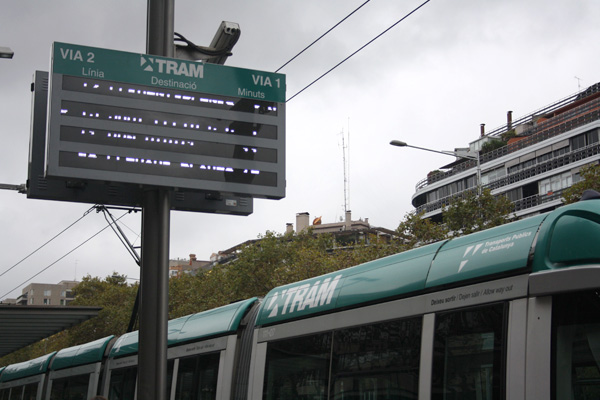

 
Foto de detall:
 

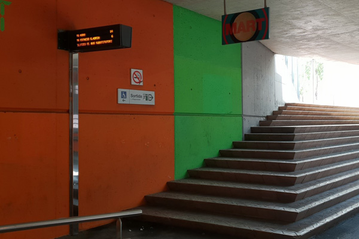

 

**Atributs**

| Atribut       | Tipus    | Descripció  |
| ------------- |:-------------| :-----|
| XARXA         | Indica a la xarxa a la qual pertany la infraestructura tramviària. Actualment Trambaix (TBX) o bé Trambesòs (TBS). En un futur es podran incloure altres xarxes encara no definides. | [String (20)] |
| CODI_ACTIU    | Codi que identifica un element en el GIS de forma unívoca. Està format per 4 parts separades per un guió. Comença amb el prefix TRM, després el codi de l'element segons el model de dades, un numero de dos dígits que indica l'operador o creador i un número de 5 dígits que identifica l'element al GIS de forma única.      |   [String (20)] |
| VIA | Determina sobre quin número de via es troba l'element. Els números de via són 1, 2, 3 i 4. Si l'element està en més d'una via s'indicarà les vies separades per un guionet, per exemple: 1-2 | [String (20)] |
| TECNOLOGIA | Fa referència a la tecnologia amb la que està muntat el sistema d'informació al viatger. La tecnologia pot ser LCD o LED . L'atribut ha de tenir un dels següents valors:<ul><li>**LCD**: Defineixen LCD com la tecnologia sobre la qual està muntat el Sistema d'informació als viatgers. [**Veure**](img/0300711.jpg)</li><li>**LED**: Defineixen LED com la tecnologia sobre la qual està muntat el Sistema d'informació als viatgers.</li></ul> | [String (20)] |
| TIPUS_UBICACIO | Determina el tipus d'ubicació del sistema d'informació al viatger. La ubicació pot ser pal, moble o marquesina. L'atribut ha de tenir un dels següents valors:<ul><li>**Pal**: Defineix que el suport del Sistema d'informació als viatgers és en Pal.</li><li>**Paret**: Defineix que el suport del Sistema d'informació als viatgers és en la Paret.</li><li>**Marquesina**: Defineix que el suport del Sistema d'informació als viatgers és en Marquesina.</li></ul>| [String (20)] |
| CODI_PARADA | Fa referència al número de la parada. Nomenclatura P-XX on XX és el número de parada. | [String (20)] |

 

**Representació GIS:**

 

 

    Nom capa element: Parades-siv
    Nom taula DB: atmgis_03_siv
    Nom camp geometria DB: geom
    Representació gràfica:

        [symbol: 'siv.svg', size: '1', weight: '0.4', color: '#e02c07']

  

### 008 Sistema d'interfonia

> `Identificador: 03008 | Codi: INT | Geometria: PUNT`

 

Sistema d’interfonia de la parada. Sistema d'interfonia (cablejat, micròfon, altaveu, etc.) incrustat dins del cos de la parada per a permetre la comunicació entre els usuaris i el Centre de Control en cas d'incidència o necessitat d'informació.

 

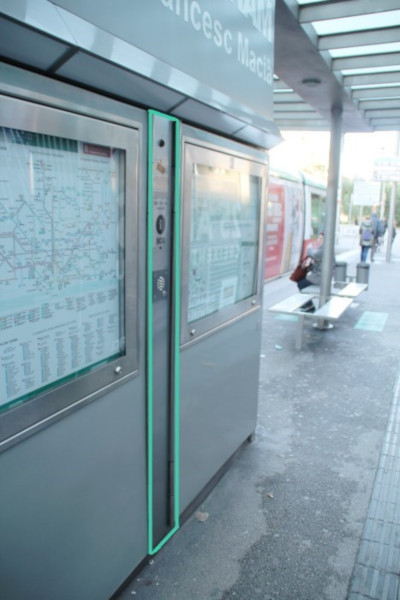

 
Foto de detall:
 

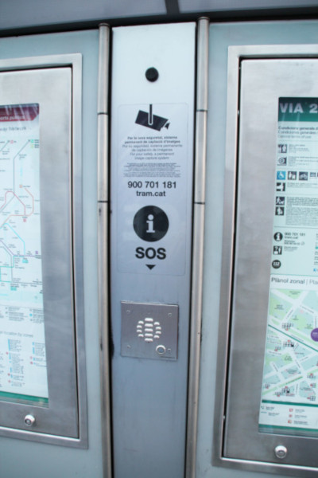

 

**Atributs**

| Atribut       | Tipus    | Descripció  |
| ------------- |:-------------| :-----|
| XARXA         | Indica a la xarxa a la qual pertany la infraestructura tramviària. Actualment Trambaix (TBX) o bé Trambesòs (TBS). En un futur es podran incloure altres xarxes encara no definides. | [String (20)] |
| CODI_ACTIU    | Codi que identifica un element en el GIS de forma unívoca. Està format per 4 parts separades per un guió. Comença amb el prefix TRM, després el codi de l'element segons el model de dades, un numero de dos dígits que indica l'operador o creador i un número de 5 dígits que identifica l'element al GIS de forma única.      |   [String (20)] |
| VIA | Determina sobre quin número de via es troba l'element. Els números de via són 1, 2, 3 i 4. Si l'element està en més d'una via s'indicarà les vies separades per un guionet, per exemple: 1-2 | [String (20)] |
| CODI_PARADA | Fa referència al número de la parada. Nomenclatura P-XX on XX és el número de parada. | [String (20)] |

 

**Representació GIS:**

 

 

    Nom capa element: Parades-interfonia
    Nom taula DB: atmgis_03_sistema_interfonia
    Nom camp geometria DB: geom
    Representació gràfica:

        [symbol: 'micro.svg', size: '1', weight: '0.4', color: '#e02c07']

  

### 009 Sistema de megafonia

> `Identificador: 03009 | Codi: MEG | Geometria: PUNT`

 

Sistema de megafonia de la parada. Sistema de megafonia (cablejat, altaveus, amplificador, etc.) de la parada que serveix per emetre informació diversa als usuaris (incidències, retards, avisos, etc.).

 

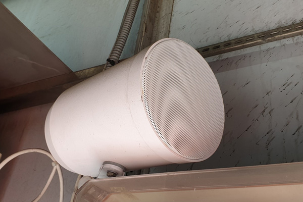

 
Foto de detall:
 

 

**Atributs**

| Atribut       | Tipus    | Descripció  |
| ------------- |:-------------| :-----|
| XARXA         | Indica a la xarxa a la qual pertany la infraestructura tramviària. Actualment Trambaix (TBX) o bé Trambesòs (TBS). En un futur es podran incloure altres xarxes encara no definides. | [String (20)] |
| CODI_ACTIU    | Codi que identifica un element en el GIS de forma unívoca. Està format per 4 parts separades per un guió. Comença amb el prefix TRM, després el codi de l'element segons el model de dades, un numero de dos dígits que indica l'operador o creador i un número de 5 dígits que identifica l'element al GIS de forma única.      |   [String (20)] |
| VIA | Determina sobre quin número de via es troba l'element. Els números de via són 1, 2, 3 i 4. Si l'element està en més d'una via s'indicarà les vies separades per un guionet, per exemple: 1-2 | [String (20)] |
| NUMERO_MEGAFONS | Número de megàfons per estació. | [Integer (2)] |
| CODI_PARADA | Fa referència al número de la parada. Nomenclatura P-XX on XX és el número de parada. | [String (20)] |

 

**Representació GIS:**

 

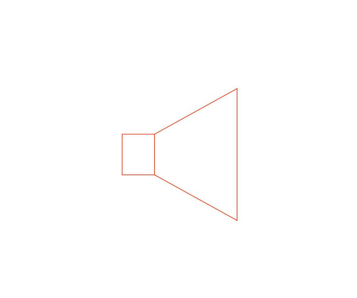

 

    Nom capa element: Parades-megafonia
    Nom taula DB: atmgis_03_sistema_de_megafonia
    Nom camp geometria DB: geom
    Representació gràfica:

        [symbol: 'megafonia.svg', size: '1', weight: '0.4', color: '#e02c07']

  

### 010 Aparador

> `Identificador: 03010 | Codi: OPI | Geometria: POLÍGON`

 

Aparador amb informació a l'usuari. Aparador incrustat al cos central de la parada amb informació diversa d'interès per als usuaris.

 

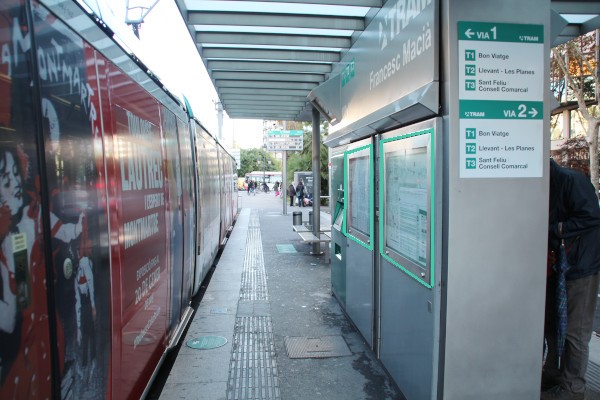

 
Foto de detall:
 

 

**Atributs**

| Atribut       | Tipus    | Descripció  |
| ------------- |:-------------| :-----|
| XARXA         | Indica a la xarxa a la qual pertany la infraestructura tramviària. Actualment Trambaix (TBX) o bé Trambesòs (TBS). En un futur es podran incloure altres xarxes encara no definides. | [String (20)] |
| CODI_ACTIU    | Codi que identifica un element en el GIS de forma unívoca. Està format per 4 parts separades per un guió. Comença amb el prefix TRM, després el codi de l'element segons el model de dades, un numero de dos dígits que indica l'operador o creador i un número de 5 dígits que identifica l'element al GIS de forma única.      |   [String (20)] |
| DIMENSIONS | Indica les dimensions de l'aparador amb format: amplada x alçada. Unitats en mil·límetres. | [String (20)] |
| CONTINGUT | Fa referència al contingut de l'aparador. Pot exposar la xarxa TRAM o bé els horaris del sistema. L'atribut ha de tenir un dels següents valors:<ul><li>**Horaris**: Defineix que el contingut de l'aparador és de tipus Horaris (exposa els horaris del TRAM). [**Veure**](img/0301011.jpg)</li><li>**Xarxa**: Defineix que el contingut de l'aparador és de tipus Xarxa (exposa xarxa del TRAM). [**Veure**](img/0301012.jpg)</li><li>**Avisos**: Defineix que el contingut de l'aparador és de tipus Avisos (exposa xarxa del TRAM). </li></ul>| [String (20)] |
| VIA | Determina sobre quin número de via es troba l'element. Els números de via són 1, 2, 3 i 4. Si l'element està en més d'una via s'indicarà les vies separades per un guionet, per exemple: 1-2 | [String (20)] |
| CODI_PARADA | Fa referència al número de la parada. Nomenclatura P-XX on XX és el número de parada. | [String (20)] |

 

**Representació GIS:**

 

 

    Nom capa element: Parades-opi
    Nom taula DB: atmgis_03_aparador
    Nom camp geometria DB: geom
    Representació gràfica:

        [weight: '0.5', dasharray: 'continua', color: '#e02c07', fillcolor: '#f67d64', fillstyle: 'solid']

  

### 011 Escala mecànica

> `Identificador: 03011 | Codi: ESC | Geometria: POLÍGON`

 

Escales mecàniques de les parades. Són les escales mecàniques presents a parades singulars, com a l'intercanviador de Cornellà Centre.

 

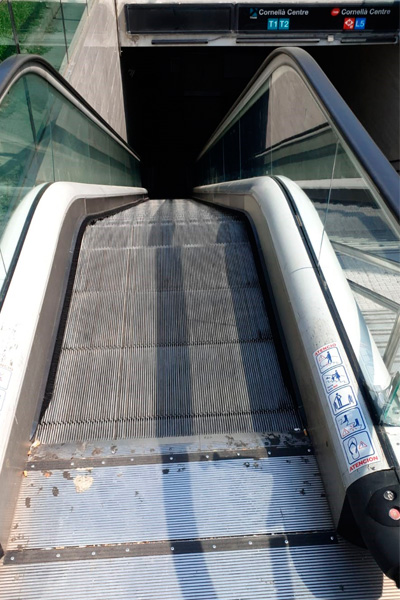

 

**Atributs**

| Atribut       | Tipus    | Descripció  |
| ------------- |:-------------| :-----|
| XARXA         | Indica a la xarxa a la qual pertany la infraestructura tramviària. Actualment Trambaix (TBX) o bé Trambesòs (TBS). En un futur es podran incloure altres xarxes encara no definides. | [String (20)] |
| CODI_ACTIU    | Codi que identifica un element en el GIS de forma unívoca. Està format per 4 parts separades per un guió. Comença amb el prefix TRM, després el codi de l'element segons el model de dades, un numero de dos dígits que indica l'operador o creador i un número de 5 dígits que identifica l'element al GIS de forma única.      |   [String (20)] |
| CODI_PARADA | Fa referència al número de la parada. Nomenclatura P-XX on XX és el número de parada. | [String (20)] |

 

**Representació GIS:**

 

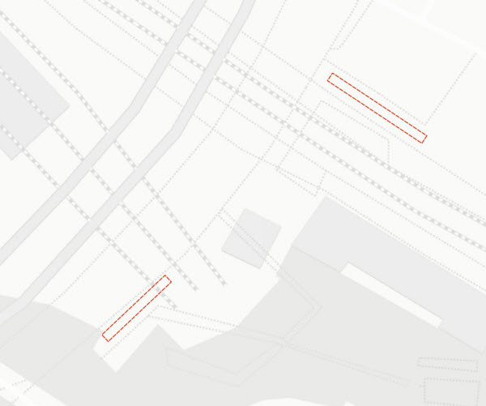

 

    Nom capa element: Parades-escales
    Nom taula DB: atmgis_03_escala_mecanica
    Nom camp geometria DB: geom
    Representació gràfica:

        [weight: '0.4', dasharray: '3 1', color: '#e02c07']

  

### 012 Ascensors

> `Identificador: 03012 | Codi: ANR | Geometria: POLÍGON`

 

Ascensors de les parades. Són els ascensors presents a parades singulars, com a l'intercanviador de Cornellà Centre.

 

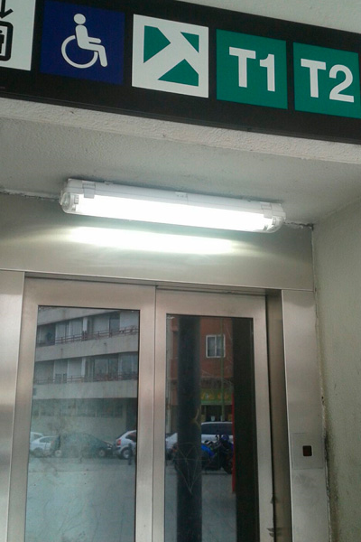

 

**Atributs**

| Atribut       | Tipus    | Descripció  |
| ------------- |:-------------| :-----|
| XARXA         | Indica a la xarxa a la qual pertany la infraestructura tramviària. Actualment Trambaix (TBX) o bé Trambesòs (TBS). En un futur es podran incloure altres xarxes encara no definides. | [String (20)] |
| CODI_ACTIU    | Codi que identifica un element en el GIS de forma unívoca. Està format per 4 parts separades per un guió. Comença amb el prefix TRM, després el codi de l'element segons el model de dades, un numero de dos dígits que indica l'operador o creador i un número de 5 dígits que identifica l'element al GIS de forma única.      |   [String (20)] |
| CODI_PARADA | Fa referència al número de la parada. Nomenclatura P-XX on XX és el número de parada. | [String (20)] |

 

**Representació GIS:**

 

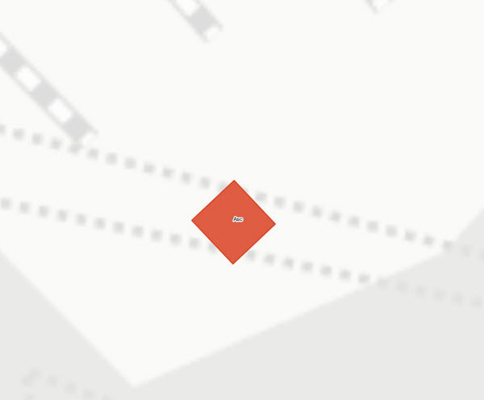

 

    Nom capa element: Parades-ascensors
    Nom taula DB: atmgis_03_ascensors
    Nom camp geometria DB: geom
    Representació gràfica:

        [weight: '0.4', dasharray: 'continua', color: '#e02c07', fillcolor: '#df5d43', fillstyle: 'solid', labelby: 'asc']

  

### 013 Baranes

> `Identificador: 03013 | Codi: BAR | Geometria: LÍNIA`

 

Baranes de seguretat dins del cos de la parada. Són aquelles baranes incloses dins de la parada, normalment en rampes, escales o per separar l'àmbit de la parada de la urbanització o la xarxa viària que l'envolta.

 

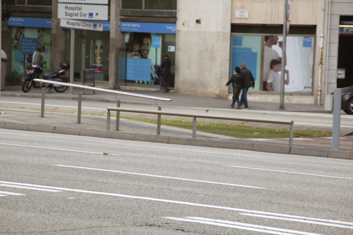

 

**Atributs**

| Atribut       | Tipus    | Descripció  |
| ------------- |:-------------| :-----|
| XARXA         | Indica a la xarxa a la qual pertany la infraestructura tramviària. Actualment Trambaix (TBX) o bé Trambesòs (TBS). En un futur es podran incloure altres xarxes encara no definides. | [String (20)] |
| CODI_ACTIU    | Codi que identifica un element en el GIS de forma unívoca. Està format per 4 parts separades per un guió. Comença amb el prefix TRM, després el codi de l'element segons el model de dades, un numero de dos dígits que indica l'operador o creador i un número de 5 dígits que identifica l'element al GIS de forma única.      |   [String (20)] |
| CODI_PARADA | Fa referència al número de la parada. Nomenclatura P-XX on XX és el número de parada. | [String (20)] |

 

**Representació GIS:**

 

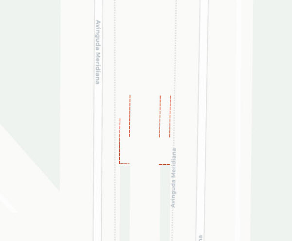

 

    Nom capa element: Parades-baranes
    Nom taula DB: atmgis_03_baranes
    Nom camp geometria DB: geom
    Representació gràfica:

        [weight: '0.5', dasharray: '3 1', color: '#e02c07']

  

### 014 Papereres

> `Identificador: 03014 | Codi: PAP | Geometria: PUNT`

 

Papereres dins del cos de la parada. Són aquelles papereres incloses dins de la parada per a l'ús dels usuaris.

 

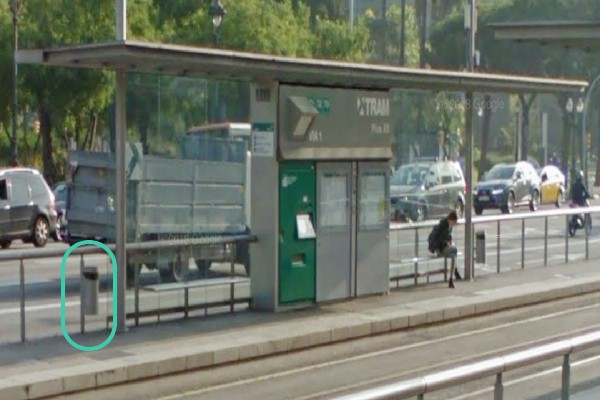

 

**Atributs**

| Atribut       | Tipus    | Descripció  |
| ------------- |:-------------| :-----|
| XARXA         | Indica a la xarxa a la qual pertany la infraestructura tramviària. Actualment Trambaix (TBX) o bé Trambesòs (TBS). En un futur es podran incloure altres xarxes encara no definides. | [String (20)] |
| CODI_ACTIU    | Codi que identifica un element en el GIS de forma unívoca. Està format per 4 parts separades per un guió. Comença amb el prefix TRM, després el codi de l'element segons el model de dades, un numero de dos dígits que indica l'operador o creador i un número de 5 dígits que identifica l'element al GIS de forma única.      |   [String (20)] |
| CODI_PARADA | Fa referència al número de la parada. Nomenclatura P-XX on XX és el número de parada. | [String (20)] |

 

**Representació GIS:**

 

 

    Nom capa element: Parades-papereres
    Nom taula DB: atmgis_03_papereres
    Nom camp geometria DB: geom
    Representació gràfica:

        [symbol: 'paperera.svg', size: '1', weight: '0.4', color: '#e02c07']

  

### 015 Bancs

> `Identificador: 03015 | Codi: BAN | Geometria: PUNT`

 

Bancs dins del cos de la parada. Es tracta dels bancs metàl·lics inclosos dins de la parada per a l'ús dels usuaris.

 

 

**Atributs**

| Atribut       | Tipus    | Descripció  |
| ------------- |:-------------| :-----|
| XARXA         | Indica a la xarxa a la qual pertany la infraestructura tramviària. Actualment Trambaix (TBX) o bé Trambesòs (TBS). En un futur es podran incloure altres xarxes encara no definides. | [String (20)] |
| CODI_ACTIU    | Codi que identifica un element en el GIS de forma unívoca. Està format per 4 parts separades per un guió. Comença amb el prefix TRM, després el codi de l'element segons el model de dades, un numero de dos dígits que indica l'operador o creador i un número de 5 dígits que identifica l'element al GIS de forma única.      |   [String (20)] |
| CODI_PARADA | Fa referència al número de la parada. Nomenclatura P-XX on XX és el número de parada. | [String (20)] |

 

**Representació GIS:**

 

 

    Nom capa element: Parades-bancs
    Nom taula DB: atmgis_03_bancs
    Nom camp geometria DB: geom
    Representació gràfica:

        [symbol: 'banc.svg', size: '1', weight: '0.4', color: '#e02c07']

  

### 015 Noms parades

> `Identificador: 03016 | Codi: NOM | Geometria: -`

 

Nom i ubicació principal de les parades del tramvia. Es tracta d'una capa virtual per visualitzar els noms de les parades.

 

 
Foto de detall:
 

 

**Atributs**

| Atribut       | Tipus    | Descripció  |
| ------------- |:-------------| :-----|
| XARXA         | Indica a la xarxa a la qual pertany la infraestructura tramviària. Actualment Trambaix (TBX) o bé Trambesòs (TBS). En un futur es podran incloure altres xarxes encara no definides. | [String (20)] |
| CODI_ACTIU    | Codi que identifica un element en el GIS de forma unívoca. Està format per 4 parts separades per un guió. Comença amb el prefix TRM, després el codi de l'element segons el model de dades, un numero de dos dígits que indica l'operador o creador i un número de 5 dígits que identifica l'element al GIS de forma única.      |   [String (20)] |
| NOM_PARADA | Indica el nom de la parada a la qual pertany l'andana. | [String (40)] |
| CODI_PARADA | Fa referència al número de la parada. Nomenclatura P-XX on XX és el número de parada. | [String (20)] |

 

**Representació GIS:**

 

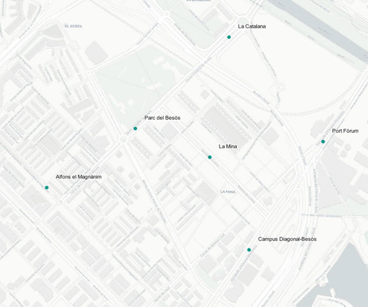

 

    Nom capa element: Parades-noms
    Nom taula DB: atmgis_03_noms_parades
    Nom camp geometria DB: geom
    Representació gràfica:

        [symbol: 'marker', size: '2', color: '#009688', fillcolor: '#009688', fillstyle: 'solid', labelby: '@nom_parada']
