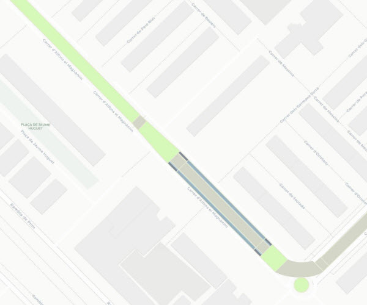

## 04 Pavimentació

 

>  Grup: Obra Civil · Número elements: 1

 

Fa referència al conjunt de recobriments asfàltics, naturals, cimentats o empedrats amb els quals es revesteix la plataforma tramviària en funció de les necessitats requerides.

 

### 001 Paviment

> `Identificador: 04001 | Codi: PAV | Geometria: POLÍGON`

 

Revestiment de la plataforma tramviària. La tipologia de revestiment de la plataforma del tramvia varia segons les característiques de cada zona.

 

 

**Atributs**

| Atribut       | Tipus    | Descripció  |
| ------------- |:-------------| :-----|
| XARXA         | Indica a la xarxa a la qual pertany la infraestructura tramviària. Actualment Trambaix (TBX) o bé Trambesòs (TBS). En un futur es podran incloure altres xarxes encara no definides. | [String (20)] |
| CODI_ACTIU    | Codi que identifica un element en el GIS de forma unívoca. Està format per 4 parts separades per un guió. Comença amb el prefix TRM, després el codi de l'element segons el model de dades, un numero de dos dígits que indica l'operador o creador i un número de 5 dígits que identifica l'element al GIS de forma única.      |   [String (20)] |
| TIPUS_PAVIMENTACIO | Indica el tipus de pavimentació de la zona en concret. L'atribut ha de tenir un dels següents valors:<ul><li>**Aglomerat**: El formigó asfàltic en el qual s'utilitza com a aglomerant algun hidrocarbur com l'asfalt mesclat amb àrids, com la grava o la sorra, per les seves propietats de resistència i impermeabilització. [**Veure**](img/0400111.jpg)</li><li>**Formigo**: El formigó és el material de construcció resultant de la mescla de ciment (o un altre conglomerant) amb grava, sorra i aigua. La mescla esdevé una pasta emmotllable amb propietats adherents, que en poques hores s'endureix i esdevé un material de consistència pètria. [**Veure**](img/0400112.jpg)</li><li>**Llamborda**: Els llambordins són pedres o blocs de forma rectangular que es fan servir per construir paviments. [**Veure**](img/0400113.jpg)</li><li>**Llosa formigo**: Es tracta d'un llosat de formigó per a paviments, amb un bon gruix, de forma quadrada o rectangular. [**Veure**](img/0400114.jpg) </li><li>**Llosa pedra**: Es tracta d'un llosat de pedra per a paviments, amb un bon gruix, de forma quadrada o rectangular. S'utilitzen tipus de roca abundants i duradors. [**Veure**](img/0400115.jpg) </li><li>**Gespa**: Recobriment amb gespa de jardineria, amb sistema de drenatge i reg per al seu manteniment. [**Veure**](img/0400116.jpg) </li><li>**Granit**: Peces de granit normalment utilitzades com a vorades delimitadores o vores d'andana, però també encintats de passos de vianants i altres superfícies transitables. [**Veure**](img/0400117.jpg) </li><li>**Panot**: El panot es un paviment realitzat amb formigó que s'utilitza per a pavimentar voreres de vianants i, en el cas de les parades del tramvia, també com a encaminament d'invidents. [**Veure**](img/0400118.jpg) </li><li>**Andana**: Pavimentació per a la zona d'andanes. </li></ul>| [String (20)] |

 

**Representació GIS:**

 

 

    Nom capa element: Pavimentació-paviment
    Nom taula DB: atmgis_04_paviment
    Nom camp geometria DB: geom
    Representació gràfica:

        aglomerat [weight: '0.26', dasharray: 'continua', color: '#232323', opacity: '0', fillcolor: '#d4d6c8', fillstyle: 'solid']
        andana [weight: '0.26', dasharray: 'continua', color: '#232323', opacity: '0', fillcolor: '#9ab5c1', fillstyle: 'solid']
        formigo [weight: '0.26', dasharray: 'continua', color: '#232323', opacity: '0', fillcolor: '#9a9b94', fillstyle: 'solid']
        gespa [weight: '0.26', dasharray: 'continua', color: '#232323', opacity: '0', fillcolor: '#d6f8b8', fillstyle: 'solid']
        granit [weight: '0.26', dasharray: 'continua', color: '#232323', opacity: '0', fillcolor: '#e6e9d2', fillstyle: 'solid']
        llamborda [weight: '0.26', dasharray: 'continua', color: '#232323', opacity: '0', fillcolor: '#e3e2c3', fillstyle: 'solid']
        llosa formigo [weight: '0.26', dasharray: 'continua', color: '#232323', opacity: '0', fillcolor: '#808b97', fillstyle: 'solid']
        llosa pedra [weight: '0.26', dasharray: 'continua', color: '#232323', opacity: '0', fillcolor: '#f09872', fillstyle: 'solid']
        panot [weight: '0.26', dasharray: 'continua', color: '#f7f7f7', opacity: '0', fillcolor: '#b5cfd8', fillstyle: 'solid']

  
