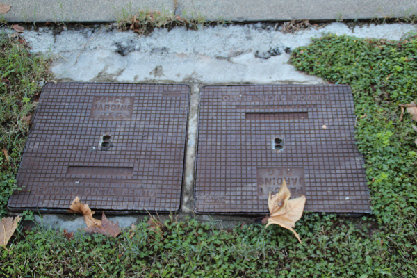
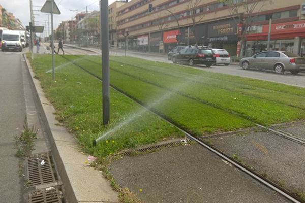
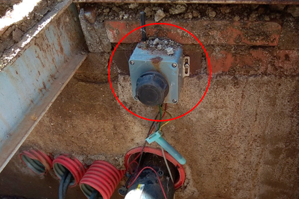
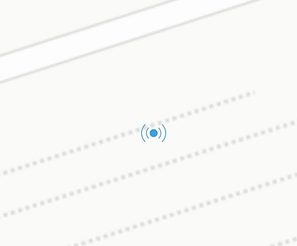
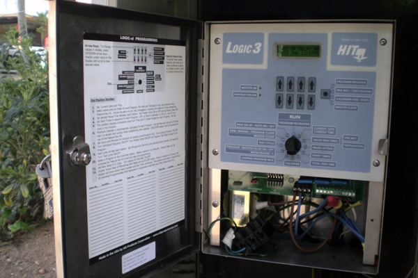
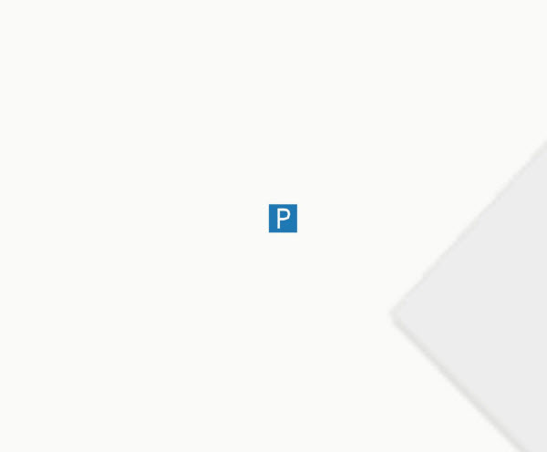

## 05 Reg

 

>  Grup: Obra Civil · Número elements: 7

 

Es tracta del sistema (incloent comptadors, programadors, vàlvules, canonades, punts de reg, etc.) que permet regar la gespa de la plataforma tramviària.

 

### 001 Pericons

> `Identificador: 05001 | Codi: ARE | Geometria: PUNT`

 

Pericons del sistema de reg. Un pericó és una caixa d'obra o prefabricada utilitzada per rebre, enllaçar i distribuir canalitzacions o conductes subterranis; solen estar enterrades i tenen una tapa a la part superior per a poder accedir-hi i procedir al seu registre o netejar el seu interior.

 

 
Foto de detall:
 

 

**Atributs**

| Atribut       | Tipus    | Descripció  |
| ------------- |:-------------| :-----|
| XARXA         | Indica a la xarxa a la qual pertany la infraestructura tramviària. Actualment Trambaix (TBX) o bé Trambesòs (TBS). En un futur es podran incloure altres xarxes encara no definides. | [String (20)] |
| CODI_ACTIU    | Codi que identifica un element en el GIS de forma unívoca. Està format per 4 parts separades per un guió. Comença amb el prefix TRM, després el codi de l'element segons el model de dades, un numero de dos dígits que indica l'operador o creador i un número de 5 dígits que identifica l'element al GIS de forma única.      |   [String (20)] |
| ESCOMESA | Codi actiu de l'escomesa a la que pertany el pericó de reg. | [String (15)] |
| TIPUS | Indica el tipus de contingut del pericó de reg. L'atribut ha de tenir un dels següents valors:<ul><li>**Aigues freatiques**: Indica que l'arqueta és de tipus Aigües Freàtiques. </li><li>**Aigues freatiques PE 125**: Indica que l'arqueta és de tipus Aigües Freàtiques PE 125. </li><li>**Aigues freatiques PE 140**: Indica que l'arqueta és de tipus Aigües Freàtiques PE 140. </li><li>**Armari PLD**: Indica que l'arqueta és de tipus Armari PLD. </li><li>**By-pass**: Indica que l'arqueta és de tipus By-pass. </li><li>**Contador SGAE**: Indica que l'arqueta és de tipus Comptador SGAE. </li><li>**Comptador**: Indica que l'arqueta és de tipus Comptador. </li><li>**Comptador S.G.A.B.**: Indica que l'arqueta és de tipus Comptador Comptador S.G.A.B. </li><li>**Electrovalvula doble**: Indica que l'arqueta és de tipus Electrovàlvula doble. </li><li>**Electrovalvula simple**: Indica que l'arqueta és de tipus Electrovàlvula simple. </li><li>**Pou de drenatge**: Indica que l'arqueta és de tipus Pou de drenatge. </li><li>**Programador Electric**: Indica que l'arqueta és de tipus Programador elèctric. </li><li>**Ventosa**: Indica que l'arqueta és de tipus Ventosa. </li><li>**Valvula rentat**: Indica que l'arqueta és de tipus Vàlvula rentat. </li><li>**Escomesa + Programador**: Indica que l'arqueta és de tipus Escomesa i programador. </li><li>**Valvula sectorial**: Indica que l'arqueta és de tipus Valvula sectorial. </li>| [String (25)] |
| DIMENSIONS | Fa referència a les dimensions del pericó de reg. Longitud per alçada en els rectangulars i diàmetre en els circulars. Unitats en centímetres. | [String (20)] |

 

**Representació GIS:**

 

 

    Nom capa element: Reg-Pericons
    Nom taula DB: atmgis_05_pericons
    Nom camp geometria DB: geom
    Representació gràfica:

        [symbol: 'perico.svg', size: '2.5', weight: '0.3', color: '#09549a', fillcolor: '#76dcfb']

  

### 002 Canalitzacions

> `Identificador: 05002 | Codi: TUB | Geometria: LÍNIA`

 

Tub de reg. Sistema de tubs que distribueix l'aigua des del seu origen en l'escomesa fins als diferents punts de reg.

 

 

**Atributs**

| Atribut       | Tipus    | Descripció  |
| ------------- |:-------------| :-----|
| XARXA         | Indica a la xarxa a la qual pertany la infraestructura tramviària. Actualment Trambaix (TBX) o bé Trambesòs (TBS). En un futur es podran incloure altres xarxes encara no definides. | [String (20)] |
| CODI_ACTIU    | Codi que identifica un element en el GIS de forma unívoca. Està format per 4 parts separades per un guió. Comença amb el prefix TRM, després el codi de l'element segons el model de dades, un numero de dos dígits que indica l'operador o creador i un número de 5 dígits que identifica l'element al GIS de forma única.      |   [String (20)] |
| TIPUS | Indica si es tracta d'una canalització principal o secundària. L'atribut ha de tenir un dels següents valors:<ul><li>**Principal**: Defineix que es tracta d'una canalització de reg de la xarxa principal. </li><li>**Secundaria**: Defineix que es tracta d'una canalització de reg de la xarxa secundària. </li>| [String (20)] |
| CANONADA | Indica el material i secció de la canonada de reg. L'atribut ha de tenir un dels següents valors:<ul><li>**PE 20 mm**: Defineix que la secció de canonada és PE 20 mm. </li><li>**PE 25 mm**: Defineix que la secció de canonada és PE 25mm. </li><li>**PE 40 mm**: Defineix que la secció de canonada és PE 40 mm. </li><li>**PE 50 mm**: Defineix que la secció de canonada és PE 50 mm. </li><li>**PE 63 mm**: Defineix que la secció de canonada és PE 63 mm. </li><li>**PE 75 mm**: Defineix que la secció de canonada és PE 75 mm. </li><li>**PE 90 mm**: Defineix que la secció de canonada és PE 90 mm. </li><li>**PE 110 mm**: Defineix que la secció de canonada és PE 110 mm. </li><li>**PE 125 mm**: Defineix que la secció de canonada és PE 125 mm. </li><li>**PE 190 mm**: Defineix que la secció de canonada és PE 190 mm. </li><li>**Elèctrica**: Defineix canonada Elèctrica </li><li>**Vàries**: Defineix canonada Vàries </li> | [String (20)] |

 

**Representació GIS:**

 

 

    Nom capa element: Reg-canalitzacions
    Nom taula DB: atmgis_05_canalitzacions
    Nom camp geometria DB: geom
    Representació gràfica:

        [weight: '0.26', dasharray: '3 1', color: '#1f78b4']

  

### 003 Escomeses

> `Identificador: 05003 | Codi: ERE | Geometria: PUNT`

 

Punt de connexió amb el subministrador d'aigua. Punt que connecta el sistema de reg amb la xarxa d'aigua de boca o de freàtiques, si s'escau.

 

 

**Atributs**

| Atribut       | Tipus    | Descripció  |
| ------------- |:-------------| :-----|
| XARXA         | Indica a la xarxa a la qual pertany la infraestructura tramviària. Actualment Trambaix (TBX) o bé Trambesòs (TBS). En un futur es podran incloure altres xarxes encara no definides. | [String (20)] |
| CODI_ACTIU    | Codi que identifica un element en el GIS de forma unívoca. Està format per 4 parts separades per un guió. Comença amb el prefix TRM, després el codi de l'element segons el model de dades, un numero de dos dígits que indica l'operador o creador i un número de 5 dígits que identifica l'element al GIS de forma única.      |   [String (20)] |
| TIPUS | Determina el tipus de captació d'aigua de l'escomesa. L'atribut ha de tenir un dels següents valors:<ul><li>**Potable**: Defineix que la captació d'aigua de l'escomesa de reg es fa de la xarxa d'aigua potable. </li><li>**Freatica**: Defineix que la captació d'aigua de l'escomesa de reg es fa de del freàtic. </li><li>**Mixta**: Defineix que la captació d'aigua de l'escomesa de reg es fa tant des del freàtic com des de la xarxa d'aigua potable. </li>| [String (20)] |
| NUMERO_CONTRACTE | Número de contracte amb la companyia d'abastiment d'aigua. | [String (20)] |

 

**Representació GIS:**

 

 

    Nom capa element: Reg-escomeses
    Nom taula DB: atmgis_05_escomeses
    Nom camp geometria DB: geom
    Representació gràfica:

        [symbol: 'escomesa.svg', size: '2.5', weight: '0.4', color: '#1f78b4', fillcolor: '#bef4fd']

  

### 004 Punts de reg

> `Identificador: 05004 | Codi: PDR | Geometria: PUNT`

 

Tipus de sistema de reg. El sistema de reg compta amb varis sistemes en els punts de regatge. Són l'anell de reg, l'aspersor convencional i el difusor emergent.

 

 

**Atributs**

| Atribut       | Tipus    | Descripció  |
| ------------- |:-------------| :-----|
| XARXA         | Indica a la xarxa a la qual pertany la infraestructura tramviària. Actualment Trambaix (TBX) o bé Trambesòs (TBS). En un futur es podran incloure altres xarxes encara no definides. | [String (20)] |
| CODI_ACTIU    | Codi que identifica un element en el GIS de forma unívoca. Està format per 4 parts separades per un guió. Comença amb el prefix TRM, després el codi de l'element segons el model de dades, un numero de dos dígits que indica l'operador o creador i un número de 5 dígits que identifica l'element al GIS de forma única.      |   [String (20)] |
| TIPUS_REG | Indica la tipologia de punt de reg. L'atribut ha de tenir un dels següents valors:<ul><li>**Aspersor**: Defineix que punt de reg és de tipus Aspersor. [**Veure**](img/0500411.jpg) </li><li>**Anell de goteig**: Defineix que punt de reg és de tipus Anell de degoteig. [**Veure**](img/0500412.jpg) </li><li>**Difusor**: Defineix que punt de reg és de tipus difusor. </li>| [String (20)] |
| RADI_ASPERSOR | Indica l'abast de l'aspersió per als aspersors i els difusors. Unitats en metres. | [String (10)] |
| VIA | Determina sobre quin número de via es troba l'element. Els números de via són 1, 2, 3 i 4. | [String (20)] |

 

**Representació GIS:**

 

 

    Nom capa element: Reg-punts de reg
    Nom taula DB: atmgis_05_punts_de_reg
    Nom camp geometria DB: geom
    Representació gràfica:

        [symbol: 'punt_reg.svg', size: '1.2', weight: 'sin borde', color: '#1f78b4', fillcolor: '#1f78b4']

  

### 005 Armaris de reg

> `Identificador: 05005 | Codi: ARR | Geometria: PUNT`

 

Lloc on s’allotgen els diferents elements de mesura i telegestió Armaris ubicats a carrer que contenen elements del sistema de reg tals com el programador, pluviòmetre, etc.

 

 
Foto de detall:
 

 

**Atributs**

| Atribut       | Tipus    | Descripció  |
| ------------- |:-------------| :-----|
| XARXA         | Indica a la xarxa a la qual pertany la infraestructura tramviària. Actualment Trambaix (TBX) o bé Trambesòs (TBS). En un futur es podran incloure altres xarxes encara no definides. | [String (20)] |
| CODI_ACTIU    | Codi que identifica un element en el GIS de forma unívoca. Està format per 4 parts separades per un guió. Comença amb el prefix TRM, després el codi de l'element segons el model de dades, un numero de dos dígits que indica l'operador o creador i un número de 5 dígits que identifica l'element al GIS de forma única.      |   [String (20)] |
| ESCOMESA | Codi actiu de l'escomesa que alimenta l'armari de reg. | [String (20)] |
| PLUVIOMETRE | Atribut que defineix si l'armari disposa de pluviòmetre o no. | [boolean] |

 

**Representació GIS:**

 

 

    Nom capa element: Reg-armaris de reg
    Nom taula DB: atmgis_05_armaris_de_reg
    Nom camp geometria DB: geom
    Representació gràfica:

        [symbol: 'armari.svg', angle: '90', size: '3', weight: '0.3', color: '#0c6eab', fillcolor: '#83d1ea']

  

### 006 Elements de mesura i telegestió

> `Identificador: 05006 | Codi: ELM | Geometria: PUNT`

 

Elements d'automatització i mesura del consum del reg. Elements tals com el comptador, electrovàlvules, concentradors, etc. que permeten mesurar, controlar i gestionar el consum d’aigua de reg de la plataforma tramviària.

 

 

**Atributs**

| Atribut       | Tipus    | Descripció  |
| ------------- |:-------------| :-----|
| XARXA         | Indica a la xarxa a la qual pertany la infraestructura tramviària. Actualment Trambaix (TBX) o bé Trambesòs (TBS). En un futur es podran incloure altres xarxes encara no definides. | [String (20)] |
| CODI_ACTIU    | Codi que identifica un element en el GIS de forma unívoca. Està format per 4 parts separades per un guió. Comença amb el prefix TRM, després el codi de l'element segons el model de dades, un numero de dos dígits que indica l'operador o creador i un número de 5 dígits que identifica l'element al GIS de forma única.      |   [String (20)] |
| TIPUS | Tipologia de l'element de mesura de l'element de mesura i telegestió. L'atribut ha de tenir un dels següents valors:<ul><li>**Vàlvula de tall general**: Defineix que l'element de mesura i telegestió és una electrovàlvula de tall general . </li><li>**Emissor de radiofrequencia**: Defineix que l'element de mesura i telegestió és un emissor de radiofreqüència. </li><li>**Repetidor aeri**: Defineix que l'element de mesura i telegestió és un repetidor aeri. </li><li>**Equip concentrador**: Defineix que l'element de mesura i telegestió és un equip concentrador. </li>| [String (50)] |

 

**Representació GIS:**

 

 

    Nom capa element: Reg-mesura i telegestió
    Nom taula DB: atmgis_05_elements_de_mesura_i_telegestio
    Nom camp geometria DB: geom
    Representació gràfica:

        [symbol: 'telegestio.svg', size: '3.5', weight: '0.5', color: '#1f78b4', fillcolor: '#3aa0e4']

  

### 007 Programadors

> `Identificador: 05007 | Codi: PRG | Geometria: PUNT`

 

Programadors per controlar els pericons o armaris Els programadors són uns autòmats que obren i tanquen el reg amb una programació horària predeterminada.

 

 
Foto de detall:
 

 

**Atributs**

| Atribut       | Tipus    | Descripció  |
| ------------- |:-------------| :-----|
| XARXA         | Indica a la xarxa a la qual pertany la infraestructura tramviària. Actualment Trambaix (TBX) o bé Trambesòs (TBS). En un futur es podran incloure altres xarxes encara no definides. | [String (20)] |
| CODI_ACTIU    | Codi que identifica un element en el GIS de forma unívoca. Està format per 4 parts separades per un guió. Comença amb el prefix TRM, després el codi de l'element segons el model de dades, un numero de dos dígits que indica l'operador o creador i un número de 5 dígits que identifica l'element al GIS de forma única.      |   [String (20)] |
| TIPUS | Tipus del programador. | [String (20)] |

 

**Representació GIS:**

 

 

    Nom capa element: Reg-programadors
    Nom taula DB: atmgis_05_programadors
    Nom camp geometria DB: geom
    Representació gràfica:

        [symbol: 'programador.svg', angle: '180', size: '1.5', weight: '0.1', color: '#fcf9ea', fillcolor: '#1f78b4']
