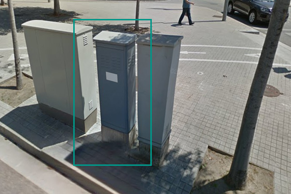
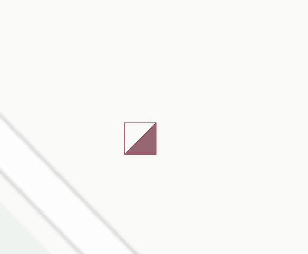
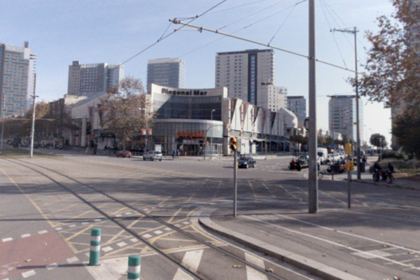
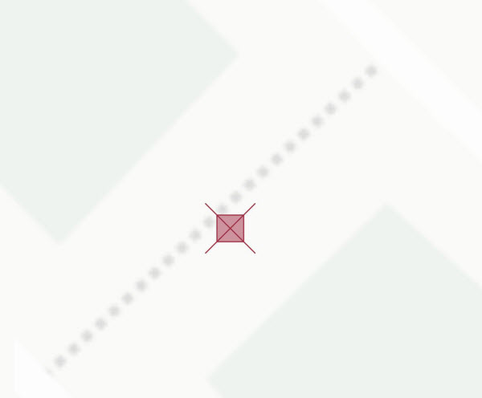

## 14 Semaforització

 

>  Grup: Sistemes Tramviaris · Número elements: 4

 

Es tracta del conjunt d'elements (armaris -reguladors de trànsit, semàfors i balises) que gestionen el trànsit d'una cruïlla i, en el cas que ens ocupa, també regulen el pas dels combois, com qualsevol altre vehicle/usuari de la via pública.

 

### 001 Detectors

> `Identificador: 14001 | Codi: BAL | Geometria: PUNT`

 

Balisa per detecció de pas del tramvia. Balises actives ubicades a la via que, al pas dels combois, envien senyals al regulador de la cruïlla per tal que aquest gestioni el pas del tramvia per la cruïlla en relació a les diferents fases semafòriques.

 

 

**Atributs**

| Atribut       | Tipus    | Descripció  |
| ------------- |:-------------| :-----|
| XARXA         | Indica a la xarxa a la qual pertany la infraestructura tramviària. Actualment Trambaix (TBX) o bé Trambesòs (TBS). En un futur es podran incloure altres xarxes encara no definides. | [String (20)] |
| CODI_ACTIU    | Codi que identifica un element en el GIS de forma unívoca. Està format per 4 parts separades per un guió. Comença amb el prefix TRM, després el codi de l'element segons el model de dades, un numero de dos dígits que indica l'operador o creador i un número de 5 dígits que identifica l'element al GIS de forma única.      |   [String (20)] |
| TIPUS | Indica el tipus de detector. Pot tractar-se d'un detector de línia de parada, un detector de cancel·lació o un (…). | [String (20)] |
| REGULADOR | Indica el codi intern del regulador que gestiona el detector. | [String (20)] |
| VIA | Determina sobre quin número de via es troba l'element. Els números de via són 1, 2, 3 i 4. | [String (20)] |
| APROX | Fa referència al codi o diversos codis interns dels reguladors que gestionen el detector. Els codis, en cas d'haver-n'hi més d'un, apareixen separats per espais. | [String (20)]|

 

**Representació GIS:**

 

 

    Nom capa element: Semaforitzció-detectors
    Nom taula DB: atmgis_14_detectors
    Nom camp geometria DB: geom
    Representació gràfica:

        [symbol: 'punt_reg.svg', size: '1.2', weight: 'sin borde', color: '#a02c41', fillcolor: '#a02c41']

  

### 002 Reguladors

> `Identificador: 14002 | Codi: REG | Geometria: PUNT`

 

Armari PLC de control i electrònica. Armari que conté l’autòmat que gestiona la programació semafòrica d’una cruïlla en general, i en el cas que ens aplica, rep informació dels detectors del pas del tramvia per tal de poder gestionar les diferents fases semafòriques i/o els seus temps per facilitar el pas dels combois.

 

 

**Atributs**

| Atribut       | Tipus    | Descripció  |
| ------------- |:-------------| :-----|
| XARXA         | Indica a la xarxa a la qual pertany la infraestructura tramviària. Actualment Trambaix (TBX) o bé Trambesòs (TBS). En un futur es podran incloure altres xarxes encara no definides. | [String (20)] |
| CODI_ACTIU    | Codi que identifica un element en el GIS de forma unívoca. Està format per 4 parts separades per un guió. Comença amb el prefix TRM, després el codi de l'element segons el model de dades, un numero de dos dígits que indica l'operador o creador i un número de 5 dígits que identifica l'element al GIS de forma única.      |   [String (20)] |
| CODI_INTERN | Codi intern del regulador format per 3 lletres que indiquen el municipi seguit d'un número de 2 xifres que identifica l'element. | [String (20)] |
| ESTRATEGIA_REGULACIO | Indica l'estratègia de prioritat semafòrica dels reguladors de trànsit. Pot tractar-se de prioritat dinàmica o microregulació. L'atribut ha de tenir un dels següents valors:<ul><li>**Prioritat dinamica**: Defineix que l'estratègia de regulació del regulador semafòric és de tipus prioritat dinàmica. </li><li>**Microregulacio**: Defineix que l'estratègia de regulació del regulador semafòric és de tipus microregulació. </li> | [String (20)] |
| DA1_DA3 | Indica quin element dona la senyal d'aproximació (activació de prioritat semafòrica) al regulador en el sentit de via 1 o via 3. | [String (20)] |
| DA2_DA4 | Indica quin element dona la senyal d'aproximació (activació de prioritat semafòrica) al regulador en el sentit de via 2 o via 4. | [String (20)] |

 

**Representació GIS:**

 

 

    Nom capa element: Semaforitzció-reguladors
    Nom taula DB: atmgis_14_reguladors
    Nom camp geometria DB: geom
    Representació gràfica:

        Simbologia no definida

  

### 003 Semàfors tramvia

> `Identificador: 14003 | Codi: SMF | Geometria: PUNT`

 

Capçal del semàfor viari propi de tramvia. Semàfors viaris específics del tramvia. Normalment de tres òptiques corresponents al triangle o senyal de preavís, barra horitzontal o "vermell" i barra vertical "verd".

 

 

**Atributs**

| Atribut       | Tipus    | Descripció  |
| ------------- |:-------------| :-----|
| XARXA         | Indica a la xarxa a la qual pertany la infraestructura tramviària. Actualment Trambaix (TBX) o bé Trambesòs (TBS). En un futur es podran incloure altres xarxes encara no definides. | [String (20)] |
| CODI_ACTIU    | Codi que identifica un element en el GIS de forma unívoca. Està format per 4 parts separades per un guió. Comença amb el prefix TRM, després el codi de l'element segons el model de dades, un numero de dos dígits que indica l'operador o creador i un número de 5 dígits que identifica l'element al GIS de forma única.      |   [String (20)] |
| VIA | Determina sobre quin número de via es troba l'element. Els números de via són 1, 2, 3 i 4. | [String (20)] |
| NUMERO_OPTIQUES | Es refereix al tipus d'òptica dels semàfors. Pot tenir 2 òptiques de 200 mm o 3 òptiques de 200 mm. L'atribut ha de tenir un dels següents valors:<ul><li>**12/200**: Indica que es tracta d'un semàfor de 2 òptiques de 200 mm. </li><li>**13/200**: Indica que es tracta d'un semàfor de 3 òptiques de 200 mm. </li> | [String (20)] |
| SUPORT | Fa referència al suport sobre el qual està situat el semàfor. Pot prendre el valor de Bàcul, columna o pòrtic. L'atribut ha de tenir un dels següents valors:<ul><li>**Bacul**: Indica que suport del semàfor és de tipus bàcul. [**Veure**](img/1400311.jpg) </li><li>**Columna**: Indica que suport del semàfor és de tipus Columna. [**Veure**](img/1400312.jpg) </li><li>**Portic**: Indica que suport del semàfor és de tipus Pòrtic. [**Veure**](img/1400313.jpg) </li> | [String (20)] |
| TECNOLOGIA | Fa referència al sistema amb el qual el semàfor emet llum. Pot tractar-se de tecnologia de tipus LED, incandescència o tecnologia mixta (LED i incandescència alhora). L'atribut ha de tenir un dels següents valors:<ul><li>**Incandescencia**: Indica que la tecnologia amb la qual el semàfor emet llum és de tipus incandescent. [**Veure**](img/1400314.jpg) </li><li>**LED**: Indica que la tecnologia amb la qual el semàfor emet llum és de tipus LED.[**Veure**](img/1400315.jpg) </li><li>**Mixta**: Indica que la tecnologia amb la qual el semàfor emet llum és de tipus mixta (tant LED com incandescència). </li> | [String (20)] |
| SEMAFOR_NUMERACIO_INTERNA | Indica la numeració interna del semàfor. | [String (10)] |
| FORMAT_NUMERO | Fa referència a com s'exposa el número intern del semàfor. Pot estar marcat en placa o en pintura. L'atribut ha de tenir un dels següents valors:<ul><li>**Placa**: Defineix que el número intern de semàfor està exposat en placa. </li><li>**Pintura**: Defineix que el número intern de semàfor està exposat en pintura. [**Veure**](img/1400316.jpg) </li>| [String (20)] |
| REGULADOR | Regulador semàfor. | [String (20)] |

 

**Representació GIS:**

 

 

    Nom capa element: Semaforitzció-semàfors tram
    Nom taula DB: atmgis_14_semafors_tramvia
    Nom camp geometria DB: geom
    Representació gràfica:

        [symbol: 'semafor.svg', size: '3', weight: '0.5', color: '#a02c41', fillcolor: '#cd939e']

  

### 004 Cruïlles

> `Identificador: 14004 | Codi: CRU | Geometria: PUNT`

 

Encreuament viari. Conjunt d’elements d’infraestructura viària i de sistemes de transport que es creuen, en aquest cas a nivell. El creuament, en el cas de la plataforma tramviària, pot ser amb un pas de vianants/carril bicicleta aïllat, o amb un pas de vianants/carril bicicleta i un carrer, o amb un gual.

 

 

**Atributs**

| Atribut       | Tipus    | Descripció  |
| ------------- |:-------------| :-----|
| XARXA         | Indica a la xarxa a la qual pertany la infraestructura tramviària. Actualment Trambaix (TBX) o bé Trambesòs (TBS). En un futur es podran incloure altres xarxes encara no definides. | [String (20)] |
| CODI_ACTIU    | Codi que identifica un element en el GIS de forma unívoca. Està format per 4 parts separades per un guió. Comença amb el prefix TRM, després el codi de l'element segons el model de dades, un numero de dos dígits que indica l'operador o creador i un número de 5 dígits que identifica l'element al GIS de forma única.      |   [String (20)] |
| CODI_INTERN | Codi intern o nom de la cruïlla segons nomenclatura ATM. | [String (50)] |

 

**Representació GIS:**

 

 

    Nom capa element: Semaforitzció-cruïlles
    Nom taula DB: atmgis_14_cruilles
    Nom camp geometria DB: geom
    Representació gràfica:

        [symbol: 'cruilla.svg', size: '3', weight: '0.5', color: '#a02c41', fillcolor: '#cd939e']
