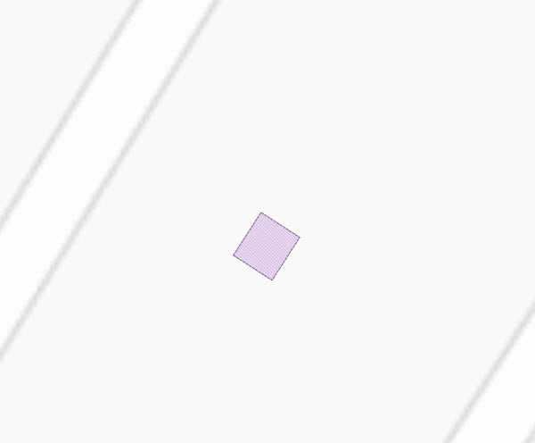
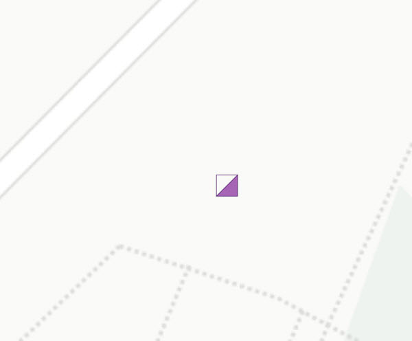
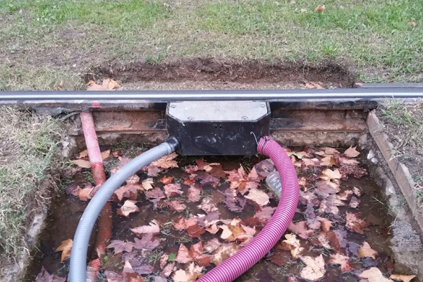
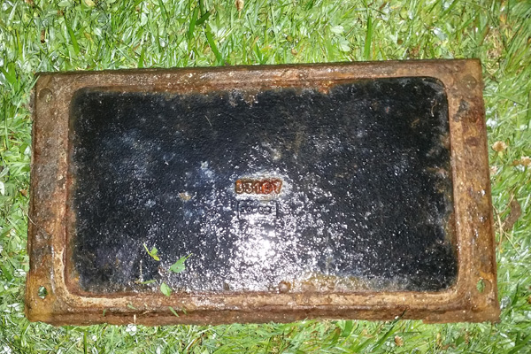
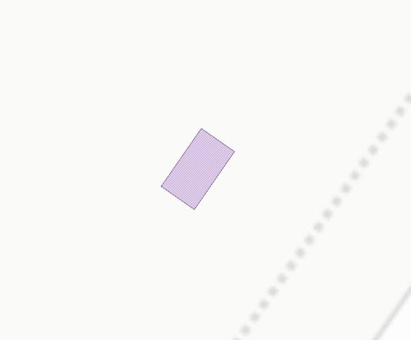
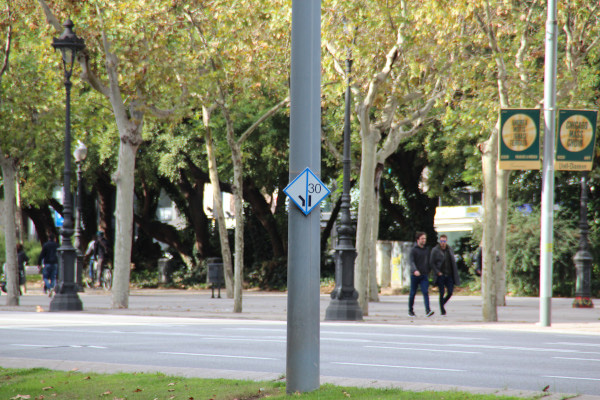
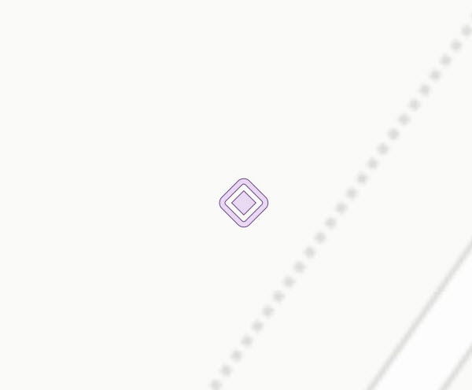
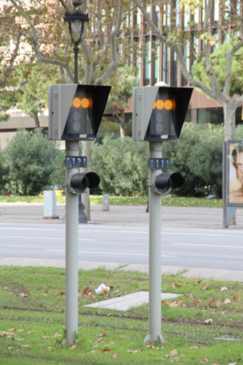
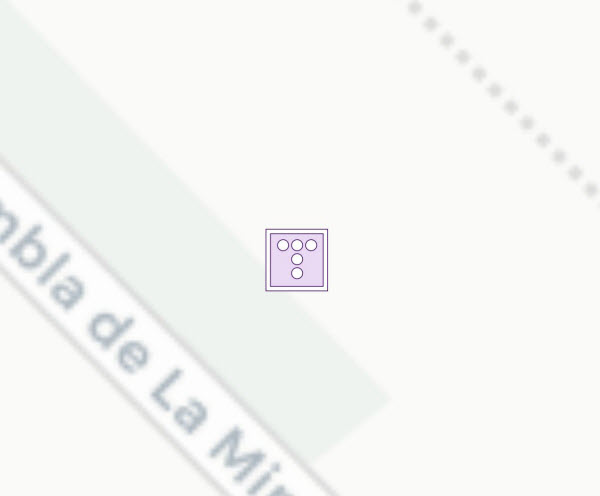

## 13 Senyalització ferroviària

 

>  Grup: Sistemes Tramviaris · Número elements: 5

 

Tot i que el sistema de conducció del tramvia és principalment marxa a la vista, en determinats trams on aquest mode de conducció no pot garantir-se amb seguretat es disposa de senyalització ferroviària. Aquest subsistema es compon d'un conjunt de senyals, mecanismes d'accionament i control, que tenen com a funció informar als conductors de tramvia de les condicions de la via que es trobaran en endavant perquè puguin prendre decisions amb antelació i de forma segura.

 

### 001 Accionament

> `Identificador: 13001 | Codi: ACC | Geometria: POLÍGON`

 

Accionament d'un canvi o desviament de via. Dispositiu electromecànic o mecànic que permet desplaçar els elements mòbils d’un canvi o desviament (agulles).

 

 
Foto de detall:
 

 

**Atributs**

| Atribut       | Tipus    | Descripció  |
| ------------- |:-------------| :-----|
| XARXA         | Indica a la xarxa a la qual pertany la infraestructura tramviària. Actualment Trambaix (TBX) o bé Trambesòs (TBS). En un futur es podran incloure altres xarxes encara no definides. | [String (20)] |
| CODI_ACTIU    | Codi que identifica un element en el GIS de forma unívoca. Està format per 4 parts separades per un guió. Comença amb el prefix TRM, després el codi de l'element segons el model de dades, un numero de dos dígits que indica l'operador o creador i un número de 5 dígits que identifica l'element al GIS de forma única.      |   [String (20)] |
| TIPUS | Fa referència al tipus d'accionament de la senyalització ferroviària. Aquest pot ser de tipus motoritzat, manual talonable no reversible o manual talonable reversible. L'atribut ha de tenir un dels següents valors:<ul><li>**Motorizat**: Defineix que el tipus de mecanisme de l'accionament és de tipus motoritzat. Aquest tipus d'accionament actua de forma automàtica. </li><li>**Manual talonable no reversible**: Defineix que l'accionament és talonable no reversible. Aquest accionament no torna a la posició original després de la seva activació. </li><li>**Manual talonable reversible**: Defineix que l'accionament és talonable reversible. Aquest accionament torna a la posició original després de la seva activació. </li><li>**Manual no talonable**: Defineix que l'accionament és no talonable. </li>| [String (50)] |
| ENCLAVAMENT | Fa referència al nom de l'enclavament que controla l'accionament. | [String (20)] |
| VIA | Determina sobre quin número de via es troba l'element. Els números de via són 1, 2, 3 i 4. | [String (20)] |
| CODI_INTERN | Es tracta del codi intern propi de l'accionament. | [String (20)]|

 

**Representació GIS:**

 

 

    Nom capa element: Senyalització ferroviària-accionament
    Nom taula DB: atmgis_13_accionament
    Nom camp geometria DB: geom
    Representació gràfica:

        part 1 [weight: '0.26', dasharray: '3 1', color: '#4d1c6e', fillcolor: '#ac90bf', fillstyle: 'trama diagonal']
        part 2 [weight: '0.26', dasharray: 'null', color: '#232323', fillcolor: '#e9d9f3', fillstyle: 'solid']

  

### 002 Armari

> `Identificador: 13002 | Codi: ANC | Geometria: PUNT`

 

Armari PLC de control i electrònica. Armari de tipus PLC que conté els aparells electrònics que controlen i programen els diferents elements de la senyalització ferroviària.

 

 

**Atributs**

| Atribut       | Tipus    | Descripció  |
| ------------- |:-------------| :-----|
| XARXA         | Indica a la xarxa a la qual pertany la infraestructura tramviària. Actualment Trambaix (TBX) o bé Trambesòs (TBS). En un futur es podran incloure altres xarxes encara no definides. | [String (20)] |
| CODI_ACTIU    | Codi que identifica un element en el GIS de forma unívoca. Està format per 4 parts separades per un guió. Comença amb el prefix TRM, després el codi de l'element segons el model de dades, un numero de dos dígits que indica l'operador o creador i un número de 5 dígits que identifica l'element al GIS de forma única.      |   [String (20)] |
| ALIMENTACIO_PRINCIPAL | Codi intern de l'estació que és font d'alimentació principal de l'armari. | [String (20)] |
| ALIMENTACIO_RESERVA| Codi intern de l'estació que alimenta l'armari en cas de que l'alimentació principal no estigui operativa. | [String (20)] |
| ENCLAVAMENT | Fa referència al nom de l'enclavament que gestiona l'armari. | [String (40)] |
| CODI_INTERN | Es refereix al codi intern de l'armari. | [String (20)] |

 

**Representació GIS:**

 

 

    Nom capa element: Senyalització ferroviària-armari
    Nom taula DB: atmgis_13_armari
    Nom camp geometria DB: geom
    Representació gràfica:

        [symbol: 'armari.svg', angle: '90', size: '3', weight: '0.3', color: '#4d1c6e', fillcolor: '#a765b5']

  

### 003 Elements de detecció

> `Identificador: 13003 | Codi: EDE | Geometria: POLÍGON`

 

Elements per a la detecció de pas de tramvia. Elements ubicats a la via, ja siguin circuits de via o comptadors d’eixos, que permeten detectar la presència d’un vehicle ferroviari en un tram anomenat cantó. La informació processada per aquests elements és enviada a l’enclavament ferroviari per enviar consignes als senyals ferroviaris, als vehicles i a d’altres elements.

 

 
Foto de detall:
 

 

**Atributs**

| Atribut       | Tipus    | Descripció  |
| ------------- |:-------------| :-----|
| XARXA         | Indica a la xarxa a la qual pertany la infraestructura tramviària. Actualment Trambaix (TBX) o bé Trambesòs (TBS). En un futur es podran incloure altres xarxes encara no definides. | [String (20)] |
| CODI_ACTIU    | Codi que identifica un element en el GIS de forma unívoca. Està format per 4 parts separades per un guió. Comença amb el prefix TRM, després el codi de l'element segons el model de dades, un numero de dos dígits que indica l'operador o creador i un número de 5 dígits que identifica l'element al GIS de forma única.      |   [String (20)] |
| TIPUS | Indica el tipus d'element de detecció. Pot tractar-se de llaços, bobines, eixos, circuit de via o comptador d'eixos. L'atribut ha de tenir un dels següents valors:<ul><li>**Llaços**: Defineix que l'element de detecció és de tipus llaç. </li><li>**Bobines**: Defineix que l'element de detecció és de tipus bobina. </li><li>**Circuit de via**: Defineix que l'element de detecció és de tipus circuit de via. </li><li>**Comptador d'eixos**: Defineix que l'element de detecció és de tipus comptador d'eixos. </li> | [String (20)] |
| ENCLAVAMENT | Fa referència al nom de l'enclavament que controla l'element de detecció. | [String (20)] |
| VIA | Determina sobre quin número de via es troba l'element. Els números de via són 1, 2, 3 i 4. | [String (20)] |
| CODI_INTERN | Codi intern de l'element de detecció. | [String (30)] |

 

**Representació GIS:**

 

 

    Nom capa element: Senyalització ferroviària-elements de detecció
    Nom taula DB: atmgis_13_elements_de_deteccio
    Nom camp geometria DB: geom
    Representació gràfica:

        part 1 [weight: '0.26', dasharray: '3 1', color: '#4d1c6e', fillcolor: '#ac90bf', fillstyle: 'trama en x']
        part 2 [weight: '0.26', dasharray: 'null', color: '#232323', fillcolor: '#e9d9f3', fillstyle: 'solid']

  

### 004 Senyals fixos

> `Identificador: 13004 | Codi: SFF | Geometria: PUNT`

 

Senyal ferroviària fix. Són aquells senyals ferroviaris que són estàtics, fixes sempre en la mateixa posició.

 

 

**Atributs**

| Atribut       | Tipus    | Descripció  |
| ------------- |:-------------| :-----|
| XARXA         | Indica a la xarxa a la qual pertany la infraestructura tramviària. Actualment Trambaix (TBX) o bé Trambesòs (TBS). En un futur es podran incloure altres xarxes encara no definides. | [String (20)] |
| CODI_ACTIU    | Codi que identifica un element en el GIS de forma unívoca. Està format per 4 parts separades per un guió. Comença amb el prefix TRM, després el codi de l'element segons el model de dades, un numero de dos dígits que indica l'operador o creador i un número de 5 dígits que identifica l'element al GIS de forma única.      |   [String (20)] |
| TIPUS | Determina de quin tipus de senyal fix es tracta. L'atribut ha de tenir un dels següents valors:<ul><li>**D**: Defineix que la senyal fixa és de tipus Punt de decisió. </li><li>**DX**: Defineix que la senyal fixa és de tipus Punt de decisió per la següent cruïlla. </li><li>**L**: Defineix que la senyal fixa és de tipus Límit de maniobra. </li><li>**M**: Defineix que la senyal fixa és de tipus Maniobra. </li><li>**MX**: Defineix que la senyal fixa és de tipus Maniobra per la següent cruïlla. </li><li>**Final de via**: Defineix que la senyal fixa és de tipus Final de via. </li><li>**Final Límit Velocitat**: Defineix que la senyal fixa és de tipus Final Límit Velocitat. </li><li>**Límit Velocitat**: Defineix que la senyal fixa és de tipus Límit Velocitat. </li> | [String (30)] |
| VELOCITAT | Defineix si hi ha indicador de velocitat i quina és en cas afirmatiu. Valor NUL quan no n'hi ha. | [String (10)] |
| VIA | Determina sobre quin número de via es troba l'element. Els números de via són 1, 2, 3 i 4. | [String (20)] |

 

**Representació GIS:**

 

 

    Nom capa element: Senyalització ferroviària-senyals fixos
    Nom taula DB: atmgis_13_senyals_fixos
    Nom camp geometria DB: geom
    Representació gràfica:

        [symbol: 'senyal_fixe.svg', angle: '180', size: '3', weight: '0.3', color: '#4d1c6e', fillcolor: '#e9d9f3']

  

### 005 Senyals lluminosos

> `Identificador: 13005 | Codi: SFL | Geometria: PUNT`

 

Senyal ferroviària lluminós. Són aquells senyals ferroviaris basats en senyalització lluminosa.

 

 

**Atributs**

| Atribut       | Tipus    | Descripció  |
| ------------- |:-------------| :-----|
| XARXA         | Indica a la xarxa a la qual pertany la infraestructura tramviària. Actualment Trambaix (TBX) o bé Trambesòs (TBS). En un futur es podran incloure altres xarxes encara no definides. | [String (20)] |
| CODI_ACTIU    | Codi que identifica un element en el GIS de forma unívoca. Està format per 4 parts separades per un guió. Comença amb el prefix TRM, després el codi de l'element segons el model de dades, un numero de dos dígits que indica l'operador o creador i un número de 5 dígits que identifica l'element al GIS de forma única.      |   [String (20)] |
| TIPUS | Defineix el tipus de senyal lluminós. L'atribut ha de tenir un dels següents valors:<ul><li>**Enclavament**: Defineix que el senyal lluminós és de tipus Enclavament. </li><li>**Fixe**: Defineix que la senyal lluminosa és de tipus Fixe. </li><li>**Posició d'agulla**: Defineix que el senyal lluminós és de tipus Posició d'agulla. </li><li>**Cantonament**: Defineix que el senyal lluminós és de tipus Cantonament. </li> | [String (20)] |
| ENCLAVAMENT | Fa referència al nom de l'enclavament que controla el senyal lluminós. | [String (20)] |
| VIA | Determina sobre quin número de via es troba l'element. Els números de via són 1, 2, 3 i 4. | [String (20)] |
| CODI_INTERN | Fa referència al codi intern del senyal lluminós. | [String (20)] |

 

**Representació GIS:**

 

 

    Nom capa element: Senyalització ferroviària-senyals lluminosos
    Nom taula DB: atmgis_13_senyals_lluminosos
    Nom camp geometria DB: geom
    Representació gràfica:

        [symbol: 'senyal_lluminos.svg', angle: '180', size: '1.2', weight: '0.3', color: '#4d1c6e', fillcolor: '#e9d9f3']
