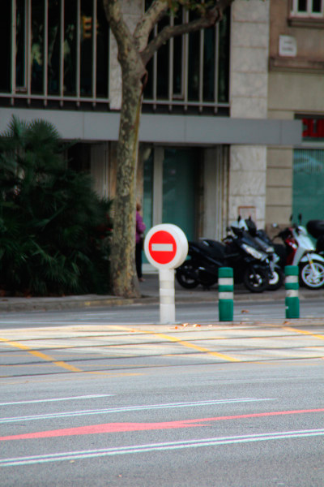
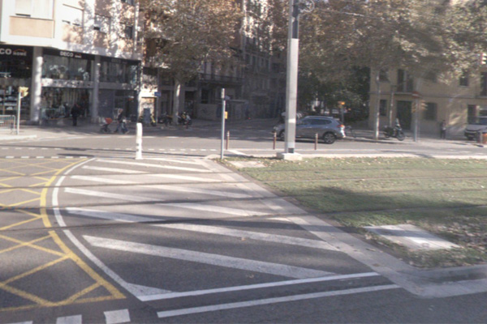

## 15 Senyalització viària

 

>  Grup: Sistemes Tramviaris · Número elements: 2

 

La senyalització viària és el conjunt de símbols, verticals i horitzontals, pensats per a guiar i orientar el trànsit, rodat o vianant, per la via pública.

 

### 001 Senyalització viària vertical

> `Identificador: 15001 | Codi: SVV | Geometria: PUNT`

 

Sistema de senyals verticals per a la ordenació del trànsit. Senyalització vertical per el trànsit rodat en l'àmbit del tramvia.

 

 

**Atributs**

| Atribut       | Tipus    | Descripció  |
| ------------- |:-------------| :-----|
| XARXA         | Indica a la xarxa a la qual pertany la infraestructura tramviària. Actualment Trambaix (TBX) o bé Trambesòs (TBS). En un futur es podran incloure altres xarxes encara no definides. | [String (20)] |
| CODI_ACTIU    | Codi que identifica un element en el GIS de forma unívoca. Està format per 4 parts separades per un guió. Comença amb el prefix TRM, després el codi de l'element segons el model de dades, un numero de dos dígits que indica l'operador o creador i un número de 5 dígits que identifica l'element al GIS de forma única.      |   [String (20)] |
| TIPUS | Indica la tipologia de senyalització vertical, com pilones, senyals, placa atenció vianants, etc. | [String (20)] |

 

**Representació GIS:**

 

 

    Nom capa element: Senyalització viària-senyalització viària verical
    Nom taula DB: atmgis_15_senyalitzacio_viaria_vertical
    Nom camp geometria DB: geom
    Representació gràfica:

        [symbol: 'senyal_fixe.svg', angle: '180', size: '2', weight: '0.2', color: '#434343', fillcolor: '#fbf9a7']

  

### 002 Senyalització viària horitzontal

> `Identificador: 15002 | Codi: SVH | Geometria: POLÍGON`

 

Sistema de senyals horitzontals per a la ordenació del trànsit. Senyalització horitzontal (pintada al terra) en l'àmbit del tramvia.

 

 

**Atributs**

| Atribut       | Tipus    | Descripció  |
| ------------- |:-------------| :-----|
| XARXA         | Indica a la xarxa a la qual pertany la infraestructura tramviària. Actualment Trambaix (TBX) o bé Trambesòs (TBS). En un futur es podran incloure altres xarxes encara no definides. | [String (20)] |
| CODI_ACTIU    | Codi que identifica un element en el GIS de forma unívoca. Està format per 4 parts separades per un guió. Comença amb el prefix TRM, després el codi de l'element segons el model de dades, un numero de dos dígits que indica l'operador o creador i un número de 5 dígits que identifica l'element al GIS de forma única.      |   [String (20)] |
| TIPUS | Indica la tipologia de senyalització horitzontal (graella, zebrejat, passos vianants, carril bici i altres pintures d'aglomerat). L'atribut ha de tenir un dels següents valors:<ul><li>**Graella**: Senyalització viària horitzontal(pintura) present en cruïlles. [**Veure**](img/1500211.jpg) </li><li>**Passos de vianants**: Senyalització viària horitzontal(pintura) de tipus pas de vianants. [**Veure**](img/1500212.jpg) </li><li>**Zebrejat**: Senyalització viària horitzontal(pintura) de tipus zebrejat. [**Veure**](img/1500213.jpg) </li><li>**Altres pintures**: Senyalització viària horitzontal(pintura) d'altres tipus. [**Veure**](img/1500214.jpg) </li><li>**Carril bici**: Senyalització viària horitzontal(pintura) de tipus carril bici. </li> | [String (20)] |

 

**Representació GIS:**

 

 

    Nom capa element: Senyalització viària-senyalització viària horitzontal
    Nom taula DB: atmgis_15_senyalitzacio_viaria_horitzontal
    Nom camp geometria DB: geom
    Representació gràfica:

        altres pintures [weight: '0.4', dasharray: 'continua', color: '#6e6e6e', fillcolor: '#a5ffd1', fillstyle: 'trama en x']
        altres pintures [weight: '0.26', dasharray: 'null', color: '#232323', fillcolor: '#e9e9e9', fillopacity: '48', fillstyle: 'solid']
        graella [weight: '0.4', dasharray: '3 1 2 1 2', color: '#6e6e6e', fillcolor: '#e5e224', fillstyle: 'trama creu']
        graella [weight: '0.26', dasharray: 'null', color: '#232323', fillcolor: '#e9e9e9', fillopacity: '48', fillstyle: 'solid']
        passos de vianants [weight: '0.26', dasharray: 'continua', color: '#232323', fillcolor: '#6e6e6e', fillstyle: 'trama en x']
        passos de vianants [weight: '0.26', dasharray: 'null', color: '#232323', fillcolor: '#ffa5a5', fillopacity: '48', fillstyle: 'solid']
        zebrejat [weight: '0.4', dasharray: '3 1 2 1 2', color: '#6e6e6e', fillcolor: '#6e6e6e', fillstyle: 'cruz']
        zebrejat [weight: '0.26', dasharray: 'null', color: '#232323', fillcolor: '#e9e9e9', fillopacity: '48', fillstyle: 'solid']
