## 11 Subestacions

 

>  Grup: Sistemes Tramviaris · Número elements: 10

 

Emplaçaments, soterrats o en superfície, que reben l'energia elèctrica i la transformen i rectifiquen per als diferents consums del sistema tramviari.

 

### 001 Obra Civil

> `Identificador: 11001 | Codi: OBC | Geometria: POLÍGON`

 

Emplaçament de la subestació. La subestació de tracció transforma i rectifica l'energia elèctrica proveïda de companyia a unes condicions de voltatge, corrent i freqüència adients per als diferents consums del tramvia. En aquest cas, l'element obra civil contempla el perímetre del conjunt.

 

 
Foto de detall:
 

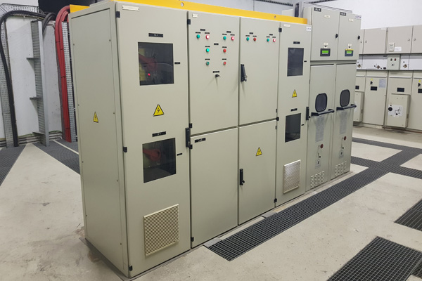

 

**Atributs**

| Atribut       | Tipus    | Descripció  |
| ------------- |:-------------| :-----|
| XARXA         | Indica a la xarxa a la qual pertany la infraestructura tramviària. Actualment Trambaix (TBX) o bé Trambesòs (TBS). En un futur es podran incloure altres xarxes encara no definides. | [String (20)] |
| CODI_ACTIU    | Codi que identifica un element en el GIS de forma unívoca. Està format per 4 parts separades per un guió. Comença amb el prefix TRM, després el codi de l'element segons el model de dades, un numero de dos dígits que indica l'operador o creador i un número de 5 dígits que identifica l'element al GIS de forma única.      |   [String (20)] |
| CODI_SUBESTACIO | Indica el codi intern de la subestació. | [String (20)] |
| NOM_SUBESTACIO | Indica el nom complert de la subestació. | [String (30)] |
| DOCUMENT_ASSOCIAT | Nom d'un o més documents associats amb plànols de diversos detalls de l'element en qüestió. | [String (80)]|

 

**Representació GIS:**

 

 

    Nom capa element: Subestacions-obra civil
    Nom taula DB: atmgis_11_obra_civil
    Nom camp geometria DB: geom
    Representació gràfica:

        [weight: '0.5', dasharray: 'continua', color: '#434343', fillcolor: '#6e6e6e', fillstyle: 'trama en x', labelby: '@nom_subestacio + @codi_subestacio']

  

### 002 Transformadors

> `Identificador: 11002 | Codi: TRA | Geometria: POLÍGON`

 

Transformador de tensió elèctrica. Màquina elèctrica d’inducció electromagnètica que permet convertir els valors de tensió d’entrada en valors diferents de sortida, sense modificar la potència.

 

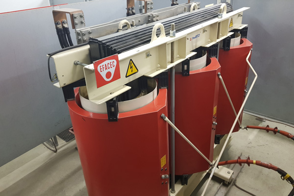

 

**Atributs**

| Atribut       | Tipus    | Descripció  |
| ------------- |:-------------| :-----|
| XARXA         | Indica a la xarxa a la qual pertany la infraestructura tramviària. Actualment Trambaix (TBX) o bé Trambesòs (TBS). En un futur es podran incloure altres xarxes encara no definides. | [String (20)] |
| CODI_ACTIU    | Codi que identifica un element en el GIS de forma unívoca. Està format per 4 parts separades per un guió. Comença amb el prefix TRM, després el codi de l'element segons el model de dades, un numero de dos dígits que indica l'operador o creador i un número de 5 dígits que identifica l'element al GIS de forma única.      |   [String (20)] |
| CODI_SUBESTACIO | Indica el codi intern de la subestació. | [String (20)] |
| NOM_SUBESTACIO | Indica el nom complert de la subestació. | [String (30)] |
| POTENCIA | Potencia del transformador. | [String (10)]|

 

**Representació GIS:**

 

 

    Nom capa element: Subestacions-trafos
    Nom taula DB: atmgis_11_transformadors
    Nom camp geometria DB: geom
    Representació gràfica:

        [weight: '0.3', dasharray: 'continua', color: '#434343', fillcolor: '#eaeaea', fillstyle: 'solid', labelby: 't']

  

### 003 Cel·les MT 25 kV

> `Identificador: 11003 | Codi: CEL | Geometria: POLÍGON`

 

Cel·les de mitja tensió. Conjunt de seccions verticals on es troben ubicats diferents equips - de maniobra (interruptors de potència, seccionadors,...) de mesura (transformadors de tensió i de corrent,...) i de protecció/control – muntats en uns compartiments amb una estructura metàl·lica externa, amb la funció de rebre i distribuir l'energia elèctrica.

 

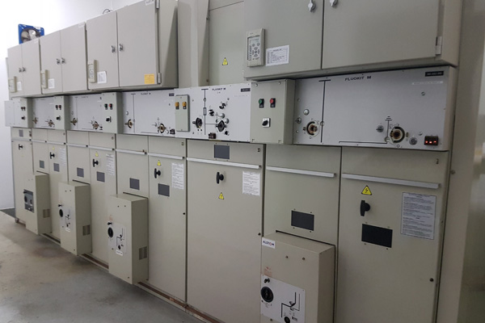

 

**Atributs**

| Atribut       | Tipus    | Descripció  |
| ------------- |:-------------| :-----|
| XARXA         | Indica a la xarxa a la qual pertany la infraestructura tramviària. Actualment Trambaix (TBX) o bé Trambesòs (TBS). En un futur es podran incloure altres xarxes encara no definides. | [String (20)] |
| CODI_ACTIU    | Codi que identifica un element en el GIS de forma unívoca. Està format per 4 parts separades per un guió. Comença amb el prefix TRM, després el codi de l'element segons el model de dades, un numero de dos dígits que indica l'operador o creador i un número de 5 dígits que identifica l'element al GIS de forma única.      |   [String (20)] |
| CODI_SUBESTACIO | Indica el codi intern de la subestació. | [String (20)] |
| NOM_SUBESTACIO | Indica el nom complert de la subestació. | [String (30)] |

 

**Representació GIS:**

 

 

    Nom capa element: Subestacions-cel·les
    Nom taula DB: atmgis_11_cel·les_mt_25_kv
    Nom camp geometria DB: geom
    Representació gràfica:

        [weight: '0.3', dasharray: 'continua', color: '#434343', fillcolor: '#eaeaea', fillstyle: 'solid', labelby: 'mt25']

  

### 004 Rectificadors 900 kW

> `Identificador: 11004 | Codi: REC | Geometria: POLÍGON`

 

Rectificador de corrent elèctric. Dispositiu elèctric que converteix el corrent altern en corrent continu.

 

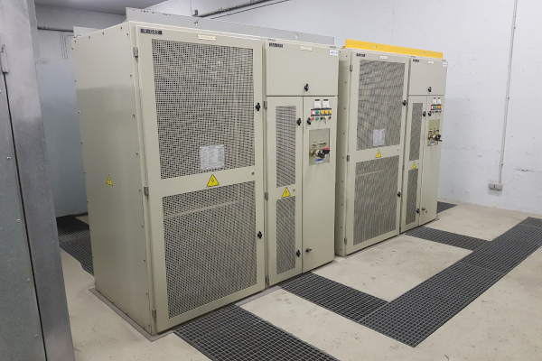

 
Foto de detall:
 

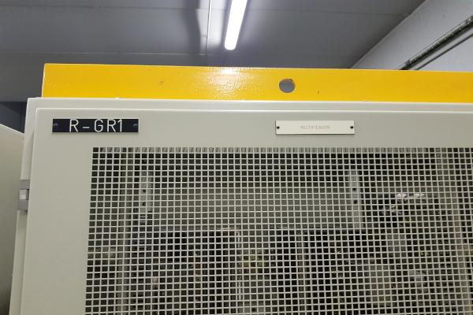

 

**Atributs**

| Atribut       | Tipus    | Descripció  |
| ------------- |:-------------| :-----|
| XARXA         | Indica a la xarxa a la qual pertany la infraestructura tramviària. Actualment Trambaix (TBX) o bé Trambesòs (TBS). En un futur es podran incloure altres xarxes encara no definides. | [String (20)] |
| CODI_ACTIU    | Codi que identifica un element en el GIS de forma unívoca. Està format per 4 parts separades per un guió. Comença amb el prefix TRM, després el codi de l'element segons el model de dades, un numero de dos dígits que indica l'operador o creador i un número de 5 dígits que identifica l'element al GIS de forma única.      |   [String (20)] |
| CODI_SUBESTACIO | Indica el codi intern de la subestació. | [String (20)] |
| NOM_SUBESTACIO | Indica el nom complert de la subestació. | [String (30)] |

 

**Representació GIS:**

 

 

    Nom capa element: Subestacions-rectificadors
    Nom taula DB: atmgis_11_rectificadors_900_kw
    Nom camp geometria DB: geom
    Representació gràfica:

        [weight: '0.3', dasharray: 'continua', color: '#434343', fillcolor: '#eaeaea', fillstyle: 'solid', labelby: 'r']
        [symbol: 'armari.svg', angle: '90', size: '3', weight: '0.3', color: '#a02c41', fillcolor: '#966770']

  

### 005 Carregadors i bateries

> `Identificador: 11005 | Codi: RCT | Geometria: POLÍGON`

 

Acumuladors d'energia. Aparells acumuladors d'energia elèctrica que funcionen coma reservori.

 

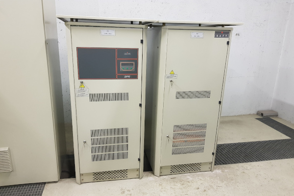

 

**Atributs**

| Atribut       | Tipus    | Descripció  |
| ------------- |:-------------| :-----|
| XARXA         | Indica a la xarxa a la qual pertany la infraestructura tramviària. Actualment Trambaix (TBX) o bé Trambesòs (TBS). En un futur es podran incloure altres xarxes encara no definides. | [String (20)] |
| CODI_ACTIU    | Codi que identifica un element en el GIS de forma unívoca. Està format per 4 parts separades per un guió. Comença amb el prefix TRM, després el codi de l'element segons el model de dades, un numero de dos dígits que indica l'operador o creador i un número de 5 dígits que identifica l'element al GIS de forma única.      |   [String (20)] |
| CODI_SUBESTACIO | Indica el codi intern de la subestació. | [String (20)] |
| NOM_SUBESTACIO | Indica el nom complert de la subestació. | [String (30)] |

 

**Representació GIS:**

 

 

    Nom capa element: Subestacions-carregador i bateries
    Nom taula DB: atmgis_11_carregadors_i_bateries
    Nom camp geometria DB: geom
    Representació gràfica:

        Simbologia no definida

  

### 006 Quadre BT

> `Identificador: 11006 | Codi: QUB | Geometria: POLÍGON`

 

Quadre de baixa tensió. És el conjunt de mòduls que reben el circuit principal de BT del transformador i el distribueixen en diversos circuits individuals que alimenten diferents elements de la subestació.

 

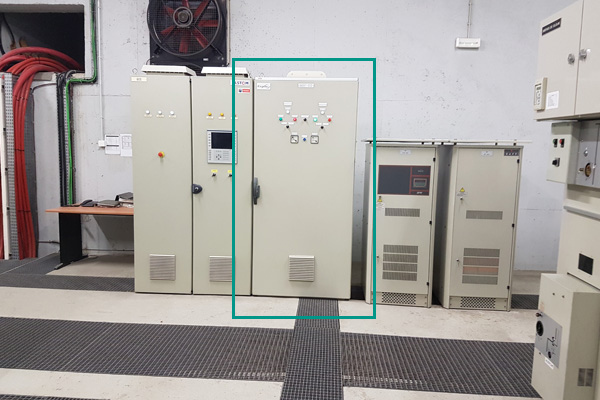

 
Foto de detall:
 

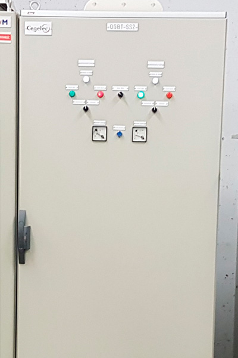

 

**Atributs**

| Atribut       | Tipus    | Descripció  |
| ------------- |:-------------| :-----|
| XARXA         | Indica a la xarxa a la qual pertany la infraestructura tramviària. Actualment Trambaix (TBX) o bé Trambesòs (TBS). En un futur es podran incloure altres xarxes encara no definides. | [String (20)] |
| CODI_ACTIU    | Codi que identifica un element en el GIS de forma unívoca. Està format per 4 parts separades per un guió. Comença amb el prefix TRM, després el codi de l'element segons el model de dades, un numero de dos dígits que indica l'operador o creador i un número de 5 dígits que identifica l'element al GIS de forma única.      |   [String (20)] |
| CODI_SUBESTACIO | Indica el codi intern de la subestació. | [String (20)] |
| NOM_SUBESTACIO | Indica el nom complert de la subestació. | [String (30)] |

 

**Representació GIS:**

 

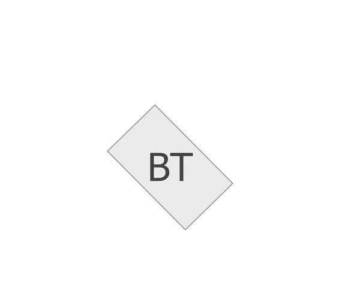

 

    Nom capa element: Subestacions-quadre bt
    Nom taula DB: atmgis_11_quadre_bt
    Nom camp geometria DB: geom
    Representació gràfica:

        [weight: '0.3', dasharray: 'continua', color: '#434343', fillcolor: '#eaeaea', fillstyle: 'solid', labelby: 'bt']

  

### 007 Quadre de control

> `Identificador: 11007 | Codi: QUC | Geometria: POLÍGON`

 

Quadre de control. Quadre que conté els comandaments per al control de la subestació.

 

 
Foto de detall:
 

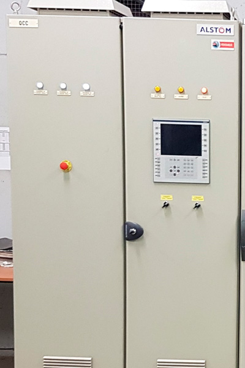

 

**Atributs**

| Atribut       | Tipus    | Descripció  |
| ------------- |:-------------| :-----|
| XARXA         | Indica a la xarxa a la qual pertany la infraestructura tramviària. Actualment Trambaix (TBX) o bé Trambesòs (TBS). En un futur es podran incloure altres xarxes encara no definides. | [String (20)] |
| CODI_ACTIU    | Codi que identifica un element en el GIS de forma unívoca. Està format per 4 parts separades per un guió. Comença amb el prefix TRM, després el codi de l'element segons el model de dades, un numero de dos dígits que indica l'operador o creador i un número de 5 dígits que identifica l'element al GIS de forma única.      |   [String (20)] |
| CODI_SUBESTACIO | Indica el codi intern de la subestació. | [String (20)] |
| NOM_SUBESTACIO | Indica el nom complert de la subestació. | [String (30)] |

 

**Representació GIS:**

 

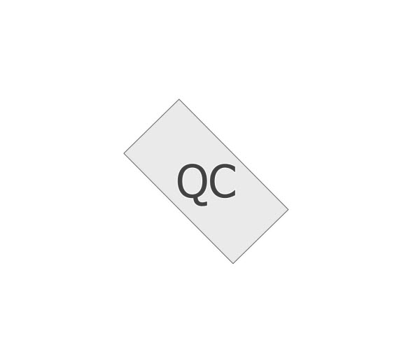

 

    Nom capa element: Subestacions-quadre de control
    Nom taula DB: atmgis_11_quadre_de_control
    Nom camp geometria DB: geom
    Representació gràfica:

        [weight: '0.3', dasharray: 'continua', color: '#434343', fillcolor: '#eaeaea', fillstyle: 'solid', labelby: 'qc']

  

### 008 Quadre de seccionadors 750 VCC

> `Identificador: 11008 | Codi: QUS | Geometria: POLÍGON`

 

Quadre de seccionadors. Quadre que conté el comandament per al control dels seccionadors de catenària.

 

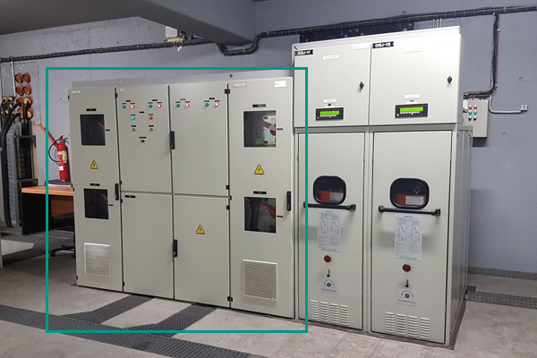

 

**Atributs**

| Atribut       | Tipus    | Descripció  |
| ------------- |:-------------| :-----|
| XARXA         | Indica a la xarxa a la qual pertany la infraestructura tramviària. Actualment Trambaix (TBX) o bé Trambesòs (TBS). En un futur es podran incloure altres xarxes encara no definides. | [String (20)] |
| CODI_ACTIU    | Codi que identifica un element en el GIS de forma unívoca. Està format per 4 parts separades per un guió. Comença amb el prefix TRM, després el codi de l'element segons el model de dades, un numero de dos dígits que indica l'operador o creador i un número de 5 dígits que identifica l'element al GIS de forma única.      |   [String (20)] |
| CODI_SUBESTACIO | Indica el codi intern de la subestació. | [String (20)] |
| NOM_SUBESTACIO | Indica el nom complert de la subestació. | [String (30)] |

 

**Representació GIS:**

 

 

    Nom capa element: Subestacions-quadre de seccionadors
    Nom taula DB: atmgis_11_quadre_de_seccionadors_750_vcc
    Nom camp geometria DB: geom
    Representació gràfica:

        [weight: '0.3', dasharray: 'continua', color: '#434343', fillcolor: '#eaeaea', fillstyle: 'solid', labelby: 'qs750']

  

### 009 Disjuntor 750 VCC

> `Identificador: 11009 | Codi: DIS | Geometria: POLÍGON`

 

Disjuntors de la subestació Un disjuntor o interruptor automàtic és un dispositiu capaç d'interrompre o obrir un circuit elèctric quan la intensitat del corrent elèctric que hi circula excedeix d'un determinat valor o, en el cas que es produeixi un curtcircuit, amb l'objectiu de no causar danys a la instal·lació elèctrica.

 

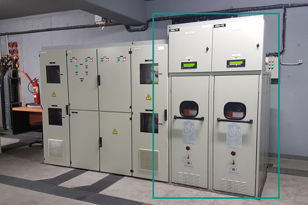

 

**Atributs**

| Atribut       | Tipus    | Descripció  |
| ------------- |:-------------| :-----|
| XARXA         | Indica a la xarxa a la qual pertany la infraestructura tramviària. Actualment Trambaix (TBX) o bé Trambesòs (TBS). En un futur es podran incloure altres xarxes encara no definides. | [String (20)] |
| CODI_ACTIU    | Codi que identifica un element en el GIS de forma unívoca. Està format per 4 parts separades per un guió. Comença amb el prefix TRM, després el codi de l'element segons el model de dades, un numero de dos dígits que indica l'operador o creador i un número de 5 dígits que identifica l'element al GIS de forma única.      |   [String (20)] |
| CODI_SUBESTACIO | Indica el codi intern de la subestació. | [String (20)] |
| NOM_SUBESTACIO | Indica el nom complert de la subestació. | [String (30)] |

 

**Representació GIS:**

 

 

    Nom capa element: Subestacions-disjuntors
    Nom taula DB: atmgis_11_disjuntor_750_vcc
    Nom camp geometria DB: geom
    Representació gràfica:

        [weight: '0.3', dasharray: 'continua', color: '#434343', fillcolor: '#eaeaea', labelby: 'd750']

  

### 010 SAA

> `Identificador: 11010 | Codi: SAA | Geometria: POLÍGON`

 

Seccionador d'Aïllament Automàtic. Seccionador que permet aïllar una subestació de la xarxa de tracció per incidència o manteniment.

 

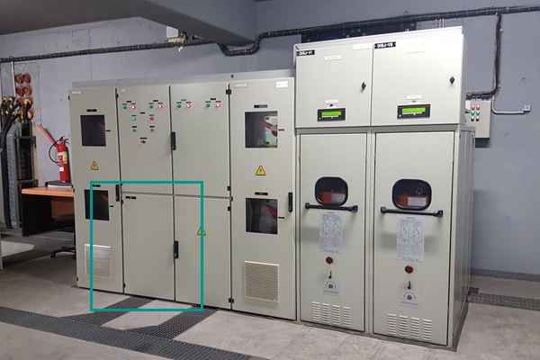

 

**Atributs**

| Atribut       | Tipus    | Descripció  |
| ------------- |:-------------| :-----|
| XARXA         | Indica a la xarxa a la qual pertany la infraestructura tramviària. Actualment Trambaix (TBX) o bé Trambesòs (TBS). En un futur es podran incloure altres xarxes encara no definides. | [String (20)] |
| CODI_ACTIU    | Codi que identifica un element en el GIS de forma unívoca. Està format per 4 parts separades per un guió. Comença amb el prefix TRM, després el codi de l'element segons el model de dades, un numero de dos dígits que indica l'operador o creador i un número de 5 dígits que identifica l'element al GIS de forma única.      |   [String (20)] |
| CODI_SUBESTACIO | Indica el codi intern de la subestació. | [String (20)] |
| NOM_SUBESTACIO | Indica el nom complert de la subestació. | [String (30)] |

 

**Representació GIS:**

 

 

    Nom capa element: SAA
    Nom taula DB: atmgis_11_saa
    Nom camp geometria DB: geom
    Representació gràfica:

        [weight: '0.3', dasharray: 'continua', color: '#434343', fillcolor: '#eaeaea', fillstyle: 'solid', labelby: 'saa']
