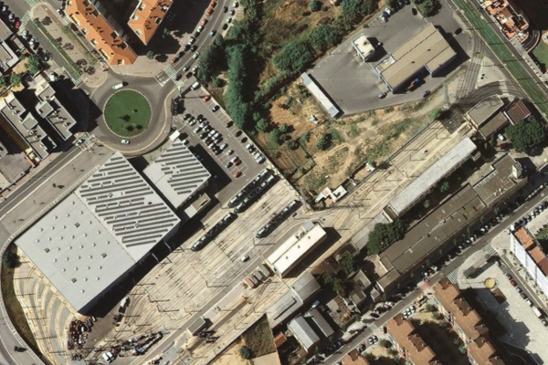
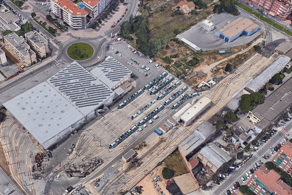
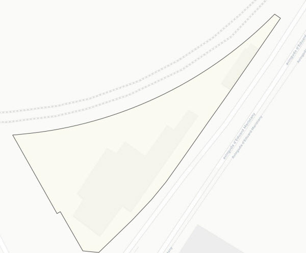
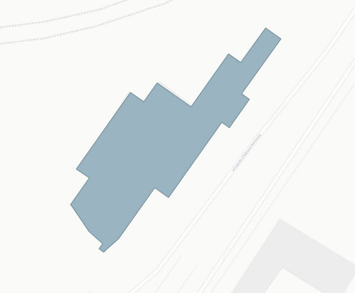

## 17 Tallers i Cotxeres

 

>  Grup: Sistemes Tramviaris · Número elements: 2

 

Es tracta de les instal·lacions, clarament delimitades i fora de l'abast públic general, que acullen activitats de manteniment i neteja a més de disposar d'espai per a l'estacionament de la flota. També s'hi troben instal·lacions com el Centre de Control i altres locals d'explotació.

 

### 001 Emplaçament

> `Identificador: 17001 | Codi: TCU | Geometria: POLÍGON`

 

Emplaçament de les Cotxeres i tallers. Són els límits del recinte de Tallers i Cotxeres.

 

 
Foto de detall:
 

 

**Atributs**

| Atribut       | Tipus    | Descripció  |
| ------------- |:-------------| :-----|
| XARXA         | Indica a la xarxa a la qual pertany la infraestructura tramviària. Actualment Trambaix (TBX) o bé Trambesòs (TBS). En un futur es podran incloure altres xarxes encara no definides. | [String (20)] |
| CODI_ACTIU    | Codi que identifica un element en el GIS de forma unívoca. Està format per 4 parts separades per un guió. Comença amb el prefix TRM, després el codi de l'element segons el model de dades, un numero de dos dígits que indica l'operador o creador i un número de 5 dígits que identifica l'element al GIS de forma única.      |   [String (20)] |
| DOCUMENT_ASSOCIAT | Nom d'un o més documents associats amb plànols de diversos detalls de l'element en qüestió. | [String (80)] |

 

**Representació GIS:**

 

 

    Nom capa element: Tallers i Cotxeres-ubicació
    Nom taula DB: atmgis_17_emplacament
    Nom camp geometria DB: geom
    Representació gràfica:

        [weight: '0.35', dasharray: 'continua', color: '#434343', fillcolor: '#fcf9ea', fillopacity: '56', fillstyle: 'solid']

  

### 002 Edificis

> `Identificador: 17002 | Codi: TCE | Geometria: POLÍGON`

 

Edificacions dins del recinte de Cotxeres. Són edificis o construccions amb funcions concretes dins del recinte de Cotxeres.

 

 

**Atributs**

| Atribut       | Tipus    | Descripció  |
| ------------- |:-------------| :-----|
| XARXA         | Indica a la xarxa a la qual pertany la infraestructura tramviària. Actualment Trambaix (TBX) o bé Trambesòs (TBS). En un futur es podran incloure altres xarxes encara no definides. | [String (20)] |
| CODI_ACTIU    | Codi que identifica un element en el GIS de forma unívoca. Està format per 4 parts separades per un guió. Comença amb el prefix TRM, després el codi de l'element segons el model de dades, un numero de dos dígits que indica l'operador o creador i un número de 5 dígits que identifica l'element al GIS de forma única.      |   [String (20)] |
| NOM | Nom descriptiu de l'edifici o element. | [String (80)] |
| DOCUMENT_ASSOCIAT | Nom d'un o més documents associats amb plànols de diversos detalls de l'element en qüestió. | [String (80)] |

 

**Representació GIS:**

 

 

    Nom capa element: Tallers i Cotxeres-edificis
    Nom taula DB: atmgis_17_edificis
    Nom camp geometria DB: geom
    Representació gràfica:

        [weight: '0.4', dasharray: 'continua', color: '#688592', fillcolor: '#9ab5c1', fillstyle: 'solid']
