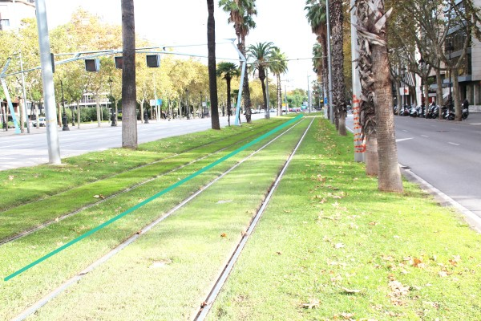
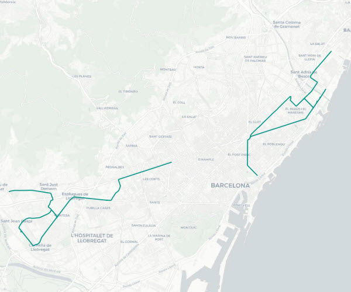
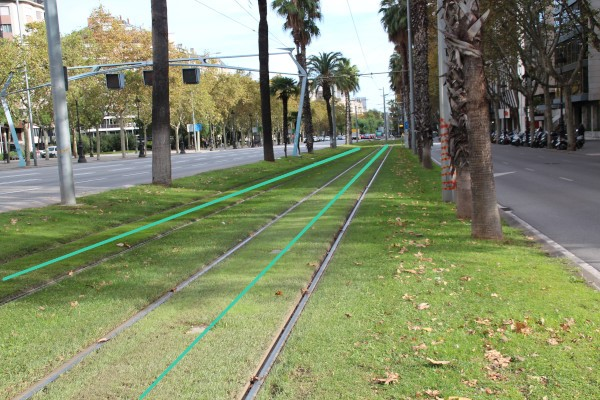
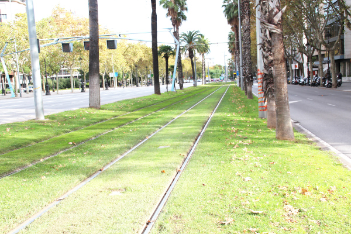
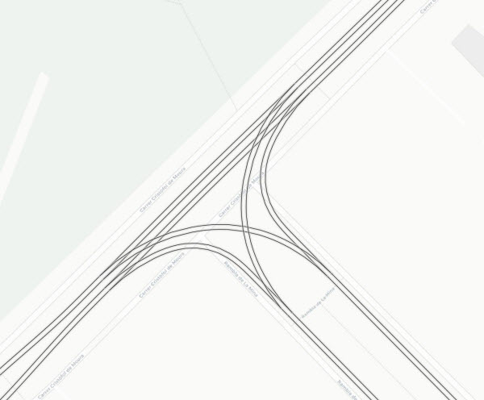
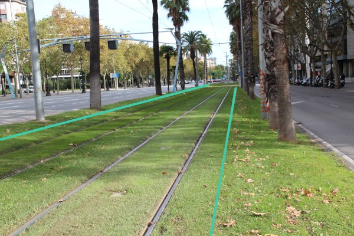
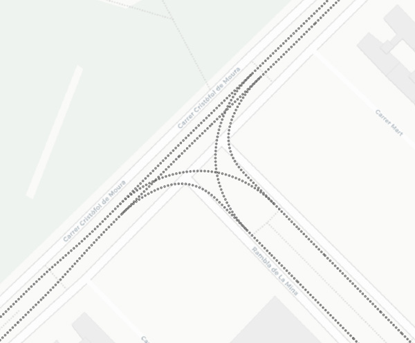

## 02 Traçat
 

>  Grup: Obra Civil · Número elements: 6

 

### 001 Eix de plataforma

> `Identificador: 02001 | Codi: EIP | Geometria: LÍNIA`

 

Eix de la plataforma de tramvia. Línia imaginària que passa pel mig de la plataforma de via de forma equidistant als seus límits. Serveix de referència per a les seccions transversals.

 

 

**Atributs**

| Atribut       | Tipus    | Descripció  |
| ------------- |:-------------| :-----|
| XARXA         | Indica a la xarxa a la qual pertany la infraestructura tramviària. Actualment Trambaix (TBX) o bé Trambesòs (TBS). En un futur es podran incloure altres xarxes encara no definides. | [String (20)] |
| CODI_ACTIU    | Codi que identifica un element en el GIS de forma unívoca. Està format per 4 parts separades per un guió. Comença amb el prefix TRM, després el codi de l'element segons el model de dades, un numero de dos dígits que indica l'operador o creador i un número de 5 dígits que identifica l'element al GIS de forma única.      |   [String (20)] |

 

**Representació GIS:**

 

 

    Nom capa element: Traçat-eix de plataforma
    Nom taula DB: atmgis_02_eix_de_plataforma
    Nom camp geometria DB: geom
    Representació gràfica:

        [weight: '0.6', dasharray: 'continua', color: '#009688']

  

### 002 Eix de via

> `Identificador: 02002 | Codi: EIX | Geometria: LÍNIA`

 

Eix de via. Línia imaginària que passa paral·lela i equidistant entre els 2 fils de rail d'una via.

 

 

**Atributs**

| Atribut       | Tipus    | Descripció  |
| ------------- |:-------------| :-----|
| XARXA         | Indica a la xarxa a la qual pertany la infraestructura tramviària. Actualment Trambaix (TBX) o bé Trambesòs (TBS). En un futur es podran incloure altres xarxes encara no definides. | [String (20)] |
| CODI_ACTIU    | Codi que identifica un element en el GIS de forma unívoca. Està format per 4 parts separades per un guió. Comença amb el prefix TRM, després el codi de l'element segons el model de dades, un numero de dos dígits que indica l'operador o creador i un número de 5 dígits que identifica l'element al GIS de forma única.      |   [String (20)] |
| VIA | Determina sobre quin número de via es troba l'element. Els números de via són 1, 2, 3 i 4. Si l'element està en més d'una via s'indicarà les vies separades per un guionet, per exemple: 1-2. Si l'element no disposa de via s'indicarà si està ubicat al costat BCN o BESOS. | [String (20)] |

 

**Representació GIS:**

 

 

    Nom capa element: Traçat-eix
    Nom taula DB: atmgis_02_eix_de_via
    Nom camp geometria DB: geom
    Representació gràfica:

        [weight: '0.26', dasharray: '3 1', color: '#930202']

  

### 003 Carrils

> `Identificador: 02003 | Codi: CAR | Geometria: LÍNIA`

 

Rails o carrils d'una via. El rail o carril és cadascuna de les barres metàl·liques que formen la via que guia els vehicles ferroviaris i per sobre les quals rodolen les rodes.

 

 

**Atributs**

| Atribut       | Tipus    | Descripció  |
| ------------- |:-------------| :-----|
| XARXA         | Indica a la xarxa a la qual pertany la infraestructura tramviària. Actualment Trambaix (TBX) o bé Trambesòs (TBS). En un futur es podran incloure altres xarxes encara no definides. | [String (20)] |
| CODI_ACTIU    | Codi que identifica un element en el GIS de forma unívoca. Està format per 4 parts separades per un guió. Comença amb el prefix TRM, després el codi de l'element segons el model de dades, un numero de dos dígits que indica l'operador o creador i un número de 5 dígits que identifica l'element al GIS de forma única.      |   [String (20)] |
| TIPUS | Es refereix al tipus de secció de carril o a l'aparell de via en cas de que n'hi hagi. Aquest últim porta implícit la secció de carril. L'atribut ha de tenir un dels següents valors:<ul><li>**Ri55**: Defineix que el carril és de tipus Ri55.</li><li>**Ri60**: Defineix que el carril és de tipus Ri60.</li><li>**UIC**: Defineix que el carril és de tipus UIC.</li></ul>| [String (20)] |

 

**Representació GIS:**

 

 

    Nom capa element: Via-carrils
    Nom taula DB: atmgis_02_carrils
    Nom camp geometria DB: geom
    Representació gràfica:

        part 1 [weight: '0.26', dasharray: 'continua', color: '#232323']
        part 2 [weight: '1.4', dasharray: 'continua', color: '#d6d6d6', fillopacity: '46', fillstyle: 'solid']

  

### 004 Gàlib lliure d'obstacles (GLO)

> `Identificador: 02004 | Codi: GLO | Geometria: LÍNIA`

 

Línies que delimiten el gàlib lliure d'obstacles. El gàlib lliure d'obstacles és el gàlib dins del qual no s'han d'implantar obstacles tals com: estructures, pals de senyalització, pals suports de les línies aèries, amb l'excepció això de les vores de les d'andanes. Es defineix a partir del gàlib dinàmic del vehicle augmentat per una làmina d'aire.

 

 

**Atributs**

| Atribut       | Tipus    | Descripció  |
| ------------- |:-------------| :-----|
| XARXA         | Indica a la xarxa a la qual pertany la infraestructura tramviària. Actualment Trambaix (TBX) o bé Trambesòs (TBS). En un futur es podran incloure altres xarxes encara no definides. | [String (20)] |
| CODI_ACTIU    | Codi que identifica un element en el GIS de forma unívoca. Està format per 4 parts separades per un guió. Comença amb el prefix TRM, després el codi de l'element segons el model de dades, un numero de dos dígits que indica l'operador o creador i un número de 5 dígits que identifica l'element al GIS de forma única.      |   [String (20)] |

 

**Representació GIS:**

 

 

    Nom capa element: Traçat-glo
    Nom taula DB: atmgis_02_galib_lliure_obstacles_glo
    Nom camp geometria DB: geom
    Representació gràfica:

        [weight: '0.26', dasharray: '2 1', color: '#ad06bf']

  

### 005 Geometria eixos de via (Planta)

> `Identificador: 02005 | Codi: EII | Geometria: LÍNIA`

 

Informació de la geometria dels eixos de via en planta Capa amb l'eix de via segmentat a partir de punts quilomètrics destacats en planta.

 

 

**Atributs**

| Atribut       | Tipus    | Descripció  |
| ------------- |:-------------| :-----|
| XARXA         | Indica a la xarxa a la qual pertany la infraestructura tramviària. Actualment Trambaix (TBX) o bé Trambesòs (TBS). En un futur es podran incloure altres xarxes encara no definides. | [String (20)] |
| CODI_ACTIU    | Codi que identifica un element en el GIS de forma unívoca. Està format per 4 parts separades per un guió. Comença amb el prefix TRM, després el codi de l'element segons el model de dades, un numero de dos dígits que indica l'operador o creador i un número de 5 dígits que identifica l'element al GIS de forma única.      |   [String (20)] |
| PK_INICI | Pk inici del tram | [String (15)] |
| PK_FINAL | Pk final del tram | [String (15)] |
| EIX      | Codi d'eix sobre el que està ubicat el PK | [String (15)] |
| VIA      | Determina sobre quin número de via es troba l'element. Els números de via són 1, 2, 3 i 4. | [String (20)] |
| LONGITUD |  Llargada del tram | [Real (3)] |
| CLOTOIDE | Paràmetre A de la clotoide a partir del PK (A) | [Real (3)] |
| RADI     | Radi a partir del PK (R en metres) | [Real (3)] |

 

**Representació GIS:**

 

 

    Nom capa element: Geometria-eixos-via-planta
    Nom taula DB: atmgis_02_geometria_eixos_de_via_planta
    Nom camp geometria DB: geom
    Representació gràfica:

        [weight: '1', dasharray: 'punts', color: '#434343', fillcolor: '#434343']

  

### 006 Geometria eixos de via (Alçat)

> `Identificador: 02006 | Codi: EIA | Geometria: LÍNIA`

 

Informació de la geometria dels eixos de via en alçat Capa amb l'eix de via segmentat a partir de punts quilomètrics destacats en alçat.

 

 

**Atributs**

| Atribut       | Tipus    | Descripció  |
| ------------- |:-------------| :-----|
| XARXA         | Indica a la xarxa a la qual pertany la infraestructura tramviària. Actualment Trambaix (TBX) o bé Trambesòs (TBS). En un futur es podran incloure altres xarxes encara no definides. | [String (20)] |
| CODI_ACTIU    | Codi que identifica un element en el GIS de forma unívoca. Està format per 4 parts separades per un guió. Comença amb el prefix TRM, després el codi de l'element segons el model de dades, un numero de dos dígits que indica l'operador o creador i un número de 5 dígits que identifica l'element al GIS de forma única.      |   [String (20)] |
| PK_INICI | Pk inici del tram | [String (15)] |
| PK_FINAL | Pk final del tram | [String (15)] |
| EIX      | Codi d'eix sobre el que està ubicat el PK | [String (15)] |
| VIA      | Determina sobre quin número de via es troba l'element. Els números de via són 1, 2, 3 i 4. | [String (20)] |
| LONGITUD |  Llargada del tram | [Real (3)] |
| KV       | KV a partir del PK | [Real (3)] |
| PENDENT  | Valor del pendent a partir del PK (en %). El símbol positiu o negatiu indica pendent positiu o negatiu segons la direcció d’avançament del PK. | [Real (3)] |

 

**Representació GIS:**

 

 

    Nom capa element: Geometria-eixos-via-alçat
    Nom taula DB: atmgis_02_geometria_eixos_de_via_alcat
    Nom camp geometria DB: geom
    Representació gràfica:

        [weight: '1', dasharray: 'punts', color: '#434343', fillcolor: '#ffffff']

  
