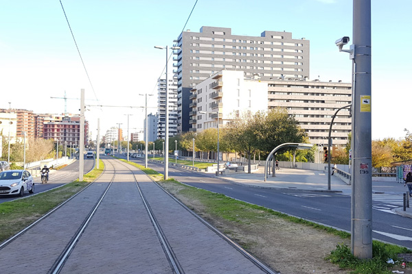
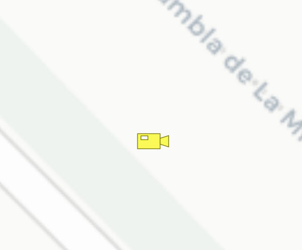
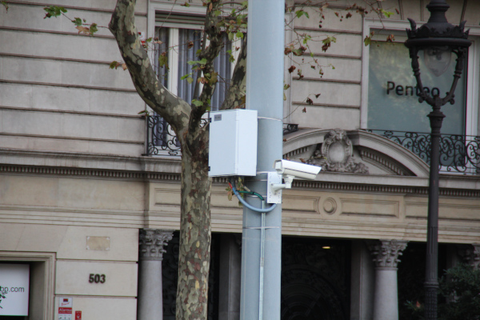
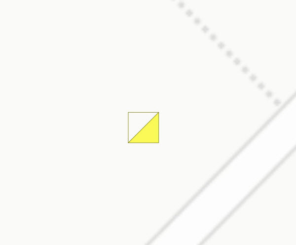

## 16 Videovigilància

 

>  Grup: Sistemes Tramviaris · Número elements: 2

 

Es tracta del sistema o circuit de videocàmeres instal·lades a parades, cruïlles, zones de maniobra i altres instal·lacions tramviàries, per a la vigilància i seguretat de les instal·lacions i usuaris, així com per a la gestió d'incidències.

 

### 001 Càmeres

> `Identificador: 16001 | Codi: CAM | Geometria: PUNT`

 

Càmeres de videovigilància. El sistema de videovigilància consisteix en un conjunt de càmeres de vídeo, connectades a un aparell de registre i connexió amb el Centre de Control, des d'on es poden descarregar i/o veure imatges en temps real d'un àmbit d'interès dins del domini públic del tramvia.

 

 
Foto de detall:
 

 

**Atributs**

| Atribut       | Tipus    | Descripció  |
| ------------- |:-------------| :-----|
| XARXA         | Indica a la xarxa a la qual pertany la infraestructura tramviària. Actualment Trambaix (TBX) o bé Trambesòs (TBS). En un futur es podran incloure altres xarxes encara no definides. | [String (20)] |
| CODI_ACTIU    | Codi que identifica un element en el GIS de forma unívoca. Està format per 4 parts separades per un guió. Comença amb el prefix TRM, després el codi de l'element segons el model de dades, un numero de dos dígits que indica l'operador o creador i un número de 5 dígits que identifica l'element al GIS de forma única.      |   [String (20)] |
| CODI_INTERN | Codi intern de la càmera. | [String (10)] |
| MODEL | Indiquen el model de la càmera. | [String (20)] |
| CABLEJAT | Indica el tipus de cableja que vas des de la videocàmera l'armari corresponent. Pot ser FO (fibra òptica), UTP (ethernet) o Coaxial . L'atribut ha de tenir un dels següents valors: <ul><li>**Coaxial**: Defineix el tipus de cablejat del circuit de videovigilància com a Coaxial. [**Veure**](img/1600111.jpg) </li><li>**FO (fibra optica)**: Defineix el tipus de cablejat del circuit de videovigilància com a FO. [**Veure**](img/1600112.jpg) </li><li>**UTP**: Defineix el tipus de cablejat del circuit de videovigilància com a UTP (ethernet). [**Veure**](img/1600113.jpg) </li><li>**UTP+FO**: Defineix el tipus de cablejat del circuit de videovigilància com a UTP+FO. </li>| [String (20)] |
| CODI_PARADA | Codi de la parada a la que estan connectades les càmeres. | [String (20)] |

 

**Representació GIS:**

 

 

    Nom capa element: Videovigilància-càmeres
    Nom taula DB: atmgis_16_cameres
    Nom camp geometria DB: geom
    Representació gràfica:

        [symbol: 'camera.svg', size: '3', weight: '0.5', color: '#777300', fillcolor: '#f9f957']

  

### 002 Armaris

> `Identificador: 16002 | Codi: ARV | Geometria: PUNT`

 

Armaris de videovigilància Són els armaris que emmagatzemen equips necessaris per al funcionament del sistema de videovigilància, tals com convertidors fibra-ethernet, switchos, videogravadors, etc.

 

 

**Atributs**

| Atribut       | Tipus    | Descripció  |
| ------------- |:-------------| :-----|
| XARXA         | Indica a la xarxa a la qual pertany la infraestructura tramviària. Actualment Trambaix (TBX) o bé Trambesòs (TBS). En un futur es podran incloure altres xarxes encara no definides. | [String (20)] |
| CODI_ACTIU    | Codi que identifica un element en el GIS de forma unívoca. Està format per 4 parts separades per un guió. Comença amb el prefix TRM, després el codi de l'element segons el model de dades, un numero de dos dígits que indica l'operador o creador i un número de 5 dígits que identifica l'element al GIS de forma única.      |   [String (20)] |
| TIPUS | Defineix la diferent tipologia dels armaris inclosos dins del sistema de videovigilància. Aquests poden ser de cablejat, de videogravador, o de conversió fibra-Ethernet. L'atribut ha de tenir un dels següents valors:<ul><li>**conversio fibra-ethernet**: Indica que l'armari de videovigilància és de tipus conversió de fibra òptica a Ethernet. </li><li>**videogravador**: Indica que l'armari de videovigilància és de tipus videogravador. </li><li>**cablejat**: Indica que l'armari de videovigilància és de tipus cablejat. </li> | [String (30)] |

 

**Representació GIS:**

 

 

    Nom capa element: Videovigilància-armaris
    Nom taula DB: atmgis_16_armaris
    Nom camp geometria DB: geom
    Representació gràfica:

        [symbol: 'armari.svg', angle: '90', size: '3', weight: '0.3', color: '#777300', fillcolor: '#f9f957']
