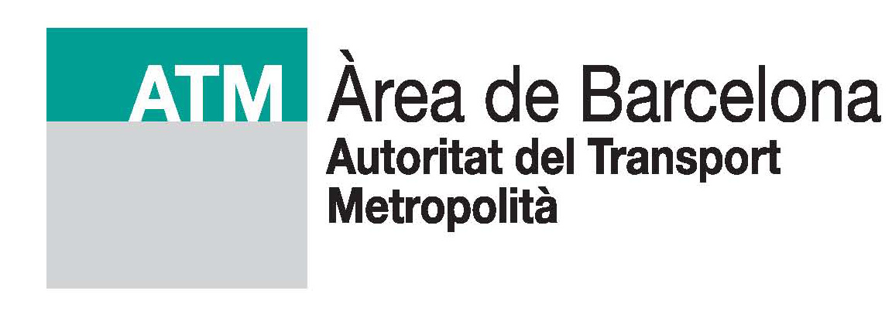
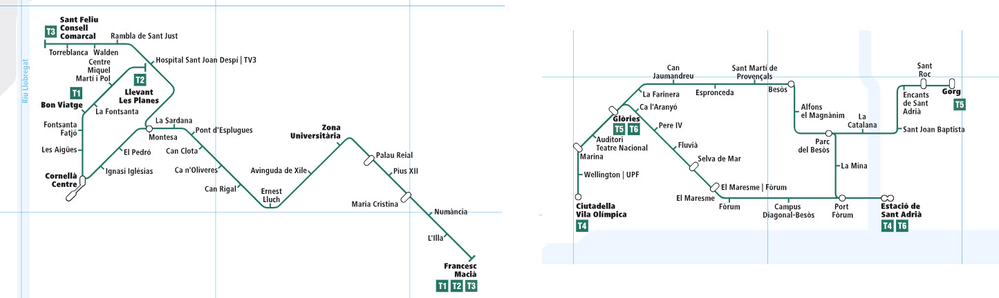

## Presentació
  
[

](https://www.atm.cat)
  
Aquest document presenta el model de dades creat en el projecte:

 

**Integració de la informació de les xarxes de tramvia de l’Àrea Metropolitana de Barcelona en un Sistema d’Informació Geogràfica.**

 

L’objectiu d’aquest document és descriure amb el màxim de detall possible el model de dades definit per al Sistema d’Informació Geogràfica de l’ATM. El model de dades és necessari per normalitzar l’estructura de treball del GIS de l’ATM. Consulta l’apartat [diccionari](#diccionari) per veure el llistat d'elements que componen el model.

  

## Àmbit model de dades
 
El model de dades definit es aquest document s’aplicarà al Sistema d’Informació Geogràfic de l’ATM que cobreix les línies tramvia **Tram Besós** i **Tram Baix**.
  

  

## Estructura
 
El diccionari s’organitza per categories, on cada categoria conté n elements. Per cada element del diccionari, es defineixen els següents aspectes:<ol><li>La categoria a la que pertany l’element</li><li>Una breu descripció de l’element</li><li>Una fotografia general</li><li>Una fotografia de detall (quan és necessari)</li><li>La descripció de l’element</li><li>Propietats de l’element:<ul><li>Identificador únic</li><li>Tipus de geometria</li><li>Nom de la capa GIS</li><li>Simbologia de representació</li></ul><li>Annotacions i comentaris relatives al element</li><li>Els atributs que defineixen l’element</li><li>Una mostra de la seva representació en el GIS</li></ol>

  

## Diccionari
 

* [Obra Civil](Domini_public.md)
    * [01 Domini public](Domini_public.md)
        * [001 Infraestructura tramviària](Domini_public/#001-infraestructura-tramviaria)
        * [002 Franja protecció](Domini_public/#002-franja-proteccio)
    * [02 Traçat](Tracat.md)
        * [001 Eix de plataforma](Tracat/#001-eix-de-plataforma)
        * [002 Eix de Via](Tracat/#002-eix-de-via)
        * [003 Carrils](Tracat/#003-carrils)
        * [004 Gàlib lliure d'obstacles (GLO)](Tracat/#004-galib-lliure-dobstacles-glo)
        * [005 Goemetria eixos de via (Planta)](Tracat/#005-geometria-eixos-de-via-planta)
        * [006 Geometria eixos de via (Alçat)](Tracat/#006-geometria-eixos-de-via-alcat)
    * [03 Parades](Parades.md)
        * [001 Andanes](Parades/#001-andanes)
        * [002 Marquesines](Parades/#002-marquesines)
        * [003 Moble tècnic](Parades/#003-moble-tecnic)
        * [004 Quadre elèctric](Parades/#004-quadre-electric)
        * [005 Aramari de telecomunicacions](Parades/#005-armari-de-telecomunicacions)
        * [006 Distribuïdor automàtic de bitllets](Parades/#006-distribuidor-automatic-de-bitllets)
        * [007 SIV](Parades/#007-siv)
        * [008 Sistema d'interfonia](Parades/#008-sistema-dinterfonia)
        * [009 Sistema de megafonia](Parades/#009-sistema-de-megafonia)
        * [010 Aparador](Parades/#010-aparador)
        * [011 Escala mecànica](Parades/#011-escala-mecanica)
        * [012 Ascensors](Parades/#012-ascensors)
        * [013 Baranes](Parades/#013-baranes)
        * [014 Papereres](Parades/#014-papereres)
        * [015 Bancs](Parades/#015-bancs)
        * [016 Noms parades](Parades/#015-noms-parades)
    * [04 Pavimentació](Pavimentacio.md)
        * [001 Paviment](Pavimentacio/#001-paviment)
    * [05 Reg](Reg.md)
        * [001 Pericons](Reg/#001-pericons)
        * [002 Canalitzacions](Reg/#002-canalitzacions)
        * [003 Escomeses](Reg/#003-escomeses)
        * [004 Punts de reg](Reg/#004-punts-de-reg)
        * [005 Armaris de reg](Reg/#005-armaris-de-reg)
        * [006 Elements de mesura i telegestió](Reg/#006-elements-de-mesura-i-telegestio)
        * [007 Programadors](Reg/#007-programadors)
    * [06 Drenatge](Drenatge.md)
        * [001 Pericons](Drenatge/#001-pericons)
        * [002 Drenatges centrals i laterals](Drenatge/#002-drenatges-centrals-i-laterals)
        * [003 Reixa](Drenatge/#003-reixa)
        * [004 Tubs de desguàs](Drenatge/#004-tubs-de-desguas)
        * [005 Embornals de plataforma](Drenatge/#005-embornals-de-plataforma)
        * [006 Drenatge vertical](Drenatge/#006-drenatge-vertical)
        * [007 Punt de connexió](Drenatge/#007-punt-de-connexio)
    * [07 Enllumenat](Enllumenat.md)
        * [001 Línies](Enllumenat/#001-linies)
        * [002 Punts de llum](Enllumenat/#002-punts-de-llum)
        * [003 Columnes](Enllumenat/#003-columnes)
        * [004 Elements LED de parada](Enllumenat/#004-elements-led-de-parada)
        * [005 Quadres Municipals](Enllumenat/#005-quadres-municipals)
* [Sistemes Tramviaris](Catenaria.md)
    * [08 Catenària](Catenaria.md)
        * [001 Seccionadors](Catenaria/#001-seccionadors)
        * [002 LAC](Catenaria/#002-lac)
        * [003 Pals](Catenaria/#003-pals)
        * [004 Subjeccions](Catenaria/#004-subjeccions)
        * [005 Pòrtics](Catenaria/#005-portics)
        * [006 Tensors](Catenaria/#006-tensors)
    * [09 Multitubular](Multitubular.md)
        * [001 Pericons](Multitubular/#001-pericons)
        * [002 Prisma](Multitubular/#002-prisma)
    * [10 Energia](Energia.md)
        * [001 Feeder](Energia/#001-feeder)
        * [002 Indicadors de tensió](Energia/#002-indicadors-de-tensio)
        * [003 Armaris](Energia/#003-armaris)
        * [004 Cablejat de distribució](Energia/#004-cablejat-de-distribucio)
    * [11 Subestacions](Subestacions.md)
        * [001 Obra civil](Subestacions/#001-obra-civil)
        * [002 Transformadors](Subestacions/#002-transformadors)
        * [003 Cel·les MT 25 kV](Subestacions/#003-celles-mt-25-kv)
        * [004 Rectificadors 900 kW](Subestacions/#004-rectificadors-900-kw)
        * [005 Carregadors i bateries](Subestacions/#005-carregadors-i-bateries)
        * [006 Quadre BT](Subestacions/#006-quadre-bt)
        * [007 Quadre de control](Subestacions/#007-quadre-de-control)
        * [008 Quadre de seccionadors 750 VCC](Subestacions/#008-quadre-de-seccionadors-750-vcc)
        * [009 Disjuntor 750 VCC](Subestacions/#009-disjuntor-750-vcc)
        * [010 SAA](Subestacions/#010-saa)
    * [12 SAE](SAE.md)
        * [001 Etiquetes](SAE/#001-etiquetes)
    * [13 Senyalització ferroviària](Senyalitzacio_ferroviaria.md)
        * [001 Accionament](Senyalitzacio_ferroviaria/#001-accionament)
        * [002 Armari](Senyalitzacio_ferroviaria/#002-armari)
        * [003 Elements de detecció](Senyalitzacio_ferroviaria/#003-elements-de-deteccio)
        * [004 Senyals fixos](Senyalitzacio_ferroviaria/#004-senyals-fixos)
        * [005 Senyals lluminosos](Senyalitzacio_ferroviaria/#005-senyals-lluminosos)
    * [14 Semaforitzacio](Semaforitzacio.md)
        * [001 Detectors](Semaforitzacio/#001-detectors)
        * [002 Reguladors](Semaforitzacio/#002-reguladors)
        * [003 Semàfors tramvia](Semaforitzacio/#003-semafors-tramvia)
        * [004 Cruïlles](Semaforitzacio/#004-cruilles)
    * [15 Senyalització viària](Senyalitzacio_viaria.md)
        * [001 Senyalització viària vertical](Senyalitzacio_viaria/#001-senyalitzacio-viaria-vertical)
        * [002 Senyalització viària horizontal](Senyalitzacio_viaria/#002-senyalitzacio-viaria-horitzontal)
    * [16 Videovigilància](Videovigilancia.md)
        * [001 Càmeres](Videovigilancia/#001-cameres)
        * [002 Armaris](Videovigilancia/#002-armaris)
    * [17 Tallers i Cotxeres](Tallers_i_cotxeres.md)
        * [001 Emplaçament](Tallers_i_cotxeres/#001-emplacament)
        * [002 Edificis](Tallers_i_cotxeres/#002-edificis)
* [Sistemes Auxiliars](Mobiliari_urba.md)
    * [18 Mobiliari urbà](Mobiliari_urba.md)
        * [001 Arbre](Mobiliari_urba/#001-arbre)
        * [002 Andanes de parada de bus](Mobiliari_urba/#002-andanes-de-parada-de-bus)
        * [003 Marquesines de parada de bus](Mobiliari_urba/#003-marquesines-de-parada-de-bus)
    * [19 Estructures complementàries](Estructures_complementaries.md)
        * [001 Estructura](Estructures_complementaries/#001-estructura)
